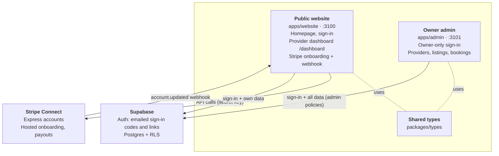

# Architecture

Last updated: 2026-09-27.

Two Nuxt apps share one Supabase project; only the website talks to Stripe.

Booking and payments, as built, with diagrams: [architecture/booking-and-payments.md](architecture/booking-and-payments.md).
The database enforces who can see and change what, so a bug in a page can't
expose another provider's data.

## The pieces

| Piece | Responsibility | Holds secrets |
| --- | --- | --- |
| Website, browser | Pages, sign-in form, dashboard UI | Supabase publishable key only |
| Website, server | Provider routes, Stripe calls, webhook | Supabase secret key, Stripe secret key, webhook secret |
| Admin, browser | All admin pages; reads through RLS admin policies | Supabase publishable key only |
| Admin, server | Admin-only writes via `requireAdmin` (none built yet) | Supabase secret key |
| Supabase | Auth, Postgres, access rules | — |
| Stripe | Provider identity checks, bank details, payouts, payment splits | — |

## Flows

**Sign-in (both apps).** The user enters an email, Supabase emails a link,
and the link lands on `/confirm`. `/confirm` sends them to the page they were
headed for. The website creates an account on first sign-in; the admin app
never does.

**Provider payout setup.**

1. The provider saves a business profile, creating their `providers` row (through RLS).
2. **Set up payouts** calls `POST /api/provider/stripe/onboard`. This creates
   the Express account on first use (with an idempotency key), saves
   `stripe_account_id` with the service role, and returns a Stripe-hosted
   onboarding link.
3. Stripe sends the provider back to `/dashboard/payouts?stripe=return`. The
   page calls `POST /api/provider/stripe/sync`, which fetches the account from
   Stripe and copies its status onto the row.
4. Later changes arrive as `account.updated` webhooks, verified and synced the
   same way.
5. Once payouts are ready, the button opens the provider's Stripe Express dashboard.

## Repo map

| Path | What's there |
| --- | --- |
| `apps/website/app/pages/index.vue` | Homepage (placeholder markup) |
| `apps/website/app/pages/login.vue`, `confirm.vue` | Provider sign-in or sign-up; email-link landing |
| `apps/website/app/pages/dashboard/` | Overview, services, experiences, bookings, payouts, business profile |
| `apps/website/app/layouts/dashboard.vue` | Dashboard sidebar and sign-out |
| `apps/website/app/composables/useProvider.ts` | The signed-in provider's record, shared across pages |
| `apps/website/server/api/provider/` | Profile read/save; Stripe onboard, sync and dashboard link |
| `apps/website/server/api/stripe/webhook.post.ts` | Stripe `account.updated` receiver |
| `apps/website/server/utils/` | `requireUser`, `requireProvider`, `getOwnProvider`; Stripe client and sync |
| `apps/admin/app/pages/` | Admin pages; `providers.vue` has live data |
| `apps/admin/app/middleware/admin.global.ts` | Sends signed-in non-admins away |
| `apps/admin/server/utils/requireAdmin.ts` | Check for every admin server route |
| `packages/types/src/` | `Provider`, `payoutSetupOf`, `isAdmin`; generated `database.ts` |
| `supabase/migrations/` | Schema, one file per change |
| `supabase/tests/` | pgTAP access-rule tests; shared setup in `_helpers/users.psql` |
| `supabase/config.toml` | Local database settings |
| `docs/schema/` | Generated table docs (tbls) |
| `apps/*/.env.example`, `.env.example` | Which keys each app and the root scripts need |
| `.claude/launch.json` | Dev server entries for the preview pane |
| `.claude/skills/` | Project skills for Claude Code |
