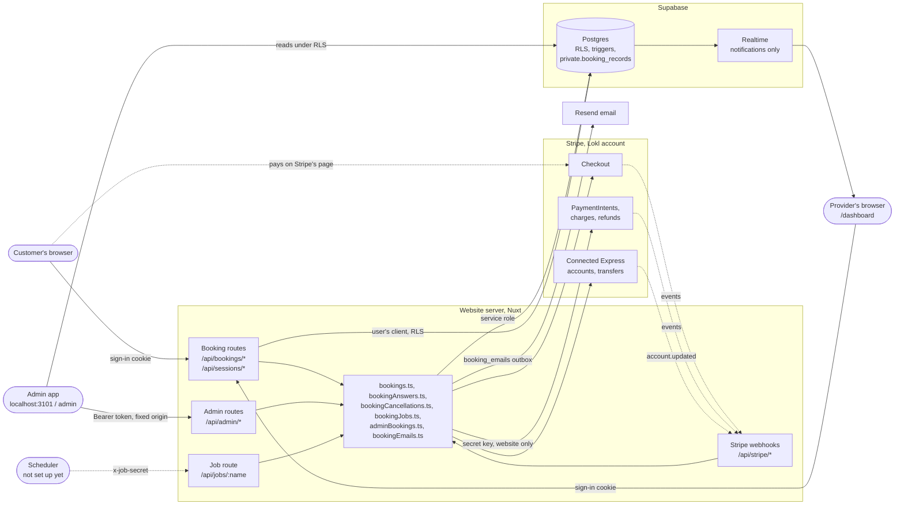
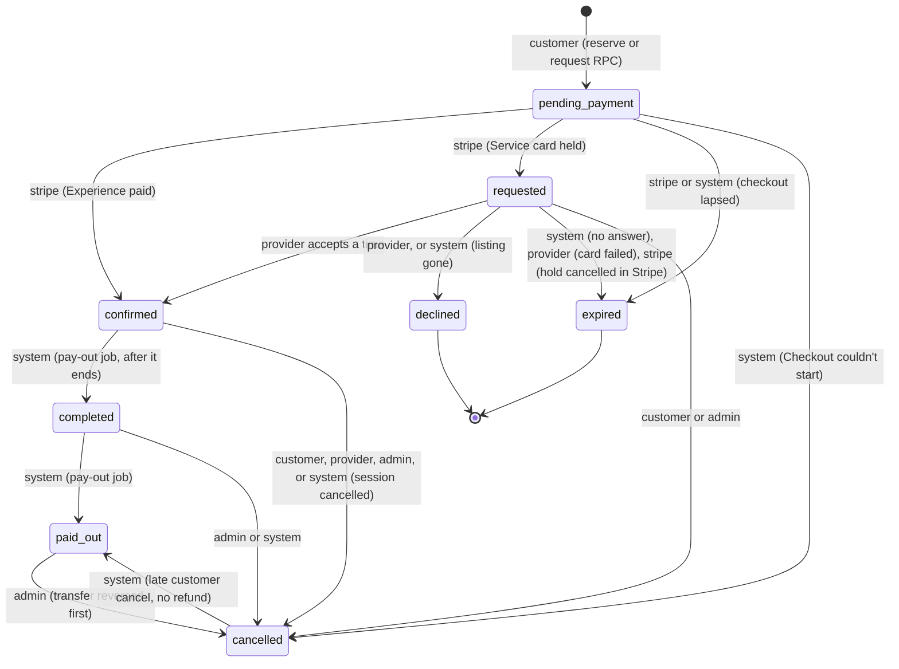
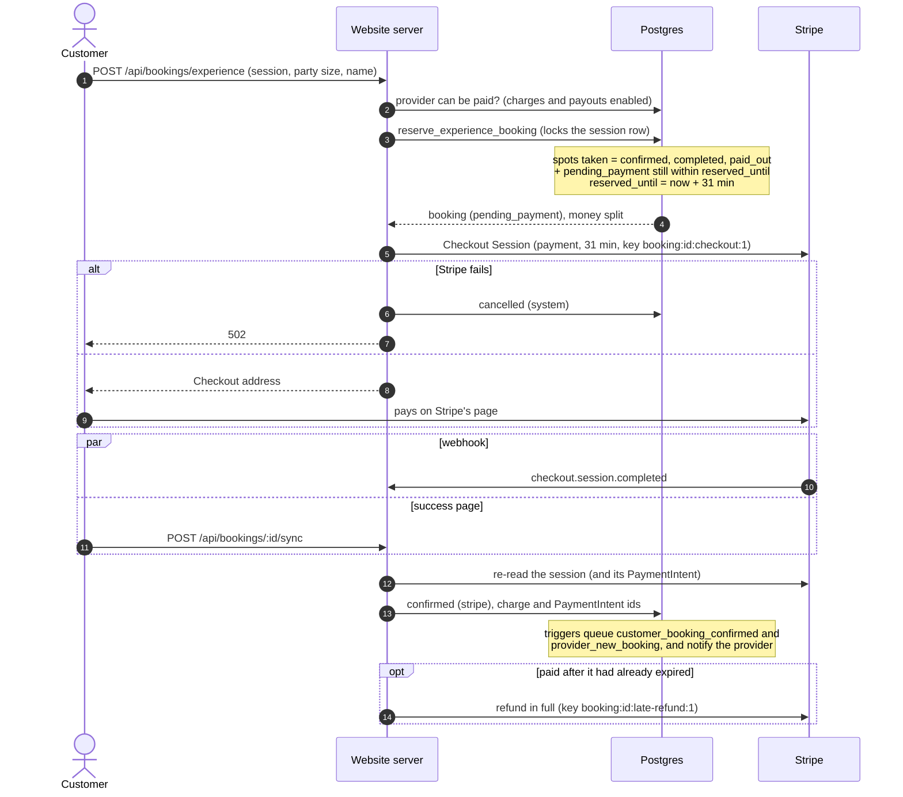
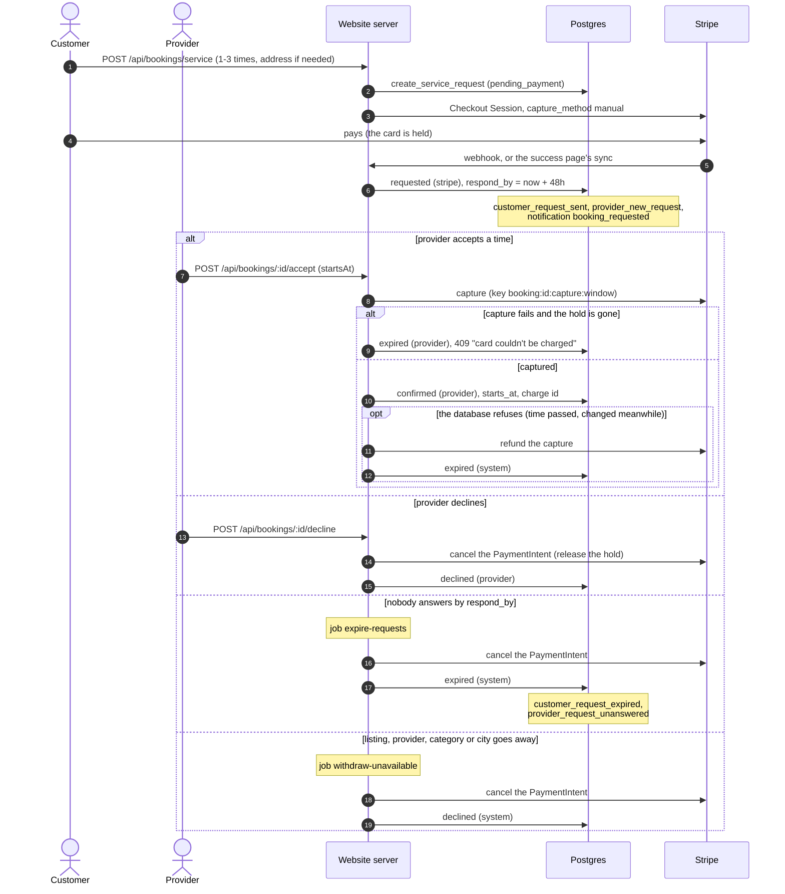
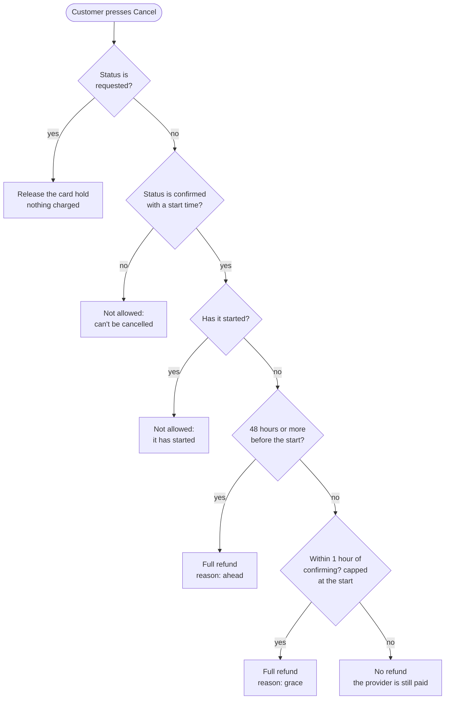
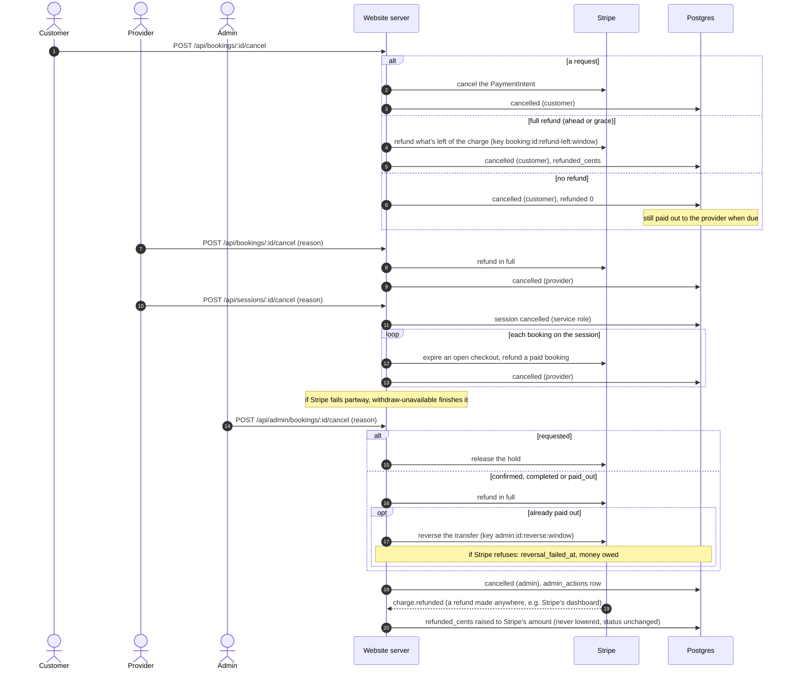
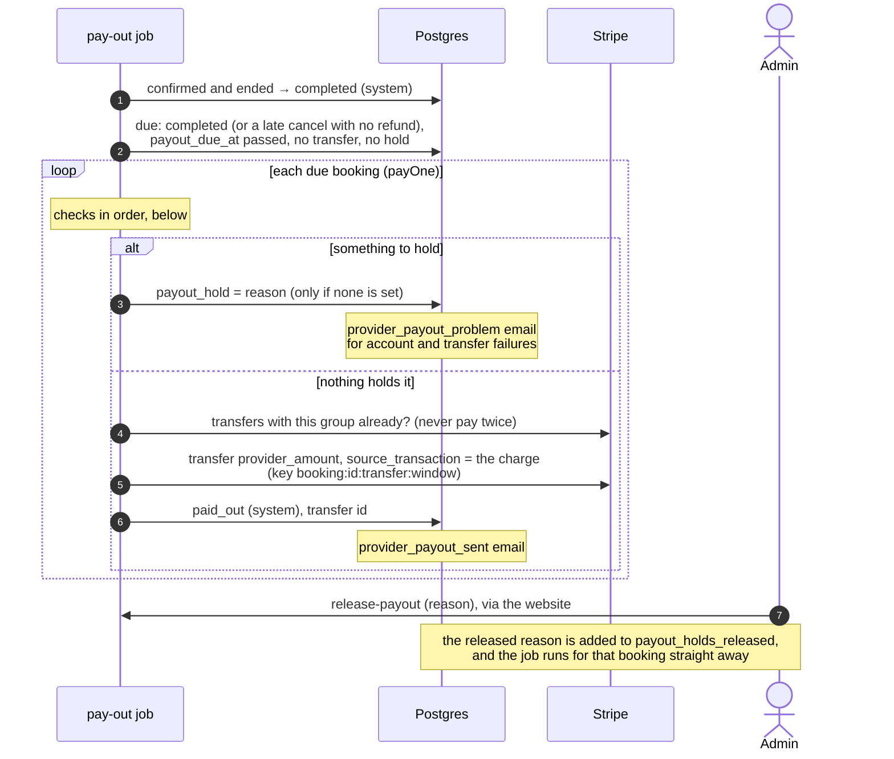
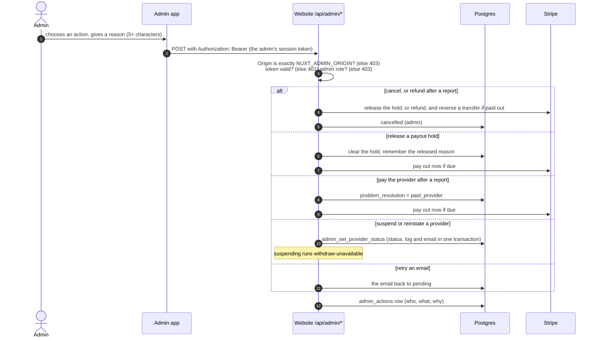
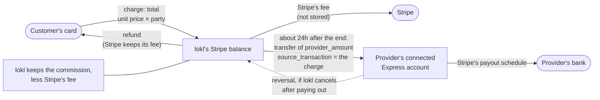
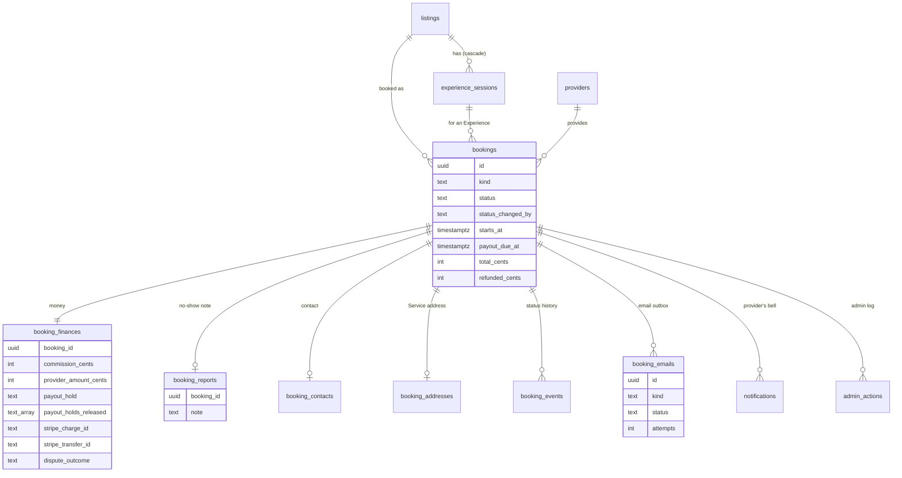

# Booking and payments: as built

How booking Services and Experiences, and the money around them, work in the
code today. Written from the code and migrations on 2026-10-04.
[docs/design/booking-and-checkout.md](../design/booking-and-checkout.md) is
the original design; where the two differ, this document follows the code
and lists the differences at the end ([Differences from the design](#12-differences-from-the-design)).

**Keep it current:** a change to booking or payment code updates this
document in the same commit (see [CLAUDE.md](../../CLAUDE.md), "Keeping docs current").

The diagrams are [Mermaid](https://mermaid.js.org/), which GitHub draws.
Source paths are links. Short forms used below:

| Short form | Path |
| --- | --- |
| `bookings.ts` | [apps/website/server/utils/bookings.ts](../../apps/website/server/utils/bookings.ts) |
| `bookingAnswers.ts` | [apps/website/server/utils/bookingAnswers.ts](../../apps/website/server/utils/bookingAnswers.ts) |
| `bookingCancellations.ts` | [apps/website/server/utils/bookingCancellations.ts](../../apps/website/server/utils/bookingCancellations.ts) |
| `bookingJobs.ts` | [apps/website/server/utils/bookingJobs.ts](../../apps/website/server/utils/bookingJobs.ts) |
| `adminBookings.ts` | [apps/website/server/utils/adminBookings.ts](../../apps/website/server/utils/adminBookings.ts) |
| `bookingEmails.ts` | [apps/website/server/utils/bookingEmails.ts](../../apps/website/server/utils/bookingEmails.ts) |
| `bookingRecords.ts` | [apps/website/server/utils/bookingRecords.ts](../../apps/website/server/utils/bookingRecords.ts) |
| policy | [packages/types/src/bookings.ts](../../packages/types/src/bookings.ts) |
| guard | `bookings_guard` in [supabase/migrations/20261003022309_booking_finances.sql](../../supabase/migrations/20261003022309_booking_finances.sql) (its latest version; it was redefined in six migrations) |

## Contents

1. [System overview](#1-system-overview)
2. [Booking states](#2-booking-states)
3. [Booking an Experience](#3-booking-an-experience)
4. [Requesting a Service](#4-requesting-a-service)
5. [Cancellations and refunds](#5-cancellations-and-refunds)
6. [Payouts and holds](#6-payouts-and-holds)
7. [Admin actions](#7-admin-actions)
8. [Money](#8-money)
9. [Tables and who can read them](#9-tables-and-who-can-read-them)
10. [Emails and notifications](#10-emails-and-notifications)
11. [Idempotency, webhooks and jobs](#idempotency-webhooks-and-jobs)
12. [Differences from the design](#12-differences-from-the-design)

---

## 1. System overview

- **Who holds which key.** Pages and routes read with the signed-in user's
  client, so RLS applies. Every booking write goes through
  `private.booking_records` with the service role, only in server code
  ([bookingRecords.ts](../../apps/website/server/utils/bookingRecords.ts)).
  The Stripe secret key exists only on the website's server; the admin app
  never has one and calls the website's `/api/admin/*` routes instead.
- **Charges and transfers.** Customers pay lokl's own Stripe account
  (Checkout, `mode: "payment"`); the provider's share is a separate transfer
  to their connected Express account after the booking has happened. There
  are no application fees.
- **Emails** are rows in an outbox (`booking_emails`), queued by database
  triggers and sent by the website. **Notifications** are rows the
  providers' bell reads live over Realtime.
- **Timed jobs** run through `/api/jobs/:name` with a shared secret. No
  scheduler calls them yet ([§11](#idempotency-webhooks-and-jobs)).

## 2. Booking states

A booking's `status`, and every move the database allows
([guard](../../supabase/migrations/20261003022309_booking_finances.sql)).
Each arrow names who can make it: the `status_changed_by` value recorded
with it, and copied into `booking_events.actor`.

What the guard checks on each move, and where the code makes it:

| Move | Code | The database also requires |
| --- | --- | --- |
| insert as `pending_payment` | `reserve_experience_booking`, `create_service_request` (RPCs, service role only), from `startExperienceCheckout` / `startServiceCheckout` in `bookings.ts` | the kind and provider match the listing; the customer doesn't own it; the session belongs to it |
| `pending_payment` → `confirmed` | `syncCheckoutSession` in `bookings.ts` | Experiences only. Sets `confirmed_at`, `ends_at` (start + duration) and `payout_due_at` (end + 24h) |
| `pending_payment` → `requested` | `syncCheckoutSession` | Services only; sets `respond_by` = now + 48h |
| `pending_payment` → `expired` | `syncCheckoutSession`; jobs `release-reservations`, `withdraw-unavailable` | |
| `pending_payment` → `cancelled` | `createCheckout` when Stripe fails | `cancelled_by` = system |
| `requested` → `confirmed` | `acceptRequest` in `bookingAnswers.ts` | now ≤ `respond_by`; the time is one the customer offered, and still ahead |
| `requested` → `declined` | `declineRequest`; job `withdraw-unavailable` | |
| `requested` → `expired` | job `expire-requests`; `acceptRequest` (card failed); webhook `payment_intent.canceled` | |
| `requested` → `cancelled` | `customerCancel` (release), `adminCancelBooking` | |
| `confirmed` → `cancelled` | `customerCancel`, `providerCancel`, `cancelSession`, `adminCancelBooking`, job `withdraw-unavailable` | customer or provider: not after the start; provider: a reason of 5+ characters; a full refund unless it's a customer's late cancel (within 48h of the start and over 1h after confirming) |
| `confirmed` → `completed` | job `pay-out`, once `ends_at` has passed | |
| `completed` → `paid_out`, `cancelled` → `paid_out` | job `pay-out` (`payOne`) | a transfer recorded, no hold, no open dispute, no unresolved report. From `cancelled`: only a customer's late cancel with no refund |
| `completed` → `cancelled` | `adminCancelBooking` | admin or system only |
| `paid_out` → `cancelled` | `adminCancelBooking` | admin only, and the transfer reversal (or its failure) recorded first |

Also enforced on every update: the booking's kind, listing, provider,
customer, session, party size, offered times and prices never change;
`refunded_cents` never goes down; times change only with a status change. A
no-show report can be made once, from `confirmed` or `completed`, between
the start and `payout_due_at`; its resolution is set once.

Every server write is conditional on the status it read
(`.eq("status", from)`), so two writers can't both move a booking.

## 3. Booking an Experience

- **Coming back without paying:** the listing page calls
  `POST /api/bookings/:id/abandon` (`abandonCheckout` in `bookings.ts`),
  which expires the Checkout Session if it's still open, then syncs: the
  booking becomes `expired` and the spots are free.
- **Never coming back:** the `release-reservations` job picks up
  `pending_payment` bookings past `reserved_until` and does the same, so a
  payment made at the last moment still confirms rather than expiring.
- Routes: [experience.post.ts](../../apps/website/server/api/bookings/experience.post.ts),
  [sync.post.ts](../../apps/website/server/api/bookings/[id]/sync.post.ts),
  [abandon.post.ts](../../apps/website/server/api/bookings/[id]/abandon.post.ts).
  Request shape: `experienceBookingRequestSchema` in the
  [policy](../../packages/types/src/bookings.ts) file.

## 4. Requesting a Service

The customer offers one to three times, each at least 24 hours away; the
card is only held (manual capture) until the provider answers.

- Overlapping requests aren't blocked: the provider's booking page shows a
  warning when an offered time overlaps a confirmed booking
  (`requestOverlaps` in `bookingAnswers.ts`).
- A provider who's suspended can't answer requests
  ([providerAccess.ts](../../apps/website/server/utils/providerAccess.ts)).
- If the hold is cancelled in Stripe's dashboard, the
  `payment_intent.canceled` webhook expires the request (actor `stripe`).
- Routes: [service.post.ts](../../apps/website/server/api/bookings/service.post.ts),
  [accept.post.ts](../../apps/website/server/api/bookings/[id]/accept.post.ts),
  [decline.post.ts](../../apps/website/server/api/bookings/[id]/decline.post.ts).

## 5. Cancellations and refunds

### The customer's policy

`customerCancelOutcome` in the [policy](../../packages/types/src/bookings.ts)
file, shown to the customer before they confirm and applied by the server
and the database alike:

The provider and the admin always refund in full; the provider must give a
reason (5+ characters) and can't cancel after the start.

### Who cancels, and what happens to the money

- A booking cancelled with a full refund has its payout hold cleared
  (trigger `bookings_clear_hold_when_refunded`,
  [20261003031256](../../supabase/migrations/20261003031256_cancelled_bookings_hold_nothing.sql)).
- `refundInFull` refunds `min(total, charged) − already refunded`, so a
  repeat can't refund twice.
- Code: `customerCancel`, `providerCancel`, `cancelSession` in
  `bookingCancellations.ts`; `adminCancelBooking` in `adminBookings.ts`;
  routes [cancel.post.ts](../../apps/website/server/api/bookings/[id]/cancel.post.ts),
  [sessions/:id/cancel.post.ts](../../apps/website/server/api/sessions/[id]/cancel.post.ts),
  [admin cancel](../../apps/website/server/api/admin/bookings/[id]/cancel.post.ts).

## 6. Payouts and holds

The `pay-out` job (`payOut` and `payOne` in `bookingJobs.ts`) pays the
provider's share about a day after the booking ends, unless something holds
it for lokl to review.

### What holds a payout, in order

| # | Check | Hold | Released by the admin? |
| --- | --- | --- | --- |
| 1 | A no-show report, not resolved as "pay the provider" | `problem_reported` | No: resolve the report instead |
| 2 | A recorded dispute that's **open** | `dispute` | No: it can't be released while open |
| 3 | A recorded dispute that was **lost** | `dispute` | Yes, and then not held again |
| 4 | Part of the payment refunded (`refunded_cents > 0`) | `refunded` | Yes, and then not held again |
| 5 | The provider is suspended | `provider_suspended` | Yes, and then not held again |
| 6 | Stripe's charge says disputed, but no dispute is recorded (a missed webhook) | the dispute is fetched and recorded (`recordDispute`), then judged as in 2–3 | as 2–3 |
| 7 | Stripe's charge shows a refund the webhook missed | `refunded` | as 4 |
| 8 | No Stripe account, Stripe can't find it, or transfers aren't active on it | `account_cannot_receive` (+ `payout_failure`) | Yes; a fresh refusal holds it again |
| 9 | Stripe refuses the transfer | `transfer_failed` (+ `payout_failure`) | Yes; a fresh refusal holds it again |

**Disputes are judged by the outcome recorded on the booking**, written from
Stripe's dispute by `recordDispute` in `bookings.ts` (the webhook, or step 6).
A **won** dispute, or one closed as a warning, doesn't hold the payout.
Stripe's `charge.disputed` flag isn't used for this: it stays `true` after
lokl wins.

**A hold the admin has released isn't put back for the same reason.**
`releasePayout` (`adminBookings.ts`) adds the released reason to
`booking_finances.payout_holds_released` (migration
[payout_holds_released](../../supabase/migrations/20261004014320_payout_holds_released.sql)),
and the job skips those judgements (3, 4, 5, 7). A release covers only its
own reason: a new refund after releasing a suspension still holds. Account
and transfer refusals (8, 9) are fresh answers from Stripe each time, so a
release means "try again", and another refusal holds it again.

Both rules were fixed on 2026-10-04: before, the job held a won dispute again
from Stripe's flag, and put every released hold straight back. Tested in
[payout-holds.test.mts](../../supabase/tests/app/payout-holds.test.mts),
with a real dispute won in the sandbox.

- **No-show reports:** `POST /api/bookings/:id/report-problem` (`reportProblem`
  in `bookingCancellations.ts`) records the customer's note (final once
  written) and sets the `problem_reported` hold. The admin resolves it either
  way: pay the provider (`resolveProblemPaid`, which then runs the payout) or
  refund the customer (`adminCancelBooking` with the resolution `refunded`).
- **Disputes after a payout** aren't automatic: the admin sees them and
  decides whether to cancel and reverse the transfer.
- **`transfer.reversed`** (from lokl or Stripe's dashboard) records the
  reversal id on its booking.

## 7. Admin actions

| Route | Body | Logged as |
| --- | --- | --- |
| [`POST /api/admin/bookings/:id/cancel`](../../apps/website/server/api/admin/bookings/[id]/cancel.post.ts) | `{ reason, resolveProblem? }` | `cancel_booking` or `resolve_problem_refunded` |
| [`POST /api/admin/bookings/:id/release-payout`](../../apps/website/server/api/admin/bookings/[id]/release-payout.post.ts) | `{ reason }` | `release_payout` |
| [`POST /api/admin/bookings/:id/resolve-problem`](../../apps/website/server/api/admin/bookings/[id]/resolve-problem.post.ts) | `{ outcome: pay_provider \| refund, reason }` | `resolve_problem_paid` or `resolve_problem_refunded` |
| `POST /api/admin/emails/:id/retry` | none | `retry_email` |
| `POST /api/admin/providers/:id/suspend`, `/reinstate` | `{ reason, message? }` | `suspend_provider`, `reinstate_provider` |

- The checks are in [adminRequest.ts](../../apps/website/server/utils/adminRequest.ts);
  CORS for the admin app's exact address only in
  [admin-cors.ts](../../apps/website/server/middleware/admin-cors.ts).
- The admin app calls these through
  [useWebsiteAdmin.ts](../../apps/admin/app/composables/useWebsiteAdmin.ts)
  from the booking page ([bookings/[id].vue](../../apps/admin/app/pages/bookings/[id].vue))
  and the providers page. It reads bookings, finances, emails, the action
  log and job runs directly, under admin RLS.
- Commission rates are edited directly under RLS (admin Settings), not
  through the website.
- **The dashboard** ([index.vue](../../apps/admin/app/pages/index.vue)) reads
  `admin_dashboard()` ([migration](../../supabase/migrations/20261004043455_admin_dashboard.sql)).
  "Paid" means `confirmed_at` is set. GMV is charged less refunded for
  bookings paid in the last 30 days, commission is after refunds and before
  Stripe's fees (the Bookings totals' rule), and active providers have a
  paid booking in the last 90, all by the Atlanta calendar. The money and
  provider numbers come from `admin_bookings_page` (`p_paid_from`,
  `p_paid_to`) and `admin_providers_page` (`p_paid_since`, `not_ready`), the
  same filters the dashboard's links open, so each number matches its page.

## 8. Money

- **The split is made in the database** when the booking is created:
  `booking_money()` ([bookings migration](../../supabase/migrations/20261001012101_bookings.sql))
  takes the rate from `commission_rates` (Services 12%, Experiences 20%;
  admins can change them, and every change is logged in
  `commission_rate_changes`). `commission = round(total × rate)`,
  `provider_amount = total − commission`. The split is stored in
  `booking_finances` and can never change (`booking_finances_guard`).
- **Stripe's fee** isn't stored: lokl pays it from the commission. A refund
  doesn't return Stripe's fee, so lokl absorbs it.
- **The transfer** is linked to the original charge (`source_transaction`),
  so it can't move money lokl hasn't received, and has the group
  `booking_<id>`, which the job checks first so a booking is never paid twice.
- **A reversal** that Stripe refuses (the provider's balance is too low) is
  recorded as `reversal_failed_at` with Stripe's message: money the provider
  owes lokl, shown to the admin.

A worked example, a $50 Experience for one person:

| | Amount |
| --- | --- |
| Customer charged | $50.00 |
| Commission (20%) | $10.00 |
| Provider's share, transferred about a day after it ends | $40.00 |
| Stripe's fee (from the commission) | about $1.75 (2.9% + 30¢, card dependent) |
| lokl keeps | about $8.25 |

## 9. Tables and who can read them

The server reads and writes a booking with its money through the view
`private.booking_records` (bookings joined with finances and the report
note), which only the service role can use.

| Table | Customer | Provider | Admin | Visitor | Written by | Deleted? |
| --- | --- | --- | --- | --- | --- | --- |
| `bookings` | own | own business's | all | no | service role only | never |
| `booking_finances` | **no** | own business's | all | no | service role only | never |
| `booking_reports` | own | **no** | all | no | service role, once; final | never |
| `booking_contacts`, `booking_addresses` | own | once the booking is confirmed | all | no | service role | never |
| `booking_events` | as the booking | as the booking | all | no | trigger only | never |
| `booking_emails` | no | no | all | no | triggers and the server | never |
| `experience_sessions` | future, visible ones | own (all) | all | future, visible ones | provider (not moved or cancelled once booked) | with its listing, unless booked |
| `notifications` | no | own (may mark read) | no | no | triggers | with its listing |
| `admin_actions`, `job_runs` | no | no | all | no | service role | never |
| `commission_rates` | any signed-in user | any signed-in user | all, may change the rate | no | admin (rate only) | never |
| `providers` (`stripe_*`, `status`) | no | own | all | no | server only (Stripe sync, admin RPC) | never |

Sources: [bookings](../../supabase/migrations/20261001012101_bookings.sql),
[booking_finances](../../supabase/migrations/20261003022309_booking_finances.sql),
[booking_emails](../../supabase/migrations/20261002192826_booking_emails.sql),
[booking_admin](../../supabase/migrations/20261003010713_booking_admin.sql),
[experience_sessions](../../supabase/migrations/20260928002703_experience_sessions.sql),
[notifications](../../supabase/migrations/20260928031356_notifications.sql);
pgTAP tests in [supabase/tests](../../supabase/tests).

## 10. Emails and notifications

### Emails

Queued as rows in `booking_emails` by triggers on `bookings`
(`bookings_queue_emails`) and `booking_finances`
(`booking_finances_queue_emails`), one per booking and kind
([booking_finances migration](../../supabase/migrations/20261003022309_booking_finances.sql)),
then sent by the website ([bookingEmails.ts](../../apps/website/server/utils/bookingEmails.ts),
templates in [bookingEmailTemplates.ts](../../apps/website/server/utils/bookingEmailTemplates.ts)).

| Email | To | Queued when |
| --- | --- | --- |
| `customer_request_sent` | customer | a Service request is placed (→ `requested`) |
| `provider_new_request` | provider | the same |
| `customer_request_accepted` | customer | `requested` → `confirmed` |
| `customer_request_declined` | customer | `requested` → `declined` |
| `customer_request_expired` | customer | `requested` → `expired` |
| `provider_request_unanswered` | provider | `requested` → `expired` by the system (no answer in time) |
| `customer_booking_confirmed` | customer | an Experience is paid (`pending_payment` → `confirmed`) |
| `provider_new_booking` | provider | the same |
| `customer_booking_cancelled` | customer | cancelled from `requested`, `confirmed`, `completed` or `paid_out` |
| `provider_booking_cancelled` | provider | the same, unless the provider cancelled it |
| `provider_payout_sent` | provider | → `paid_out` |
| `provider_payout_problem` | provider | a payout held for `account_cannot_receive` or `transfer_failed` |
| `customer_problem_received` | customer | a no-show report |
| `provider_problem_reported` | provider | the same |
| `provider_problem_paid` | provider | the report resolved: pay the provider |
| `customer_problem_refunded` | customer | the report resolved: refund (instead of the cancellation emails) |
| `provider_problem_refunded` | provider | the same |

Not emailed: checkouts that lapse or fail (`pending_payment` → `expired` or
`cancelled`) and `confirmed` → `completed`.

**Sending:** a row is claimed (`pending` → `sending`; a claim older than 10
minutes is taken over) and sent through Resend with the idempotency key
`booking-email-<row id>`. Failures retry after 1, 5, 15, 60 and 240 minutes,
6 attempts in all, then `failed`. Resend quota errors wait an hour without
using an attempt and fail after 48 hours. A row is `skipped` when there's no
address, `NUXT_EMAIL_MODE` is `off`, no reply-to is set, the address isn't on
the allowlist (`allowlist` mode), or a new-request email would arrive after
the request was answered. Sends start straight after each route, webhook or
job (`kickBookingEmails`), and the `send-emails` job sweeps the rest. The
admin can retry a failed or skipped email.

Provider account emails (paused or active again) are a separate outbox,
`provider_emails`, written by `admin_set_provider_status`
([provider_account_emails](../../supabase/migrations/20261003013910_provider_account_emails.sql)).

### Notifications (the provider's bell)

| Kind | Inserted by | When |
| --- | --- | --- |
| `booking_requested` | trigger `bookings_notify_provider` | a Service request is placed |
| `booking_confirmed` | the same | an Experience is paid |
| `booking_cancelled` | the same | a request or booking is cancelled by someone other than the provider |
| `booking_problem_reported` | trigger `bookings_notify_problem` | a no-show report |

Listing kinds (approved, sent back and so on) come from
`listings_notify_status_change`. Only `notifications` is published to
Realtime; the bell subscribes to its own provider's inserts
([notificationFeed.ts](../../packages/ui/app/utils/notificationFeed.ts)).
Wording: [notifications.ts](../../packages/types/src/notifications.ts).

## 11. Idempotency, webhooks and jobs

### Stripe idempotency keys

| Key | For | Where |
| --- | --- | --- |
| `booking:<id>:checkout:1` | creating the Checkout Session | `createCheckout`, `bookings.ts` |
| `booking:<id>:late-refund:1` | refunding a payment that arrived after the booking ended | `syncCheckoutSession` |
| `booking:<id>:capture:<w>` | accepting a request | `acceptRequest` |
| `booking:<id>:release:<w>` | releasing a card hold | `declineRequest`, cancellations, jobs |
| `booking:<id>:refund-unconfirmed:<w>` | refunding a capture the database refused | `acceptRequest` |
| `booking:<id>:refund-<cents left>:<w>` | a full refund | `refundInFull` |
| `booking:<id>:transfer:<w>` | the payout | `payOne` |
| `admin:<id>:release:<w>`, `admin:<id>:reverse:<w>` | the admin's release and transfer reversal | `adminBookings.ts` |

`<w>` is a 10-minute window (`floor(now / 10 min)`): a retry within it is the
same request, and a later retry is a new one, because Stripe replays a stored
error for 24 hours. The checkout and late-refund keys are fixed per booking:
each happens at most once per booking.

### Webhooks

| Route | Secret | Events |
| --- | --- | --- |
| [/api/stripe/webhook-payments](../../apps/website/server/api/stripe/webhook-payments.post.ts) (lokl's own account) | `NUXT_STRIPE_PAYMENTS_WEBHOOK_SECRET` | `checkout.session.completed`, `.expired`, `.async_payment_succeeded`, `.async_payment_failed`; `payment_intent.canceled`; `charge.refunded`; `charge.dispute.created`, `.updated`, `.closed`; `transfer.reversed` |
| [/api/stripe/webhook](../../apps/website/server/api/stripe/webhook.post.ts) (connected accounts) | `NUXT_STRIPE_WEBHOOK_SECRET` | `account.updated` (copies charges, payouts and details-submitted to `providers`) |

The signature is checked on the raw body before anything else. Handling
(`handlePaymentsEvent` in `bookings.ts`) is safe to repeat and to receive out
of order: it re-reads the object from Stripe instead of trusting the event,
moves a booking only from the status it just read, only raises
`refunded_cents`, keeps the first `disputed_at` and closing time, records a
reversal only once, and emails are unique per booking and kind. An error
answers 500, so Stripe retries. The production endpoint must subscribe to
every event in the table ([docs/TODO.md](../TODO.md), Staging site).

### Jobs

`POST /api/jobs/<name>` with the header `x-job-secret`
([jobs/[name].post.ts](../../apps/website/server/api/jobs/[name].post.ts)),
compared in constant time with `NUXT_JOB_SECRET`; no secret set means every
call is refused. Every run is logged in `job_runs`. In development only,
`?bookingId=` and `?asOf=` run a job for one booking at a given time.
Locally: `npm run job -- <name>` ([scripts/job.mjs](../../scripts/job.mjs)).

| Job | Does | Safe to repeat because |
| --- | --- | --- |
| `release-reservations` | ends checkouts past `reserved_until` (expiring Stripe's session first, so a last-moment payment still confirms) | moves only from `pending_payment`; Stripe is re-read |
| `expire-requests` | expires requests past `respond_by` and releases the hold | skips a hold that was captured meanwhile; moves only from `requested` |
| `withdraw-unavailable` | declines requests, and ends checkouts, whose listing, provider, category or city went away; refunds and cancels bookings on cancelled sessions | conditional moves; refunds count what's already refunded |
| `pay-out` | completes ended bookings, then pays out or holds each due one | looks for an existing transfer in the booking's group first; holds only where none is set |
| `send-emails` | sends queued emails | rows are claimed; Resend keys are per row |

**No scheduler runs these yet.** Until hosting is chosen they're run by hand
or by tests ([docs/TODO.md](../TODO.md)).

## 12. Differences from the design

Where the code differs from [docs/design/booking-and-checkout.md](../design/booking-and-checkout.md):

1. **Checkout window:** 31 minutes, not 30, for both Stripe's `expires_at`
   and `reserved_until`; `reserved_until` is set for Services too, not only
   Experiences.
2. **Idempotency keys:** not "action + attempt number". Checkout and the late
   refund use fixed keys (`:1`); the rest use a 10-minute window; admin keys
   start with `admin:`.
3. **Where the money lives:** commission, provider share, Stripe ids, holds
   and disputes are in `booking_finances`, and the no-show note in
   `booking_reports`, not on `bookings` (the design's table section predates
   that move).
4. **Cancellation policy:** a full refund also within 1 hour of confirming
   (capped at the start), not only 48 hours ahead.
5. **More moves:** `paid_out` → `cancelled` (admin, with a reversal),
   `completed` → `cancelled` (admin or system), `pending_payment` →
   `cancelled` (Checkout couldn't start); a Service can also expire because
   its card failed at accept (actor provider) or its hold was cancelled in
   Stripe (actor stripe); `status_changed_by` includes `stripe`.
6. **Routes:** there's no `POST /api/admin/bookings/:id/refund`; refunds go
   through cancel or resolve-problem. Added: `/api/bookings/:id/sync`,
   `/abandon`, `/report-problem`, and the admin `release-payout`,
   `resolve-problem`, email retry, and provider suspend and reinstate.
7. **Names:** the admin check is `requireAdminRequest` / `checkAdminRequest`,
   not `requireAdminToken`.
8. **Jobs:** five, not three (the design names three and lists four):
   `send-emails` was added. `pay-out` completes bookings once they've ended,
   not when the payout is due. A refused transfer also sets a hold, and
   refunds, suspensions and disputes found on Stripe's charge hold too.
   `expire-requests` also emails the provider. `withdraw-unavailable` also
   refunds bookings on cancelled sessions. No scheduler exists.
9. **Webhooks:** also `charge.dispute.updated` and the two
   `async_payment` Checkout events. Emails and notifications come from
   database triggers, not from the webhook handler.
10. **Spots message:** "There aren't enough spots left for 1 person / N
    people", not "Someone just booked the last spot."
11. **Notifications:** a fourth booking kind, `booking_problem_reported`.
12. **Emails:** also `customer_problem_refunded`, `provider_problem_paid` and
    `provider_problem_refunded`; a booking the provider cancels doesn't email
    the provider.
13. **Access:** any signed-in user can read `commission_rates` (not only
    customers); `booking_finances` is never readable by the customer, and
    `booking_reports` never by the provider (neither is in the design's
    table).
14. **`respond_by`:** 48 hours from when the payment is recorded (webhook or
    sync), not from when the request was made, and not capped at the
    earliest offered time; the database refuses accepting a time that has
    passed.
15. **Payouts:** a report resolved as "pay the provider" lets the payout go
    ahead. Disputes are judged by the recorded outcome (a won dispute
    doesn't hold), and a released hold isn't put back for the same reason
    (both 2026-10-04, [§6](#6-payouts-and-holds)).
16. **Who can be booked:** a listing can't be booked unless its provider's
    Stripe account has charges and payouts enabled.
