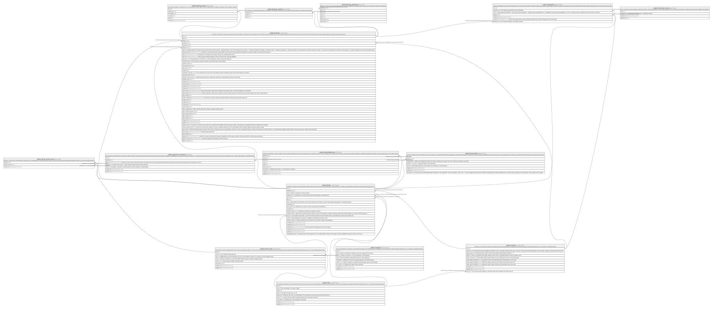

# postgres

## Tables

| Name                                            | Columns | Comment                                                                                                                                                                                                                | Type       |
| ----------------------------------------------- | ------- | ---------------------------------------------------------------------------------------------------------------------------------------------------------------------------------------------------------------------- | ---------- |
| [public.providers](public.providers.md)         | 11      | A business or host that sells Services or Experiences. One per login (owner_id is unique). Never deleted: bookings and payouts will point here, so a provider is suspended instead.                                    | BASE TABLE |
| [public.cities](public.cities.md)               | 9       | The places lokl operates. Admin-managed. Never deleted: providers and listings point here, so a city is deactivated instead.                                                                                           | BASE TABLE |
| [public.service_areas](public.service_areas.md) | 8       | Neighborhoods or zip codes within a city. Where "I come to you" Services travel, and the public location label on listings. Admin-managed. Never deleted: listings will point here, so an area is deactivated instead. | BASE TABLE |

## Stored procedures and functions

| Name                               | ReturnType | Arguments | Type     |
| ---------------------------------- | ---------- | --------- | -------- |
| public.is_admin                    | bool       |           | FUNCTION |
| public.set_updated_at              | trigger    |           | FUNCTION |
| public.providers_check_city_active | trigger    |           | FUNCTION |

## Enums

| Name | Values |
| ---- | ------- |
| auth.aal_level | aal1, aal2, aal3 |
| auth.code_challenge_method | plain, s256 |
| auth.factor_status | unverified, verified |
| auth.factor_type | phone, recovery_code, totp, webauthn |
| auth.oauth_authorization_status | approved, denied, expired, pending |
| auth.oauth_client_type | confidential, public |
| auth.oauth_registration_type | dynamic, manual |
| auth.oauth_response_type | code |
| auth.one_time_token_type | confirmation_token, email_change_token_current, email_change_token_new, phone_change_token, reauthentication_token, recovery_token |
| realtime.action | DELETE, ERROR, INSERT, TRUNCATE, UPDATE |
| realtime.equality_op | eq, gt, gte, ilike, imatch, in, is, isdistinct, like, lt, lte, match, neq |
| storage.buckettype | ANALYTICS, STANDARD, VECTOR |

## Relations

---

> Generated by [tbls](https://github.com/k1LoW/tbls)
