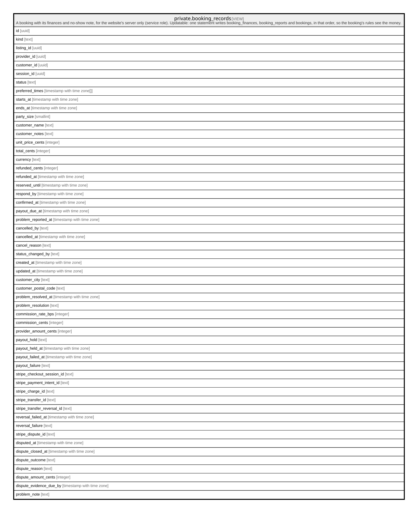

# private.booking_records

## Description

A booking with its finances and no-show note, for the website's server only (service role). Updatable: one statement writes booking_finances, booking_reports and bookings, in that order, so the booking's rules see the money.

<details>
<summary><strong>Table Definition</strong></summary>

```sql
CREATE VIEW booking_records AS (
 SELECT b.id,
    b.kind,
    b.listing_id,
    b.provider_id,
    b.customer_id,
    b.session_id,
    b.status,
    b.preferred_times,
    b.starts_at,
    b.ends_at,
    b.party_size,
    b.customer_name,
    b.customer_notes,
    b.unit_price_cents,
    b.total_cents,
    b.currency,
    b.refunded_cents,
    b.refunded_at,
    b.reserved_until,
    b.respond_by,
    b.confirmed_at,
    b.payout_due_at,
    b.problem_reported_at,
    b.cancelled_by,
    b.cancelled_at,
    b.cancel_reason,
    b.status_changed_by,
    b.created_at,
    b.updated_at,
    b.customer_city,
    b.customer_postal_code,
    b.problem_resolved_at,
    b.problem_resolution,
    f.commission_rate_bps,
    f.commission_cents,
    f.provider_amount_cents,
    f.payout_hold,
    f.payout_held_at,
    f.payout_failed_at,
    f.payout_failure,
    f.stripe_checkout_session_id,
    f.stripe_payment_intent_id,
    f.stripe_charge_id,
    f.stripe_transfer_id,
    f.stripe_transfer_reversal_id,
    f.reversal_failed_at,
    f.reversal_failure,
    f.stripe_dispute_id,
    f.disputed_at,
    f.dispute_closed_at,
    f.dispute_outcome,
    f.dispute_reason,
    f.dispute_amount_cents,
    f.dispute_evidence_due_by,
    r.note AS problem_note
   FROM ((bookings b
     JOIN booking_finances f ON ((f.booking_id = b.id)))
     LEFT JOIN booking_reports r ON ((r.booking_id = b.id)))
)
```

</details>

## Columns

| Name                        | Type                       | Default | Nullable | Children | Parents | Comment |
| --------------------------- | -------------------------- | ------- | -------- | -------- | ------- | ------- |
| id                          | uuid                       |         | true     |          |         |         |
| kind                        | text                       |         | true     |          |         |         |
| listing_id                  | uuid                       |         | true     |          |         |         |
| provider_id                 | uuid                       |         | true     |          |         |         |
| customer_id                 | uuid                       |         | true     |          |         |         |
| session_id                  | uuid                       |         | true     |          |         |         |
| status                      | text                       |         | true     |          |         |         |
| preferred_times             | timestamp with time zone[] |         | true     |          |         |         |
| starts_at                   | timestamp with time zone   |         | true     |          |         |         |
| ends_at                     | timestamp with time zone   |         | true     |          |         |         |
| party_size                  | smallint                   |         | true     |          |         |         |
| customer_name               | text                       |         | true     |          |         |         |
| customer_notes              | text                       |         | true     |          |         |         |
| unit_price_cents            | integer                    |         | true     |          |         |         |
| total_cents                 | integer                    |         | true     |          |         |         |
| currency                    | text                       |         | true     |          |         |         |
| refunded_cents              | integer                    |         | true     |          |         |         |
| refunded_at                 | timestamp with time zone   |         | true     |          |         |         |
| reserved_until              | timestamp with time zone   |         | true     |          |         |         |
| respond_by                  | timestamp with time zone   |         | true     |          |         |         |
| confirmed_at                | timestamp with time zone   |         | true     |          |         |         |
| payout_due_at               | timestamp with time zone   |         | true     |          |         |         |
| problem_reported_at         | timestamp with time zone   |         | true     |          |         |         |
| cancelled_by                | text                       |         | true     |          |         |         |
| cancelled_at                | timestamp with time zone   |         | true     |          |         |         |
| cancel_reason               | text                       |         | true     |          |         |         |
| status_changed_by           | text                       |         | true     |          |         |         |
| created_at                  | timestamp with time zone   |         | true     |          |         |         |
| updated_at                  | timestamp with time zone   |         | true     |          |         |         |
| customer_city               | text                       |         | true     |          |         |         |
| customer_postal_code        | text                       |         | true     |          |         |         |
| problem_resolved_at         | timestamp with time zone   |         | true     |          |         |         |
| problem_resolution          | text                       |         | true     |          |         |         |
| commission_rate_bps         | integer                    |         | true     |          |         |         |
| commission_cents            | integer                    |         | true     |          |         |         |
| provider_amount_cents       | integer                    |         | true     |          |         |         |
| payout_hold                 | text                       |         | true     |          |         |         |
| payout_held_at              | timestamp with time zone   |         | true     |          |         |         |
| payout_failed_at            | timestamp with time zone   |         | true     |          |         |         |
| payout_failure              | text                       |         | true     |          |         |         |
| stripe_checkout_session_id  | text                       |         | true     |          |         |         |
| stripe_payment_intent_id    | text                       |         | true     |          |         |         |
| stripe_charge_id            | text                       |         | true     |          |         |         |
| stripe_transfer_id          | text                       |         | true     |          |         |         |
| stripe_transfer_reversal_id | text                       |         | true     |          |         |         |
| reversal_failed_at          | timestamp with time zone   |         | true     |          |         |         |
| reversal_failure            | text                       |         | true     |          |         |         |
| stripe_dispute_id           | text                       |         | true     |          |         |         |
| disputed_at                 | timestamp with time zone   |         | true     |          |         |         |
| dispute_closed_at           | timestamp with time zone   |         | true     |          |         |         |
| dispute_outcome             | text                       |         | true     |          |         |         |
| dispute_reason              | text                       |         | true     |          |         |         |
| dispute_amount_cents        | integer                    |         | true     |          |         |         |
| dispute_evidence_due_by     | timestamp with time zone   |         | true     |          |         |         |
| problem_note                | text                       |         | true     |          |         |         |

## Referenced Tables

| Name                                                  | Columns | Comment                                                                                                                                                                                                                                                                                               | Type       |
| ----------------------------------------------------- | ------- | ----------------------------------------------------------------------------------------------------------------------------------------------------------------------------------------------------------------------------------------------------------------------------------------------------- | ---------- |
| [public.bookings](public.bookings.md)                 | 33      | A customer's booking of a Service (a request the provider accepts) or an Experience session (paid at once). Written only by the website's server. lokl holds the payment and transfers the provider's share 24 hours after the booking ends. Never deleted: payments, refunds and payouts point here. | BASE TABLE |
| [public.booking_finances](public.booking_finances.md) | 22      | A booking's money side: the commission split (copied at booking), payout holds and failures, Stripe ids, dispute and reversal details. Read by the booking's provider and admins, never the customer; written by the server. Never deleted.                                                           | BASE TABLE |
| [public.booking_reports](public.booking_reports.md)   | 3       | The customer's "the provider didn't show up" note. Read by that customer and admins, never the provider; written by the server; final once written. Never deleted.                                                                                                                                    | BASE TABLE |

## Triggers

| Name                   | Definition                                                                                                                                        |
| ---------------------- | ------------------------------------------------------------------------------------------------------------------------------------------------- |
| booking_records_update | CREATE TRIGGER booking_records_update INSTEAD OF UPDATE ON private.booking_records FOR EACH ROW EXECUTE FUNCTION private.booking_records_update() |

## Relations



---

> Generated by [tbls](https://github.com/k1LoW/tbls)
