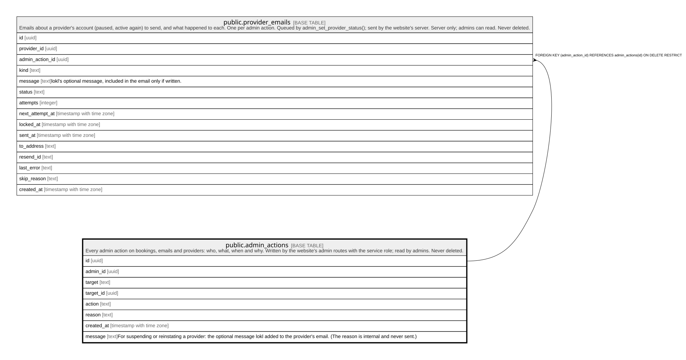

# public.admin_actions

## Description

Every admin action on bookings, emails and providers: who, what, when and why. Written by the website's admin routes with the service role; read by admins. Never deleted.

## Columns

| Name       | Type                     | Default           | Nullable | Children                                            | Parents | Comment                                                                                                                                     |
| ---------- | ------------------------ | ----------------- | -------- | --------------------------------------------------- | ------- | ------------------------------------------------------------------------------------------------------------------------------------------- |
| id         | uuid                     | gen_random_uuid() | false    | [public.provider_emails](public.provider_emails.md) |         |                                                                                                                                             |
| admin_id   | uuid                     |                   | true     |                                                     |         |                                                                                                                                             |
| target     | text                     |                   | false    |                                                     |         |                                                                                                                                             |
| target_id  | uuid                     |                   | false    |                                                     |         |                                                                                                                                             |
| action     | text                     |                   | false    |                                                     |         |                                                                                                                                             |
| reason     | text                     |                   | true     |                                                     |         |                                                                                                                                             |
| created_at | timestamp with time zone | clock_timestamp() | false    |                                                     |         |                                                                                                                                             |
| message    | text                     |                   | true     |                                                     |         | For suspending or reinstating a provider: the optional message lokl added to the provider's email. (The reason is internal and never sent.) |
| rule       | text                     |                   | true     |                                                     |         | For review moderation: the written review rule the removal applied.                                                                         |

## Constraints

| Name                        | Type        | Definition                                                                                                                                                                                                                                                                                                                                                                                          |
| --------------------------- | ----------- | --------------------------------------------------------------------------------------------------------------------------------------------------------------------------------------------------------------------------------------------------------------------------------------------------------------------------------------------------------------------------------------------------- |
| admin_actions_action_check  | CHECK       | CHECK ((action = ANY (ARRAY['cancel_booking'::text, 'release_payout'::text, 'resolve_problem_paid'::text, 'resolve_problem_refunded'::text, 'retry_email'::text, 'suspend_provider'::text, 'reinstate_provider'::text, 'remove_profile_content'::text, 'remove_review'::text, 'restore_review'::text, 'remove_review_reply'::text, 'restore_review_reply'::text, 'dismiss_review_reports'::text]))) |
| admin_actions_message_check | CHECK       | CHECK ((char_length(message) <= 1000))                                                                                                                                                                                                                                                                                                                                                              |
| admin_actions_reason        | CHECK       | CHECK (((action = 'retry_email'::text) OR (char_length(TRIM(BOTH FROM reason)) >= 5)))                                                                                                                                                                                                                                                                                                              |
| admin_actions_reason_check  | CHECK       | CHECK ((char_length(reason) <= 1000))                                                                                                                                                                                                                                                                                                                                                               |
| admin_actions_rule_check    | CHECK       | CHECK ((char_length(rule) <= 60))                                                                                                                                                                                                                                                                                                                                                                   |
| admin_actions_target_check  | CHECK       | CHECK ((target = ANY (ARRAY['booking'::text, 'provider'::text, 'email'::text, 'review'::text])))                                                                                                                                                                                                                                                                                                    |
| admin_actions_admin_id_fkey | FOREIGN KEY | FOREIGN KEY (admin_id) REFERENCES auth.users(id) ON DELETE SET NULL                                                                                                                                                                                                                                                                                                                                 |
| admin_actions_pkey          | PRIMARY KEY | PRIMARY KEY (id)                                                                                                                                                                                                                                                                                                                                                                                    |

## Indexes

| Name                     | Definition                                                                                                |
| ------------------------ | --------------------------------------------------------------------------------------------------------- |
| admin_actions_pkey       | CREATE UNIQUE INDEX admin_actions_pkey ON public.admin_actions USING btree (id)                           |
| admin_actions_target_idx | CREATE INDEX admin_actions_target_idx ON public.admin_actions USING btree (target, target_id, created_at) |

## Relations

---

> Generated by [tbls](https://github.com/k1LoW/tbls)
