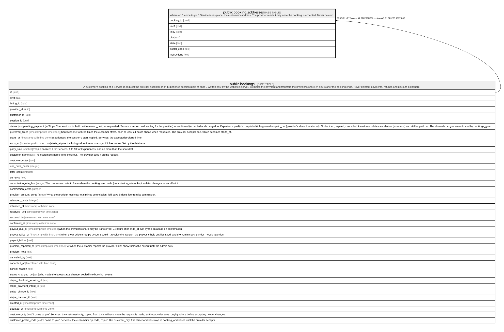

# public.booking_addresses

## Description

Where an "I come to you" Service takes place: the customer's address. The provider reads it only once the booking is accepted. Never deleted.

## Columns

| Name         | Type | Default | Nullable | Children | Parents                               | Comment |
| ------------ | ---- | ------- | -------- | -------- | ------------------------------------- | ------- |
| booking_id   | uuid |         | false    |          | [public.bookings](public.bookings.md) |         |
| line1        | text |         | false    |          |                                       |         |
| line2        | text |         | true     |          |                                       |         |
| city         | text |         | false    |          |                                       |         |
| state        | text |         | false    |          |                                       |         |
| postal_code  | text |         | false    |          |                                       |         |
| instructions | text |         | true     |          |                                       |         |

## Constraints

| Name                                 | Type        | Definition                                                          |
| ------------------------------------ | ----------- | ------------------------------------------------------------------- |
| booking_addresses_city_check         | CHECK       | CHECK (((char_length(city) >= 2) AND (char_length(city) <= 80)))    |
| booking_addresses_instructions_check | CHECK       | CHECK ((char_length(instructions) <= 500))                          |
| booking_addresses_line1_check        | CHECK       | CHECK (((char_length(line1) >= 3) AND (char_length(line1) <= 200))) |
| booking_addresses_line2_check        | CHECK       | CHECK ((char_length(line2) <= 200))                                 |
| booking_addresses_postal_code_check  | CHECK       | CHECK ((postal_code ~ '^[0-9]{5}(-[0-9]{4})?$'::text))              |
| booking_addresses_state_check        | CHECK       | CHECK ((state ~ '^[A-Z]{2}$'::text))                                |
| booking_addresses_booking_id_fkey    | FOREIGN KEY | FOREIGN KEY (booking_id) REFERENCES bookings(id) ON DELETE RESTRICT |
| booking_addresses_pkey               | PRIMARY KEY | PRIMARY KEY (booking_id)                                            |

## Indexes

| Name                   | Definition                                                                                      |
| ---------------------- | ----------------------------------------------------------------------------------------------- |
| booking_addresses_pkey | CREATE UNIQUE INDEX booking_addresses_pkey ON public.booking_addresses USING btree (booking_id) |

## Relations

---

> Generated by [tbls](https://github.com/k1LoW/tbls)
