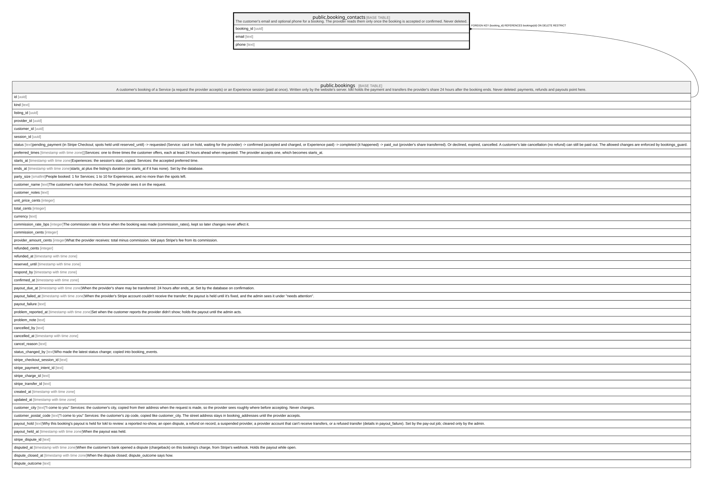

# public.booking_contacts

## Description

The customer's email and optional phone for a booking. The provider reads them only once the booking is accepted or confirmed. Never deleted.

## Columns

| Name       | Type | Default | Nullable | Children | Parents                               | Comment |
| ---------- | ---- | ------- | -------- | -------- | ------------------------------------- | ------- |
| booking_id | uuid |         | false    |          | [public.bookings](public.bookings.md) |         |
| email      | text |         | false    |          |                                       |         |
| phone      | text |         | true     |          |                                       |         |

## Constraints

| Name                             | Type        | Definition                                                                             |
| -------------------------------- | ----------- | -------------------------------------------------------------------------------------- |
| booking_contacts_email_check     | CHECK       | CHECK (((email ~ '^[^@\s]+@[^@\s]+\.[^@\s]+$'::text) AND (char_length(email) <= 320))) |
| booking_contacts_phone_check     | CHECK       | CHECK (((char_length(phone) >= 7) AND (char_length(phone) <= 30)))                     |
| booking_contacts_booking_id_fkey | FOREIGN KEY | FOREIGN KEY (booking_id) REFERENCES bookings(id) ON DELETE RESTRICT                    |
| booking_contacts_pkey            | PRIMARY KEY | PRIMARY KEY (booking_id)                                                               |

## Indexes

| Name                  | Definition                                                                                    |
| --------------------- | --------------------------------------------------------------------------------------------- |
| booking_contacts_pkey | CREATE UNIQUE INDEX booking_contacts_pkey ON public.booking_contacts USING btree (booking_id) |

## Relations

---

> Generated by [tbls](https://github.com/k1LoW/tbls)
