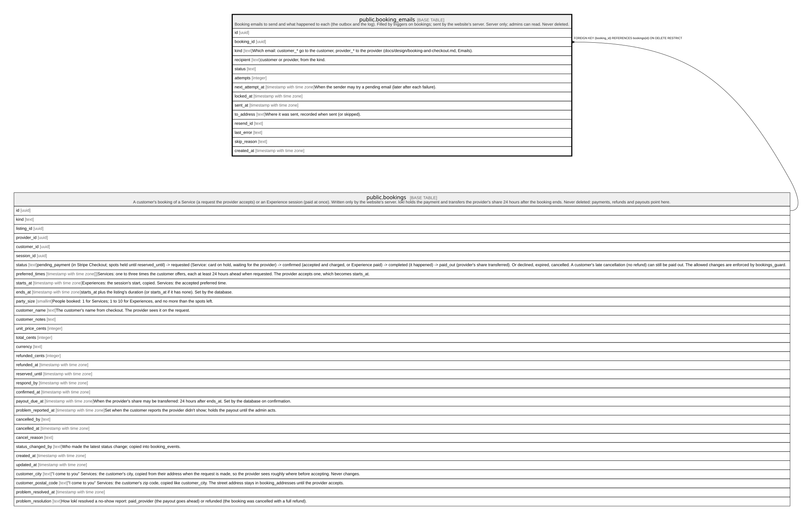

# public.booking_emails

## Description

Booking emails to send and what happened to each (the outbox and the log). Filled by triggers on bookings; sent by the website's server. Server only; admins can read. Never deleted.

## Columns

| Name            | Type                     | Default           | Nullable | Extra Definition                                          | Children | Parents                               | Comment                                                                                                               |
| --------------- | ------------------------ | ----------------- | -------- | --------------------------------------------------------- | -------- | ------------------------------------- | --------------------------------------------------------------------------------------------------------------------- |
| id              | uuid                     | gen_random_uuid() | false    |                                                           |          |                                       |                                                                                                                       |
| booking_id      | uuid                     |                   | false    |                                                           |          | [public.bookings](public.bookings.md) |                                                                                                                       |
| kind            | text                     |                   | false    |                                                           |          |                                       | Which email: customer_* go to the customer, provider_* to the provider (docs/design/booking-and-checkout.md, Emails). |
| recipient       | text                     |                   | false    | GENERATED ALWAYS AS split_part(kind, '_'::text, 1) STORED |          |                                       | customer or provider, from the kind.                                                                                  |
| status          | text                     | 'pending'::text   | false    |                                                           |          |                                       |                                                                                                                       |
| attempts        | integer                  | 0                 | false    |                                                           |          |                                       |                                                                                                                       |
| next_attempt_at | timestamp with time zone | now()             | false    |                                                           |          |                                       | When the sender may try a pending email (later after each failure).                                                   |
| locked_at       | timestamp with time zone |                   | true     |                                                           |          |                                       |                                                                                                                       |
| sent_at         | timestamp with time zone |                   | true     |                                                           |          |                                       |                                                                                                                       |
| to_address      | text                     |                   | true     |                                                           |          |                                       | Where it was sent, recorded when sent (or skipped).                                                                   |
| resend_id       | text                     |                   | true     |                                                           |          |                                       |                                                                                                                       |
| last_error      | text                     |                   | true     |                                                           |          |                                       |                                                                                                                       |
| skip_reason     | text                     |                   | true     |                                                           |          |                                       |                                                                                                                       |
| created_at      | timestamp with time zone | clock_timestamp() | false    |                                                           |          |                                       |                                                                                                                       |

## Constraints

| Name                             | Type        | Definition                                                                                                                                                                                                                                                                                                                                                                                                                                                                                                                                                                                                                 |
| -------------------------------- | ----------- | -------------------------------------------------------------------------------------------------------------------------------------------------------------------------------------------------------------------------------------------------------------------------------------------------------------------------------------------------------------------------------------------------------------------------------------------------------------------------------------------------------------------------------------------------------------------------------------------------------------------------- |
| booking_emails_attempts_check    | CHECK       | CHECK ((attempts >= 0))                                                                                                                                                                                                                                                                                                                                                                                                                                                                                                                                                                                                    |
| booking_emails_kind_check        | CHECK       | CHECK ((kind = ANY (ARRAY['customer_request_sent'::text, 'customer_request_accepted'::text, 'customer_request_declined'::text, 'customer_request_expired'::text, 'customer_booking_confirmed'::text, 'customer_booking_cancelled'::text, 'customer_problem_received'::text, 'customer_problem_refunded'::text, 'provider_new_request'::text, 'provider_new_booking'::text, 'provider_booking_cancelled'::text, 'provider_request_unanswered'::text, 'provider_payout_sent'::text, 'provider_problem_reported'::text, 'provider_payout_problem'::text, 'provider_problem_paid'::text, 'provider_problem_refunded'::text]))) |
| booking_emails_last_error_check  | CHECK       | CHECK ((char_length(last_error) <= 500))                                                                                                                                                                                                                                                                                                                                                                                                                                                                                                                                                                                   |
| booking_emails_sent_has_time     | CHECK       | CHECK (((status <> 'sent'::text) OR (sent_at IS NOT NULL)))                                                                                                                                                                                                                                                                                                                                                                                                                                                                                                                                                                |
| booking_emails_skip_reason_check | CHECK       | CHECK ((char_length(skip_reason) <= 200))                                                                                                                                                                                                                                                                                                                                                                                                                                                                                                                                                                                  |
| booking_emails_status_check      | CHECK       | CHECK ((status = ANY (ARRAY['pending'::text, 'sending'::text, 'sent'::text, 'skipped'::text, 'failed'::text])))                                                                                                                                                                                                                                                                                                                                                                                                                                                                                                            |
| booking_emails_to_address_check  | CHECK       | CHECK ((char_length(to_address) <= 320))                                                                                                                                                                                                                                                                                                                                                                                                                                                                                                                                                                                   |
| booking_emails_booking_id_fkey   | FOREIGN KEY | FOREIGN KEY (booking_id) REFERENCES bookings(id) ON DELETE RESTRICT                                                                                                                                                                                                                                                                                                                                                                                                                                                                                                                                                        |
| booking_emails_pkey              | PRIMARY KEY | PRIMARY KEY (id)                                                                                                                                                                                                                                                                                                                                                                                                                                                                                                                                                                                                           |
| booking_emails_once              | UNIQUE      | UNIQUE (booking_id, kind)                                                                                                                                                                                                                                                                                                                                                                                                                                                                                                                                                                                                  |

## Indexes

| Name                   | Definition                                                                                                                                                |
| ---------------------- | --------------------------------------------------------------------------------------------------------------------------------------------------------- |
| booking_emails_pkey    | CREATE UNIQUE INDEX booking_emails_pkey ON public.booking_emails USING btree (id)                                                                         |
| booking_emails_once    | CREATE UNIQUE INDEX booking_emails_once ON public.booking_emails USING btree (booking_id, kind)                                                           |
| booking_emails_due_idx | CREATE INDEX booking_emails_due_idx ON public.booking_emails USING btree (next_attempt_at) WHERE (status = ANY (ARRAY['pending'::text, 'sending'::text])) |

## Relations

---

> Generated by [tbls](https://github.com/k1LoW/tbls)
