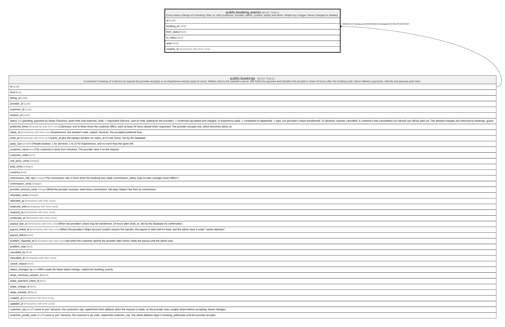

# public.booking_events

## Description

Every status change of a booking: from, to, who (customer, provider, admin, system, stripe) and when. Written by a trigger. Never changed or deleted.

## Columns

| Name        | Type                     | Default           | Nullable | Children | Parents                               | Comment |
| ----------- | ------------------------ | ----------------- | -------- | -------- | ------------------------------------- | ------- |
| id          | uuid                     | gen_random_uuid() | false    |          |                                       |         |
| booking_id  | uuid                     |                   | false    |          | [public.bookings](public.bookings.md) |         |
| from_status | text                     |                   | true     |          |                                       |         |
| to_status   | text                     |                   | false    |          |                                       |         |
| actor       | text                     |                   | false    |          |                                       |         |
| created_at  | timestamp with time zone | clock_timestamp() | false    |          |                                       |         |

## Constraints

| Name                           | Type        | Definition                                                          |
| ------------------------------ | ----------- | ------------------------------------------------------------------- |
| booking_events_booking_id_fkey | FOREIGN KEY | FOREIGN KEY (booking_id) REFERENCES bookings(id) ON DELETE RESTRICT |
| booking_events_pkey            | PRIMARY KEY | PRIMARY KEY (id)                                                    |

## Indexes

| Name                          | Definition                                                                                               |
| ----------------------------- | -------------------------------------------------------------------------------------------------------- |
| booking_events_pkey           | CREATE UNIQUE INDEX booking_events_pkey ON public.booking_events USING btree (id)                        |
| booking_events_booking_id_idx | CREATE INDEX booking_events_booking_id_idx ON public.booking_events USING btree (booking_id, created_at) |

## Relations

---

> Generated by [tbls](https://github.com/k1LoW/tbls)
