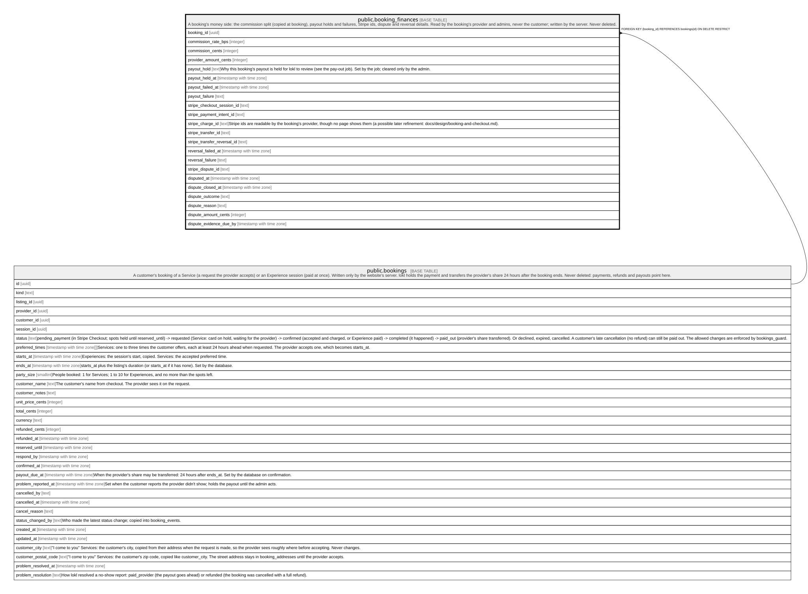

# public.booking_finances

## Description

A booking's money side: the commission split (copied at booking), payout holds and failures, Stripe ids, dispute and reversal details. Read by the booking's provider and admins, never the customer; written by the server. Never deleted.

## Columns

| Name                        | Type                     | Default      | Nullable | Children | Parents                               | Comment                                                                                                                                                                                                                                                                                                            |
| --------------------------- | ------------------------ | ------------ | -------- | -------- | ------------------------------------- | ------------------------------------------------------------------------------------------------------------------------------------------------------------------------------------------------------------------------------------------------------------------------------------------------------------------ |
| booking_id                  | uuid                     |              | false    |          | [public.bookings](public.bookings.md) |                                                                                                                                                                                                                                                                                                                    |
| commission_rate_bps         | integer                  |              | false    |          |                                       |                                                                                                                                                                                                                                                                                                                    |
| commission_cents            | integer                  |              | false    |          |                                       |                                                                                                                                                                                                                                                                                                                    |
| provider_amount_cents       | integer                  |              | false    |          |                                       |                                                                                                                                                                                                                                                                                                                    |
| payout_hold                 | text                     |              | true     |          |                                       | Why this booking's payout is held for lokl to review (see the pay-out job). Set by the job; cleared only by the admin.                                                                                                                                                                                             |
| payout_held_at              | timestamp with time zone |              | true     |          |                                       |                                                                                                                                                                                                                                                                                                                    |
| payout_failed_at            | timestamp with time zone |              | true     |          |                                       |                                                                                                                                                                                                                                                                                                                    |
| payout_failure              | text                     |              | true     |          |                                       |                                                                                                                                                                                                                                                                                                                    |
| stripe_checkout_session_id  | text                     |              | true     |          |                                       |                                                                                                                                                                                                                                                                                                                    |
| stripe_payment_intent_id    | text                     |              | true     |          |                                       |                                                                                                                                                                                                                                                                                                                    |
| stripe_charge_id            | text                     |              | true     |          |                                       | Stripe ids are readable by the booking's provider, though no page shows them (a possible later refinement: docs/design/booking-and-checkout.md).                                                                                                                                                                   |
| stripe_transfer_id          | text                     |              | true     |          |                                       |                                                                                                                                                                                                                                                                                                                    |
| stripe_transfer_reversal_id | text                     |              | true     |          |                                       |                                                                                                                                                                                                                                                                                                                    |
| reversal_failed_at          | timestamp with time zone |              | true     |          |                                       |                                                                                                                                                                                                                                                                                                                    |
| reversal_failure            | text                     |              | true     |          |                                       |                                                                                                                                                                                                                                                                                                                    |
| stripe_dispute_id           | text                     |              | true     |          |                                       |                                                                                                                                                                                                                                                                                                                    |
| disputed_at                 | timestamp with time zone |              | true     |          |                                       |                                                                                                                                                                                                                                                                                                                    |
| dispute_closed_at           | timestamp with time zone |              | true     |          |                                       |                                                                                                                                                                                                                                                                                                                    |
| dispute_outcome             | text                     |              | true     |          |                                       |                                                                                                                                                                                                                                                                                                                    |
| dispute_reason              | text                     |              | true     |          |                                       |                                                                                                                                                                                                                                                                                                                    |
| dispute_amount_cents        | integer                  |              | true     |          |                                       |                                                                                                                                                                                                                                                                                                                    |
| dispute_evidence_due_by     | timestamp with time zone |              | true     |          |                                       |                                                                                                                                                                                                                                                                                                                    |
| payout_holds_released       | text[]                   | '{}'::text[] | false    |          |                                       | Payout hold reasons an admin has released for this booking (release-payout). The pay-out job doesn't hold the payout again for a released judgement (a lost dispute, a refund, a suspended provider); an open dispute and a reported problem always hold, and a fresh refusal from Stripe holds again. Only grows. |

## Constraints

| Name                                            | Type        | Definition                                                                                                                                                                                 |
| ----------------------------------------------- | ----------- | ------------------------------------------------------------------------------------------------------------------------------------------------------------------------------------------ |
| booking_finances_commission_cents_check         | CHECK       | CHECK ((commission_cents >= 0))                                                                                                                                                            |
| booking_finances_commission_rate_bps_check      | CHECK       | CHECK (((commission_rate_bps >= 0) AND (commission_rate_bps <= 5000)))                                                                                                                     |
| booking_finances_dispute_amount_cents_check     | CHECK       | CHECK ((dispute_amount_cents >= 0))                                                                                                                                                        |
| booking_finances_dispute_order                  | CHECK       | CHECK (((dispute_closed_at IS NULL) OR (disputed_at IS NOT NULL)))                                                                                                                         |
| booking_finances_dispute_outcome_check          | CHECK       | CHECK ((dispute_outcome = ANY (ARRAY['won'::text, 'lost'::text, 'warning_closed'::text])))                                                                                                 |
| booking_finances_dispute_reason_check           | CHECK       | CHECK ((char_length(dispute_reason) <= 100))                                                                                                                                               |
| booking_finances_hold_dated                     | CHECK       | CHECK (((payout_hold IS NULL) = (payout_held_at IS NULL)))                                                                                                                                 |
| booking_finances_payout_failure_check           | CHECK       | CHECK ((char_length(payout_failure) <= 500))                                                                                                                                               |
| booking_finances_payout_hold_check              | CHECK       | CHECK ((payout_hold = ANY (ARRAY['problem_reported'::text, 'dispute'::text, 'refunded'::text, 'provider_suspended'::text, 'account_cannot_receive'::text, 'transfer_failed'::text])))      |
| booking_finances_payout_holds_released_check    | CHECK       | CHECK ((payout_holds_released <@ ARRAY['problem_reported'::text, 'dispute'::text, 'refunded'::text, 'provider_suspended'::text, 'account_cannot_receive'::text, 'transfer_failed'::text])) |
| booking_finances_provider_amount_cents_check    | CHECK       | CHECK ((provider_amount_cents >= 0))                                                                                                                                                       |
| booking_finances_reversal_failure_check         | CHECK       | CHECK ((char_length(reversal_failure) <= 500))                                                                                                                                             |
| booking_finances_booking_id_fkey                | FOREIGN KEY | FOREIGN KEY (booking_id) REFERENCES bookings(id) ON DELETE RESTRICT                                                                                                                        |
| booking_finances_pkey                           | PRIMARY KEY | PRIMARY KEY (booking_id)                                                                                                                                                                   |
| booking_finances_stripe_checkout_session_id_key | UNIQUE      | UNIQUE (stripe_checkout_session_id)                                                                                                                                                        |
| booking_finances_stripe_payment_intent_id_key   | UNIQUE      | UNIQUE (stripe_payment_intent_id)                                                                                                                                                          |
| booking_finances_stripe_transfer_id_key         | UNIQUE      | UNIQUE (stripe_transfer_id)                                                                                                                                                                |

## Indexes

| Name                                            | Definition                                                                                                                                 |
| ----------------------------------------------- | ------------------------------------------------------------------------------------------------------------------------------------------ |
| booking_finances_pkey                           | CREATE UNIQUE INDEX booking_finances_pkey ON public.booking_finances USING btree (booking_id)                                              |
| booking_finances_stripe_checkout_session_id_key | CREATE UNIQUE INDEX booking_finances_stripe_checkout_session_id_key ON public.booking_finances USING btree (stripe_checkout_session_id)    |
| booking_finances_stripe_payment_intent_id_key   | CREATE UNIQUE INDEX booking_finances_stripe_payment_intent_id_key ON public.booking_finances USING btree (stripe_payment_intent_id)        |
| booking_finances_stripe_transfer_id_key         | CREATE UNIQUE INDEX booking_finances_stripe_transfer_id_key ON public.booking_finances USING btree (stripe_transfer_id)                    |
| booking_finances_charge_idx                     | CREATE INDEX booking_finances_charge_idx ON public.booking_finances USING btree (stripe_charge_id) WHERE (stripe_charge_id IS NOT NULL)    |
| booking_finances_dispute_idx                    | CREATE INDEX booking_finances_dispute_idx ON public.booking_finances USING btree (stripe_dispute_id) WHERE (stripe_dispute_id IS NOT NULL) |

## Triggers

| Name                                 | Definition                                                                                                                                                                                                                                                                                        |
| ------------------------------------ | ------------------------------------------------------------------------------------------------------------------------------------------------------------------------------------------------------------------------------------------------------------------------------------------------- |
| booking_finances_guard               | CREATE TRIGGER booking_finances_guard BEFORE INSERT OR UPDATE ON public.booking_finances FOR EACH ROW EXECUTE FUNCTION booking_finances_guard()                                                                                                                                                   |
| booking_finances_queue_emails        | CREATE TRIGGER booking_finances_queue_emails AFTER UPDATE OF payout_hold ON public.booking_finances FOR EACH ROW WHEN (((old.payout_hold IS NULL) AND (new.payout_hold = ANY (ARRAY['account_cannot_receive'::text, 'transfer_failed'::text])))) EXECUTE FUNCTION booking_finances_queue_emails() |
| booking_finances_released_only_grows | CREATE TRIGGER booking_finances_released_only_grows BEFORE UPDATE OF payout_holds_released ON public.booking_finances FOR EACH ROW EXECUTE FUNCTION booking_finances_released_only_grows()                                                                                                        |

## Relations

---

> Generated by [tbls](https://github.com/k1LoW/tbls)
