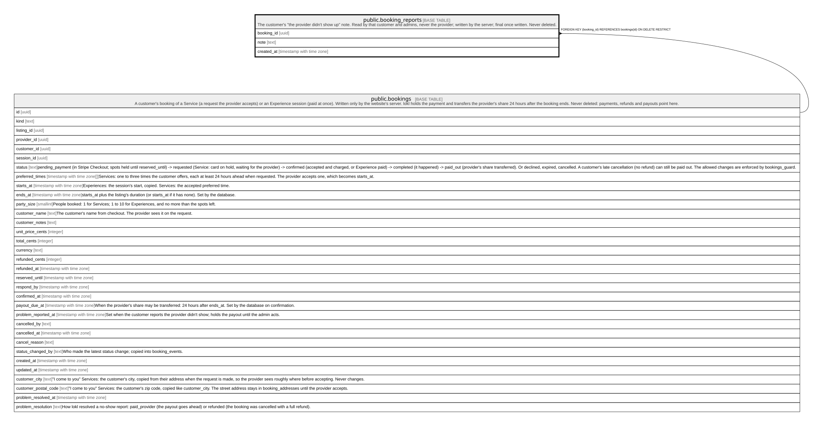

# public.booking_reports

## Description

The customer's "the provider didn't show up" note. Read by that customer and admins, never the provider; written by the server; final once written. Never deleted.

## Columns

| Name       | Type                     | Default | Nullable | Children | Parents                               | Comment |
| ---------- | ------------------------ | ------- | -------- | -------- | ------------------------------------- | ------- |
| booking_id | uuid                     |         | false    |          | [public.bookings](public.bookings.md) |         |
| note       | text                     |         | false    |          |                                       |         |
| created_at | timestamp with time zone | now()   | false    |          |                                       |         |

## Constraints

| Name                            | Type        | Definition                                                          |
| ------------------------------- | ----------- | ------------------------------------------------------------------- |
| booking_reports_note_check      | CHECK       | CHECK ((char_length(note) <= 1000))                                 |
| booking_reports_booking_id_fkey | FOREIGN KEY | FOREIGN KEY (booking_id) REFERENCES bookings(id) ON DELETE RESTRICT |
| booking_reports_pkey            | PRIMARY KEY | PRIMARY KEY (booking_id)                                            |

## Indexes

| Name                 | Definition                                                                                  |
| -------------------- | ------------------------------------------------------------------------------------------- |
| booking_reports_pkey | CREATE UNIQUE INDEX booking_reports_pkey ON public.booking_reports USING btree (booking_id) |

## Triggers

| Name                  | Definition                                                                                                                         |
| --------------------- | ---------------------------------------------------------------------------------------------------------------------------------- |
| booking_reports_final | CREATE TRIGGER booking_reports_final BEFORE UPDATE ON public.booking_reports FOR EACH ROW EXECUTE FUNCTION booking_reports_final() |

## Relations

---

> Generated by [tbls](https://github.com/k1LoW/tbls)
