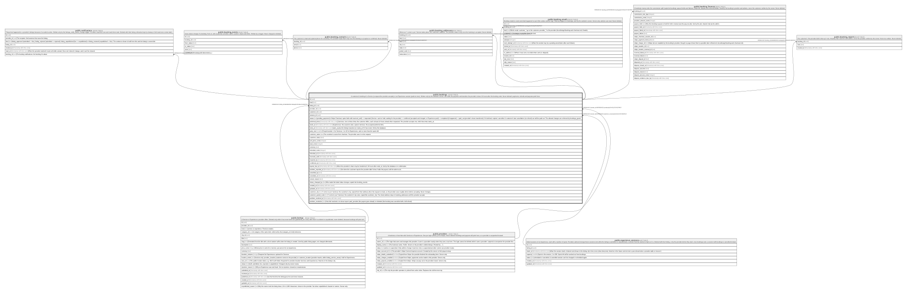

# public.bookings

## Description

A customer's booking of a Service (a request the provider accepts) or an Experience session (paid at once). Written only by the website's server. lokl holds the payment and transfers the provider's share 24 hours after the booking ends. Never deleted: payments, refunds and payouts point here.

## Columns

| Name                 | Type                       | Default                 | Nullable | Children                                                                                                                                                                                                                                                                                                                                                                    | Parents                                                     | Comment                                                                                                                                                                                                                                                                                                                                                                                                                        |
| -------------------- | -------------------------- | ----------------------- | -------- | --------------------------------------------------------------------------------------------------------------------------------------------------------------------------------------------------------------------------------------------------------------------------------------------------------------------------------------------------------------------------- | ----------------------------------------------------------- | ------------------------------------------------------------------------------------------------------------------------------------------------------------------------------------------------------------------------------------------------------------------------------------------------------------------------------------------------------------------------------------------------------------------------------ |
| id                   | uuid                       | gen_random_uuid()       | false    | [public.notifications](public.notifications.md) [public.booking_events](public.booking_events.md) [public.booking_contacts](public.booking_contacts.md) [public.booking_addresses](public.booking_addresses.md) [public.booking_emails](public.booking_emails.md) [public.booking_finances](public.booking_finances.md) [public.booking_reports](public.booking_reports.md) |                                                             |                                                                                                                                                                                                                                                                                                                                                                                                                                |
| kind                 | text                       |                         | false    |                                                                                                                                                                                                                                                                                                                                                                             |                                                             |                                                                                                                                                                                                                                                                                                                                                                                                                                |
| listing_id           | uuid                       |                         | false    |                                                                                                                                                                                                                                                                                                                                                                             | [public.listings](public.listings.md)                       |                                                                                                                                                                                                                                                                                                                                                                                                                                |
| provider_id          | uuid                       |                         | false    |                                                                                                                                                                                                                                                                                                                                                                             | [public.providers](public.providers.md)                     |                                                                                                                                                                                                                                                                                                                                                                                                                                |
| customer_id          | uuid                       |                         | false    |                                                                                                                                                                                                                                                                                                                                                                             |                                                             |                                                                                                                                                                                                                                                                                                                                                                                                                                |
| session_id           | uuid                       |                         | true     |                                                                                                                                                                                                                                                                                                                                                                             | [public.experience_sessions](public.experience_sessions.md) |                                                                                                                                                                                                                                                                                                                                                                                                                                |
| status               | text                       | 'pending_payment'::text | false    |                                                                                                                                                                                                                                                                                                                                                                             |                                                             | pending_payment (in Stripe Checkout; spots held until reserved_until) -\> requested (Service: card on hold, waiting for the provider) -\> confirmed (accepted and charged, or Experience paid) -\> completed (it happened) -\> paid_out (provider's share transferred). Or declined, expired, cancelled. A customer's late cancellation (no refund) can still be paid out. The allowed changes are enforced by bookings_guard. |
| preferred_times      | timestamp with time zone[] |                         | true     |                                                                                                                                                                                                                                                                                                                                                                             |                                                             | Services: one to three times the customer offers, each at least 24 hours ahead when requested. The provider accepts one, which becomes starts_at.                                                                                                                                                                                                                                                                              |
| starts_at            | timestamp with time zone   |                         | true     |                                                                                                                                                                                                                                                                                                                                                                             |                                                             | Experiences: the session's start, copied. Services: the accepted preferred time.                                                                                                                                                                                                                                                                                                                                               |
| ends_at              | timestamp with time zone   |                         | true     |                                                                                                                                                                                                                                                                                                                                                                             |                                                             | starts_at plus the listing's duration (or starts_at if it has none). Set by the database.                                                                                                                                                                                                                                                                                                                                      |
| party_size           | smallint                   | 1                       | false    |                                                                                                                                                                                                                                                                                                                                                                             |                                                             | People booked: 1 for Services; 1 to 10 for Experiences, and no more than the spots left.                                                                                                                                                                                                                                                                                                                                       |
| customer_name        | text                       |                         | false    |                                                                                                                                                                                                                                                                                                                                                                             |                                                             | The customer's name from checkout. The provider sees it on the request.                                                                                                                                                                                                                                                                                                                                                        |
| customer_notes       | text                       |                         | true     |                                                                                                                                                                                                                                                                                                                                                                             |                                                             |                                                                                                                                                                                                                                                                                                                                                                                                                                |
| unit_price_cents     | integer                    |                         | false    |                                                                                                                                                                                                                                                                                                                                                                             |                                                             |                                                                                                                                                                                                                                                                                                                                                                                                                                |
| total_cents          | integer                    |                         | false    |                                                                                                                                                                                                                                                                                                                                                                             |                                                             |                                                                                                                                                                                                                                                                                                                                                                                                                                |
| currency             | text                       | 'usd'::text             | false    |                                                                                                                                                                                                                                                                                                                                                                             |                                                             |                                                                                                                                                                                                                                                                                                                                                                                                                                |
| refunded_cents       | integer                    | 0                       | false    |                                                                                                                                                                                                                                                                                                                                                                             |                                                             |                                                                                                                                                                                                                                                                                                                                                                                                                                |
| refunded_at          | timestamp with time zone   |                         | true     |                                                                                                                                                                                                                                                                                                                                                                             |                                                             |                                                                                                                                                                                                                                                                                                                                                                                                                                |
| reserved_until       | timestamp with time zone   |                         | true     |                                                                                                                                                                                                                                                                                                                                                                             |                                                             |                                                                                                                                                                                                                                                                                                                                                                                                                                |
| respond_by           | timestamp with time zone   |                         | true     |                                                                                                                                                                                                                                                                                                                                                                             |                                                             |                                                                                                                                                                                                                                                                                                                                                                                                                                |
| confirmed_at         | timestamp with time zone   |                         | true     |                                                                                                                                                                                                                                                                                                                                                                             |                                                             |                                                                                                                                                                                                                                                                                                                                                                                                                                |
| payout_due_at        | timestamp with time zone   |                         | true     |                                                                                                                                                                                                                                                                                                                                                                             |                                                             | When the provider's share may be transferred: 24 hours after ends_at. Set by the database on confirmation.                                                                                                                                                                                                                                                                                                                     |
| problem_reported_at  | timestamp with time zone   |                         | true     |                                                                                                                                                                                                                                                                                                                                                                             |                                                             | Set when the customer reports the provider didn't show; holds the payout until the admin acts.                                                                                                                                                                                                                                                                                                                                 |
| cancelled_by         | text                       |                         | true     |                                                                                                                                                                                                                                                                                                                                                                             |                                                             |                                                                                                                                                                                                                                                                                                                                                                                                                                |
| cancelled_at         | timestamp with time zone   |                         | true     |                                                                                                                                                                                                                                                                                                                                                                             |                                                             |                                                                                                                                                                                                                                                                                                                                                                                                                                |
| cancel_reason        | text                       |                         | true     |                                                                                                                                                                                                                                                                                                                                                                             |                                                             |                                                                                                                                                                                                                                                                                                                                                                                                                                |
| status_changed_by    | text                       | 'system'::text          | false    |                                                                                                                                                                                                                                                                                                                                                                             |                                                             | Who made the latest status change; copied into booking_events.                                                                                                                                                                                                                                                                                                                                                                 |
| created_at           | timestamp with time zone   | now()                   | false    |                                                                                                                                                                                                                                                                                                                                                                             |                                                             |                                                                                                                                                                                                                                                                                                                                                                                                                                |
| updated_at           | timestamp with time zone   | now()                   | false    |                                                                                                                                                                                                                                                                                                                                                                             |                                                             |                                                                                                                                                                                                                                                                                                                                                                                                                                |
| customer_city        | text                       |                         | true     |                                                                                                                                                                                                                                                                                                                                                                             |                                                             | "I come to you" Services: the customer's city, copied from their address when the request is made, so the provider sees roughly where before accepting. Never changes.                                                                                                                                                                                                                                                         |
| customer_postal_code | text                       |                         | true     |                                                                                                                                                                                                                                                                                                                                                                             |                                                             | "I come to you" Services: the customer's zip code, copied like customer_city. The street address stays in booking_addresses until the provider accepts.                                                                                                                                                                                                                                                                        |
| problem_resolved_at  | timestamp with time zone   |                         | true     |                                                                                                                                                                                                                                                                                                                                                                             |                                                             |                                                                                                                                                                                                                                                                                                                                                                                                                                |
| problem_resolution   | text                       |                         | true     |                                                                                                                                                                                                                                                                                                                                                                             |                                                             | How lokl resolved a no-show report: paid_provider (the payout goes ahead) or refunded (the booking was cancelled with a full refund).                                                                                                                                                                                                                                                                                          |

## Constraints

| Name                                | Type        | Definition                                                                                                                                                                               |
| ----------------------------------- | ----------- | ---------------------------------------------------------------------------------------------------------------------------------------------------------------------------------------- |
| bookings_cancel_reason_check        | CHECK       | CHECK ((char_length(cancel_reason) <= 1000))                                                                                                                                             |
| bookings_cancelled_by_check         | CHECK       | CHECK ((cancelled_by = ANY (ARRAY['customer'::text, 'provider'::text, 'admin'::text, 'system'::text])))                                                                                  |
| bookings_confirmed_has_time         | CHECK       | CHECK (((confirmed_at IS NULL) OR ((starts_at IS NOT NULL) AND (payout_due_at IS NOT NULL))))                                                                                            |
| bookings_currency_check             | CHECK       | CHECK ((currency = 'usd'::text))                                                                                                                                                         |
| bookings_customer_area              | CHECK       | CHECK ((((customer_city IS NULL) = (customer_postal_code IS NULL)) AND ((kind = 'service'::text) OR (customer_city IS NULL))))                                                           |
| bookings_customer_city_check        | CHECK       | CHECK (((char_length(customer_city) >= 2) AND (char_length(customer_city) <= 80)))                                                                                                       |
| bookings_customer_name_check        | CHECK       | CHECK (((char_length(customer_name) >= 1) AND (char_length(customer_name) <= 120)))                                                                                                      |
| bookings_customer_notes_check       | CHECK       | CHECK ((char_length(customer_notes) <= 1000))                                                                                                                                            |
| bookings_customer_postal_code_check | CHECK       | CHECK ((customer_postal_code ~ '^[0-9]{5}(-[0-9]{4})?$'::text))                                                                                                                          |
| bookings_experience_shape           | CHECK       | CHECK (((kind <> 'experience'::text) OR ((session_id IS NOT NULL) AND (preferred_times IS NULL))))                                                                                       |
| bookings_kind_check                 | CHECK       | CHECK ((kind = ANY (ARRAY['service'::text, 'experience'::text])))                                                                                                                        |
| bookings_party_size_check           | CHECK       | CHECK (((party_size >= 1) AND (party_size <= 10)))                                                                                                                                       |
| bookings_problem_resolution_check   | CHECK       | CHECK ((problem_resolution = ANY (ARRAY['paid_provider'::text, 'refunded'::text])))                                                                                                      |
| bookings_problem_resolution_dated   | CHECK       | CHECK (((problem_resolution IS NULL) = (problem_resolved_at IS NULL)))                                                                                                                   |
| bookings_refund                     | CHECK       | CHECK (((refunded_cents >= 0) AND (refunded_cents <= total_cents)))                                                                                                                      |
| bookings_service_shape              | CHECK       | CHECK (((kind <> 'service'::text) OR ((session_id IS NULL) AND (party_size = 1) AND ((cardinality(preferred_times) >= 1) AND (cardinality(preferred_times) <= 3)))))                     |
| bookings_status_changed_by_check    | CHECK       | CHECK ((status_changed_by = ANY (ARRAY['customer'::text, 'provider'::text, 'admin'::text, 'system'::text, 'stripe'::text])))                                                             |
| bookings_status_check               | CHECK       | CHECK ((status = ANY (ARRAY['pending_payment'::text, 'requested'::text, 'confirmed'::text, 'declined'::text, 'expired'::text, 'cancelled'::text, 'completed'::text, 'paid_out'::text]))) |
| bookings_total                      | CHECK       | CHECK ((total_cents = (unit_price_cents * party_size)))                                                                                                                                  |
| bookings_unit_price_cents_check     | CHECK       | CHECK ((unit_price_cents > 0))                                                                                                                                                           |
| bookings_customer_id_fkey           | FOREIGN KEY | FOREIGN KEY (customer_id) REFERENCES auth.users(id) ON DELETE RESTRICT                                                                                                                   |
| bookings_provider_id_fkey           | FOREIGN KEY | FOREIGN KEY (provider_id) REFERENCES providers(id) ON DELETE RESTRICT                                                                                                                    |
| bookings_listing_id_fkey            | FOREIGN KEY | FOREIGN KEY (listing_id) REFERENCES listings(id) ON DELETE RESTRICT                                                                                                                      |
| bookings_session_id_fkey            | FOREIGN KEY | FOREIGN KEY (session_id) REFERENCES experience_sessions(id) ON DELETE RESTRICT                                                                                                           |
| bookings_pkey                       | PRIMARY KEY | PRIMARY KEY (id)                                                                                                                                                                         |

## Indexes

| Name                        | Definition                                                                                                                                                                  |
| --------------------------- | --------------------------------------------------------------------------------------------------------------------------------------------------------------------------- |
| bookings_pkey               | CREATE UNIQUE INDEX bookings_pkey ON public.bookings USING btree (id)                                                                                                       |
| bookings_customer_id_idx    | CREATE INDEX bookings_customer_id_idx ON public.bookings USING btree (customer_id, created_at DESC)                                                                         |
| bookings_provider_id_idx    | CREATE INDEX bookings_provider_id_idx ON public.bookings USING btree (provider_id, created_at DESC)                                                                         |
| bookings_session_id_idx     | CREATE INDEX bookings_session_id_idx ON public.bookings USING btree (session_id) WHERE (session_id IS NOT NULL)                                                             |
| bookings_listing_id_idx     | CREATE INDEX bookings_listing_id_idx ON public.bookings USING btree (listing_id)                                                                                            |
| bookings_due_idx            | CREATE INDEX bookings_due_idx ON public.bookings USING btree (status, payout_due_at) WHERE (status = ANY (ARRAY['confirmed'::text, 'completed'::text, 'cancelled'::text]))  |
| bookings_respond_by_idx     | CREATE INDEX bookings_respond_by_idx ON public.bookings USING btree (respond_by) WHERE (status = 'requested'::text)                                                         |
| bookings_reserved_until_idx | CREATE INDEX bookings_reserved_until_idx ON public.bookings USING btree (reserved_until) WHERE (status = 'pending_payment'::text)                                           |
| bookings_open_idx           | CREATE INDEX bookings_open_idx ON public.bookings USING btree (status, respond_by, reserved_until) WHERE (status = ANY (ARRAY['pending_payment'::text, 'requested'::text])) |

## Triggers

| Name                     | Definition                                                                                                                                                                                                                                 |
| ------------------------ | ------------------------------------------------------------------------------------------------------------------------------------------------------------------------------------------------------------------------------------------ |
| bookings_guard           | CREATE TRIGGER bookings_guard BEFORE INSERT OR UPDATE ON public.bookings FOR EACH ROW EXECUTE FUNCTION bookings_guard()                                                                                                                    |
| bookings_log_status      | CREATE TRIGGER bookings_log_status AFTER INSERT OR UPDATE OF status ON public.bookings FOR EACH ROW EXECUTE FUNCTION bookings_log_status()                                                                                                 |
| bookings_notify_problem  | CREATE TRIGGER bookings_notify_problem AFTER UPDATE OF problem_reported_at ON public.bookings FOR EACH ROW WHEN (((old.problem_reported_at IS NULL) AND (new.problem_reported_at IS NOT NULL))) EXECUTE FUNCTION bookings_notify_problem() |
| bookings_notify_provider | CREATE TRIGGER bookings_notify_provider AFTER UPDATE OF status ON public.bookings FOR EACH ROW WHEN ((old.status IS DISTINCT FROM new.status)) EXECUTE FUNCTION bookings_notify_provider()                                                 |
| bookings_queue_emails    | CREATE TRIGGER bookings_queue_emails AFTER UPDATE OF status, problem_reported_at, problem_resolution ON public.bookings FOR EACH ROW EXECUTE FUNCTION bookings_queue_emails()                                                              |
| bookings_set_updated_at  | CREATE TRIGGER bookings_set_updated_at BEFORE UPDATE ON public.bookings FOR EACH ROW EXECUTE FUNCTION set_updated_at()                                                                                                                     |

## Relations

---

> Generated by [tbls](https://github.com/k1LoW/tbls)
