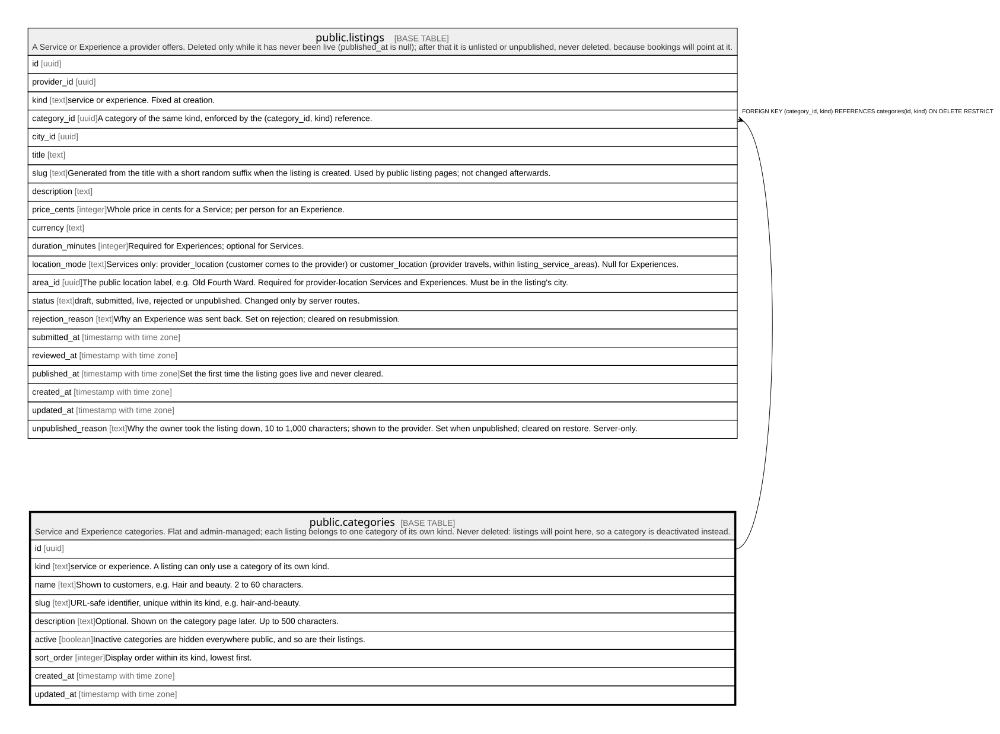

# public.categories

## Description

Service and Experience categories. Flat and admin-managed; each listing belongs to one category of its own kind. Never deleted: listings will point here, so a category is deactivated instead.

## Columns

| Name        | Type                     | Default           | Nullable | Children                                                                                                                                                                      | Parents | Comment                                                                      |
| ----------- | ------------------------ | ----------------- | -------- | ----------------------------------------------------------------------------------------------------------------------------------------------------------------------------- | ------- | ---------------------------------------------------------------------------- |
| id          | uuid                     | gen_random_uuid() | false    | [public.listings](public.listings.md) [public.guides](public.guides.md) [public.guide_versions](public.guide_versions.md) [public.guide_ai_drafts](public.guide_ai_drafts.md) |         |                                                                              |
| kind        | text                     |                   | false    | [public.listings](public.listings.md)                                                                                                                                         |         | service or experience. A listing can only use a category of its own kind.    |
| name        | text                     |                   | false    |                                                                                                                                                                               |         | Shown to customers, e.g. Hair and beauty. 2 to 60 characters.                |
| slug        | text                     |                   | false    |                                                                                                                                                                               |         | URL-safe identifier, unique within its kind, e.g. hair-and-beauty.           |
| description | text                     |                   | true     |                                                                                                                                                                               |         | Optional. Shown on the category page later. Up to 500 characters.            |
| active      | boolean                  | true              | false    |                                                                                                                                                                               |         | Inactive categories are hidden everywhere public, and so are their listings. |
| sort_order  | integer                  | 0                 | false    |                                                                                                                                                                               |         | Display order within its kind, lowest first.                                 |
| created_at  | timestamp with time zone | now()             | false    |                                                                                                                                                                               |         |                                                                              |
| updated_at  | timestamp with time zone | now()             | false    |                                                                                                                                                                               |         |                                                                              |

## Constraints

| Name                         | Type        | Definition                                                        |
| ---------------------------- | ----------- | ----------------------------------------------------------------- |
| categories_description_check | CHECK       | CHECK ((char_length(description) <= 500))                         |
| categories_kind_check        | CHECK       | CHECK ((kind = ANY (ARRAY['service'::text, 'experience'::text]))) |
| categories_name_check        | CHECK       | CHECK (((char_length(name) >= 2) AND (char_length(name) <= 60)))  |
| categories_slug_check        | CHECK       | CHECK ((slug ~ '^[a-z0-9]+(-[a-z0-9]+)*$'::text))                 |
| categories_pkey              | PRIMARY KEY | PRIMARY KEY (id)                                                  |
| categories_kind_slug_key     | UNIQUE      | UNIQUE (kind, slug)                                               |
| categories_id_kind_key       | UNIQUE      | UNIQUE (id, kind)                                                 |

## Indexes

| Name                     | Definition                                                                                 |
| ------------------------ | ------------------------------------------------------------------------------------------ |
| categories_pkey          | CREATE UNIQUE INDEX categories_pkey ON public.categories USING btree (id)                  |
| categories_kind_slug_key | CREATE UNIQUE INDEX categories_kind_slug_key ON public.categories USING btree (kind, slug) |
| categories_id_kind_key   | CREATE UNIQUE INDEX categories_id_kind_key ON public.categories USING btree (id, kind)     |

## Triggers

| Name                      | Definition                                                                                                                 |
| ------------------------- | -------------------------------------------------------------------------------------------------------------------------- |
| categories_set_updated_at | CREATE TRIGGER categories_set_updated_at BEFORE UPDATE ON public.categories FOR EACH ROW EXECUTE FUNCTION set_updated_at() |

## Relations

---

> Generated by [tbls](https://github.com/k1LoW/tbls)
