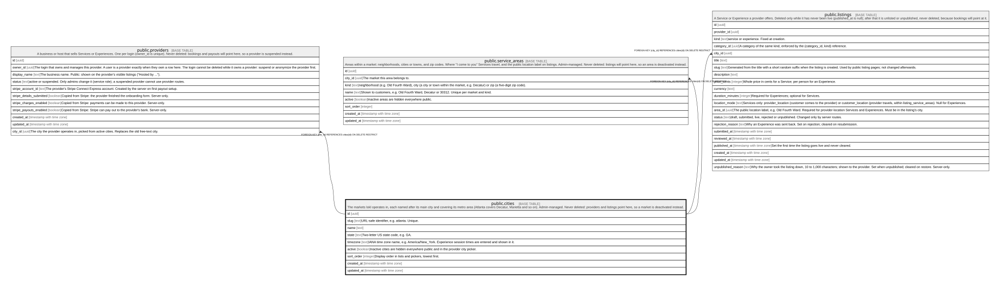

# public.cities

## Description

The markets lokl operates in, each named after its main city and covering its metro area (Atlanta covers Decatur, Marietta and so on). Admin-managed. Never deleted: providers and listings point here, so a market is deactivated instead.

## Columns

| Name       | Type                     | Default           | Nullable | Children                                                                                                                                                        | Parents | Comment                                                                                           |
| ---------- | ------------------------ | ----------------- | -------- | --------------------------------------------------------------------------------------------------------------------------------------------------------------- | ------- | ------------------------------------------------------------------------------------------------- |
| id         | uuid                     | gen_random_uuid() | false    | [public.providers](public.providers.md) [public.service_areas](public.service_areas.md) [public.listings](public.listings.md) [public.guides](public.guides.md) |         |                                                                                                   |
| slug       | text                     |                   | false    |                                                                                                                                                                 |         | URL-safe identifier, e.g. atlanta. Unique.                                                        |
| name       | text                     |                   | false    |                                                                                                                                                                 |         |                                                                                                   |
| state      | text                     |                   | false    |                                                                                                                                                                 |         | Two-letter US state code, e.g. GA.                                                                |
| timezone   | text                     |                   | false    |                                                                                                                                                                 |         | IANA time zone name, e.g. America/New_York. Experience session times are entered and shown in it. |
| active     | boolean                  | true              | false    |                                                                                                                                                                 |         | Inactive cities are hidden everywhere public and in the provider city picker.                     |
| sort_order | integer                  | 0                 | false    |                                                                                                                                                                 |         | Display order in lists and pickers, lowest first.                                                 |
| created_at | timestamp with time zone | now()             | false    |                                                                                                                                                                 |         |                                                                                                   |
| updated_at | timestamp with time zone | now()             | false    |                                                                                                                                                                 |         |                                                                                                   |

## Constraints

| Name                  | Type        | Definition                                                       |
| --------------------- | ----------- | ---------------------------------------------------------------- |
| cities_name_check     | CHECK       | CHECK (((char_length(name) >= 2) AND (char_length(name) <= 80))) |
| cities_slug_check     | CHECK       | CHECK ((slug ~ '^[a-z0-9]+(-[a-z0-9]+)*$'::text))                |
| cities_state_check    | CHECK       | CHECK ((state ~ '^[A-Z]{2}$'::text))                             |
| cities_timezone_check | CHECK       | CHECK ((timezone ~ '^[A-Za-z_]+(/[A-Za-z0-9_+-]+)+$'::text))     |
| cities_pkey           | PRIMARY KEY | PRIMARY KEY (id)                                                 |
| cities_slug_key       | UNIQUE      | UNIQUE (slug)                                                    |

## Indexes

| Name            | Definition                                                              |
| --------------- | ----------------------------------------------------------------------- |
| cities_pkey     | CREATE UNIQUE INDEX cities_pkey ON public.cities USING btree (id)       |
| cities_slug_key | CREATE UNIQUE INDEX cities_slug_key ON public.cities USING btree (slug) |

## Triggers

| Name                  | Definition                                                                                                         |
| --------------------- | ------------------------------------------------------------------------------------------------------------------ |
| cities_set_updated_at | CREATE TRIGGER cities_set_updated_at BEFORE UPDATE ON public.cities FOR EACH ROW EXECUTE FUNCTION set_updated_at() |

## Relations

---

> Generated by [tbls](https://github.com/k1LoW/tbls)
