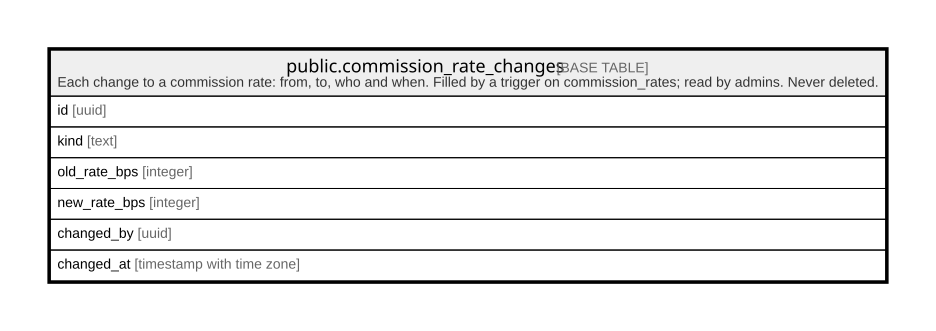

# public.commission_rate_changes

## Description

Each change to a commission rate: from, to, who and when. Filled by a trigger on commission_rates; read by admins. Never deleted.

## Columns

| Name         | Type                     | Default           | Nullable | Children | Parents | Comment |
| ------------ | ------------------------ | ----------------- | -------- | -------- | ------- | ------- |
| id           | uuid                     | gen_random_uuid() | false    |          |         |         |
| kind         | text                     |                   | false    |          |         |         |
| old_rate_bps | integer                  |                   | false    |          |         |         |
| new_rate_bps | integer                  |                   | false    |          |         |         |
| changed_by   | uuid                     |                   | true     |          |         |         |
| changed_at   | timestamp with time zone | clock_timestamp() | false    |          |         |         |

## Constraints

| Name                                    | Type        | Definition                                                            |
| --------------------------------------- | ----------- | --------------------------------------------------------------------- |
| commission_rate_changes_kind_check      | CHECK       | CHECK ((kind = ANY (ARRAY['service'::text, 'experience'::text])))     |
| commission_rate_changes_changed_by_fkey | FOREIGN KEY | FOREIGN KEY (changed_by) REFERENCES auth.users(id) ON DELETE SET NULL |
| commission_rate_changes_pkey            | PRIMARY KEY | PRIMARY KEY (id)                                                      |

## Indexes

| Name                         | Definition                                                                                          |
| ---------------------------- | --------------------------------------------------------------------------------------------------- |
| commission_rate_changes_pkey | CREATE UNIQUE INDEX commission_rate_changes_pkey ON public.commission_rate_changes USING btree (id) |

## Relations

---

> Generated by [tbls](https://github.com/k1LoW/tbls)
