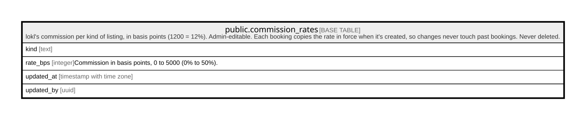

# public.commission_rates

## Description

lokl's commission per kind of listing, in basis points (1200 = 12%). Admin-editable. Each booking copies the rate in force when it's created, so changes never touch past bookings. Never deleted.

## Columns

| Name       | Type                     | Default | Nullable | Children | Parents | Comment                                            |
| ---------- | ------------------------ | ------- | -------- | -------- | ------- | -------------------------------------------------- |
| kind       | text                     |         | false    |          |         |                                                    |
| rate_bps   | integer                  |         | false    |          |         | Commission in basis points, 0 to 5000 (0% to 50%). |
| updated_at | timestamp with time zone | now()   | false    |          |         |                                                    |
| updated_by | uuid                     |         | true     |          |         |                                                    |

## Constraints

| Name                             | Type        | Definition                                                            |
| -------------------------------- | ----------- | --------------------------------------------------------------------- |
| commission_rates_kind_check      | CHECK       | CHECK ((kind = ANY (ARRAY['service'::text, 'experience'::text])))     |
| commission_rates_rate_bps_check  | CHECK       | CHECK (((rate_bps >= 0) AND (rate_bps <= 5000)))                      |
| commission_rates_updated_by_fkey | FOREIGN KEY | FOREIGN KEY (updated_by) REFERENCES auth.users(id) ON DELETE SET NULL |
| commission_rates_pkey            | PRIMARY KEY | PRIMARY KEY (kind)                                                    |

## Indexes

| Name                  | Definition                                                                              |
| --------------------- | --------------------------------------------------------------------------------------- |
| commission_rates_pkey | CREATE UNIQUE INDEX commission_rates_pkey ON public.commission_rates USING btree (kind) |

## Triggers

| Name                   | Definition                                                                                                                            |
| ---------------------- | ------------------------------------------------------------------------------------------------------------------------------------- |
| commission_rates_stamp | CREATE TRIGGER commission_rates_stamp BEFORE UPDATE ON public.commission_rates FOR EACH ROW EXECUTE FUNCTION commission_rates_stamp() |

## Relations

---

> Generated by [tbls](https://github.com/k1LoW/tbls)
