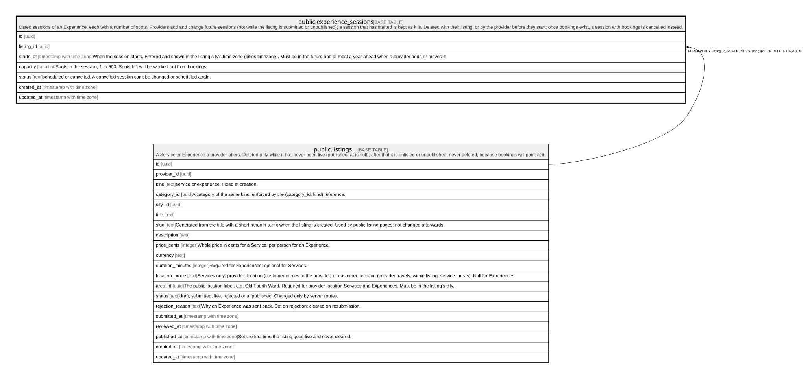

# public.experience_sessions

## Description

Dated sessions of an Experience, each with a number of spots. Providers add and change future sessions (not while the listing is submitted or unpublished); a session that has started is kept as it is. Deleted with their listing, or by the provider before they start; once bookings exist, a session with bookings is cancelled instead.

## Columns

| Name       | Type                     | Default           | Nullable | Children                              | Parents                               | Comment                                                                                                                                                                        |
| ---------- | ------------------------ | ----------------- | -------- | ------------------------------------- | ------------------------------------- | ------------------------------------------------------------------------------------------------------------------------------------------------------------------------------ |
| id         | uuid                     | gen_random_uuid() | false    | [public.bookings](public.bookings.md) |                                       |                                                                                                                                                                                |
| listing_id | uuid                     |                   | false    |                                       | [public.listings](public.listings.md) |                                                                                                                                                                                |
| starts_at  | timestamp with time zone |                   | false    |                                       |                                       | When the session starts. Entered and shown in the listing city's time zone (cities.timezone). Must be in the future and at most a year ahead when a provider adds or moves it. |
| capacity   | smallint                 |                   | false    |                                       |                                       | Spots in the session, 1 to 500. Spots left will be worked out from bookings.                                                                                                   |
| status     | text                     | 'scheduled'::text | false    |                                       |                                       | scheduled or cancelled. A cancelled session can't be changed or scheduled again.                                                                                               |
| created_at | timestamp with time zone | now()             | false    |                                       |                                       |                                                                                                                                                                                |
| updated_at | timestamp with time zone | now()             | false    |                                       |                                       |                                                                                                                                                                                |

## Constraints

| Name                                | Type        | Definition                                                           |
| ----------------------------------- | ----------- | -------------------------------------------------------------------- |
| experience_sessions_capacity_check  | CHECK       | CHECK (((capacity >= 1) AND (capacity <= 500)))                      |
| experience_sessions_status_check    | CHECK       | CHECK ((status = ANY (ARRAY['scheduled'::text, 'cancelled'::text]))) |
| experience_sessions_listing_id_fkey | FOREIGN KEY | FOREIGN KEY (listing_id) REFERENCES listings(id) ON DELETE CASCADE   |
| experience_sessions_pkey            | PRIMARY KEY | PRIMARY KEY (id)                                                     |

## Indexes

| Name                                         | Definition                                                                                                                                                            |
| -------------------------------------------- | --------------------------------------------------------------------------------------------------------------------------------------------------------------------- |
| experience_sessions_pkey                     | CREATE UNIQUE INDEX experience_sessions_pkey ON public.experience_sessions USING btree (id)                                                                           |
| experience_sessions_listing_id_starts_at_key | CREATE UNIQUE INDEX experience_sessions_listing_id_starts_at_key ON public.experience_sessions USING btree (listing_id, starts_at) WHERE (status = 'scheduled'::text) |
| experience_sessions_starts_at_idx            | CREATE INDEX experience_sessions_starts_at_idx ON public.experience_sessions USING btree (starts_at)                                                                  |

## Triggers

| Name                               | Definition                                                                                                                                                                                  |
| ---------------------------------- | ------------------------------------------------------------------------------------------------------------------------------------------------------------------------------------------- |
| experience_sessions_booked_guard   | CREATE TRIGGER experience_sessions_booked_guard BEFORE UPDATE OF capacity, starts_at, status ON public.experience_sessions FOR EACH ROW EXECUTE FUNCTION experience_sessions_booked_guard() |
| experience_sessions_check          | CREATE TRIGGER experience_sessions_check BEFORE INSERT OR UPDATE OF listing_id, starts_at, status ON public.experience_sessions FOR EACH ROW EXECUTE FUNCTION experience_sessions_check()   |
| experience_sessions_guard          | CREATE TRIGGER experience_sessions_guard BEFORE INSERT OR DELETE OR UPDATE ON public.experience_sessions FOR EACH ROW EXECUTE FUNCTION experience_sessions_guard()                          |
| experience_sessions_set_updated_at | CREATE TRIGGER experience_sessions_set_updated_at BEFORE UPDATE ON public.experience_sessions FOR EACH ROW EXECUTE FUNCTION set_updated_at()                                                |

## Relations

---

> Generated by [tbls](https://github.com/k1LoW/tbls)
