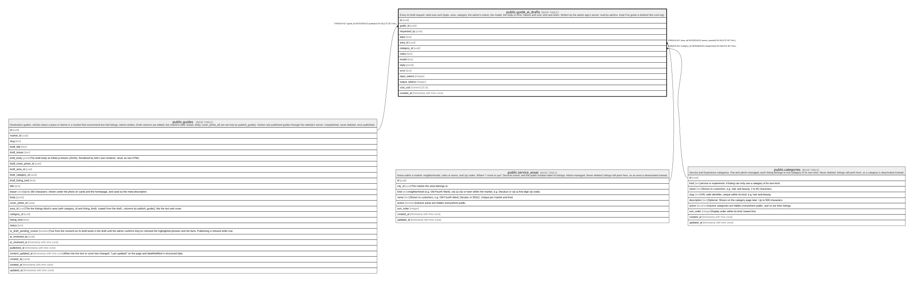

# public.guide_ai_drafts

## Description

Every AI draft request: what was sent (topic, area, category, the admin's notes), the model, the reply or error, tokens and cost, who and when. Written by the admin app's server; read by admins. Kept if its guide is deleted (the cost log).

## Columns

| Name                       | Type                     | Default           | Nullable | Children | Parents                                         | Comment                                                                                                                                                 |
| -------------------------- | ------------------------ | ----------------- | -------- | -------- | ----------------------------------------------- | ------------------------------------------------------------------------------------------------------------------------------------------------------- |
| id                         | uuid                     | gen_random_uuid() | false    |          |                                                 |                                                                                                                                                         |
| guide_id                   | uuid                     |                   | true     |          | [public.guides](public.guides.md)               |                                                                                                                                                         |
| requested_by               | uuid                     |                   | true     |          |                                                 |                                                                                                                                                         |
| topic                      | text                     |                   | false    |          |                                                 |                                                                                                                                                         |
| area_id                    | uuid                     |                   | true     |          | [public.service_areas](public.service_areas.md) |                                                                                                                                                         |
| category_id                | uuid                     |                   | true     |          | [public.categories](public.categories.md)       |                                                                                                                                                         |
| notes                      | text                     |                   | true     |          |                                                 |                                                                                                                                                         |
| model                      | text                     |                   | false    |          |                                                 |                                                                                                                                                         |
| reply                      | jsonb                    |                   | true     |          |                                                 |                                                                                                                                                         |
| error                      | text                     |                   | true     |          |                                                 |                                                                                                                                                         |
| input_tokens               | integer                  |                   | true     |          |                                                 |                                                                                                                                                         |
| output_tokens              | integer                  |                   | true     |          |                                                 |                                                                                                                                                         |
| cost_usd                   | numeric(10,4)            |                   | true     |          |                                                 |                                                                                                                                                         |
| created_at                 | timestamp with time zone | clock_timestamp() | false    |          |                                                 |                                                                                                                                                         |
| previous_draft             | jsonb                    |                   | true     |          |                                                 | The guide's draft just before this AI draft replaced it: title, teaser, body, area, category, kind and its review state. Null if the draft didn't land. |
| previous_draft_restored_at | timestamp with time zone |                   | true     |          |                                                 | When the admin put the previous draft back. Set once; the previous draft can be restored only while this is the guide's latest AI draft.                |

## Constraints

| Name                                | Type        | Definition                                                              |
| ----------------------------------- | ----------- | ----------------------------------------------------------------------- |
| guide_ai_drafts_cost_usd_check      | CHECK       | CHECK ((cost_usd >= (0)::numeric))                                      |
| guide_ai_drafts_error_check         | CHECK       | CHECK ((char_length(error) <= 1000))                                    |
| guide_ai_drafts_input_tokens_check  | CHECK       | CHECK ((input_tokens >= 0))                                             |
| guide_ai_drafts_model_check         | CHECK       | CHECK ((char_length(model) <= 80))                                      |
| guide_ai_drafts_notes_check         | CHECK       | CHECK ((char_length(notes) <= 4000))                                    |
| guide_ai_drafts_output_tokens_check | CHECK       | CHECK ((output_tokens >= 0))                                            |
| guide_ai_drafts_topic_check         | CHECK       | CHECK ((char_length(topic) <= 200))                                     |
| guide_ai_drafts_requested_by_fkey   | FOREIGN KEY | FOREIGN KEY (requested_by) REFERENCES auth.users(id) ON DELETE SET NULL |
| guide_ai_drafts_area_id_fkey        | FOREIGN KEY | FOREIGN KEY (area_id) REFERENCES service_areas(id) ON DELETE SET NULL   |
| guide_ai_drafts_category_id_fkey    | FOREIGN KEY | FOREIGN KEY (category_id) REFERENCES categories(id) ON DELETE SET NULL  |
| guide_ai_drafts_guide_id_fkey       | FOREIGN KEY | FOREIGN KEY (guide_id) REFERENCES guides(id) ON DELETE SET NULL         |
| guide_ai_drafts_pkey                | PRIMARY KEY | PRIMARY KEY (id)                                                        |

## Indexes

| Name                 | Definition                                                                          |
| -------------------- | ----------------------------------------------------------------------------------- |
| guide_ai_drafts_pkey | CREATE UNIQUE INDEX guide_ai_drafts_pkey ON public.guide_ai_drafts USING btree (id) |

## Relations

---

> Generated by [tbls](https://github.com/k1LoW/tbls)
