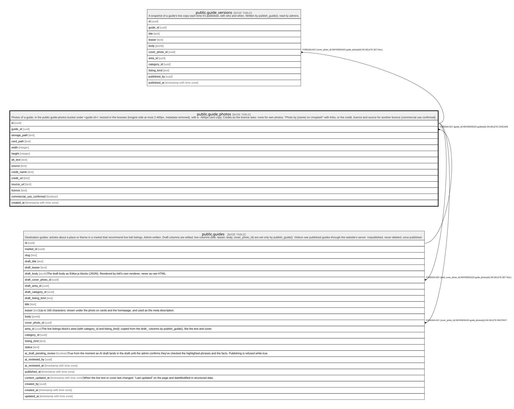

# public.guide_photos

## Description

Photos of a guide, in the public guide-photos bucket under <guide id>/: resized in the browser (longest side at most 2,400px, metadata removed), with a ~600px card copy. Credits as the licence asks: none for own photos; "Photo by {name} on Unsplash" with links; or the credit, licence and source for another licence (commercial use confirmed).

## Columns

| Name                     | Type                     | Default           | Nullable | Children                                                                            | Parents                           | Comment |
| ------------------------ | ------------------------ | ----------------- | -------- | ----------------------------------------------------------------------------------- | --------------------------------- | ------- |
| id                       | uuid                     | gen_random_uuid() | false    | [public.guides](public.guides.md) [public.guide_versions](public.guide_versions.md) |                                   |         |
| guide_id                 | uuid                     |                   | false    |                                                                                     | [public.guides](public.guides.md) |         |
| storage_path             | text                     |                   | false    |                                                                                     |                                   |         |
| card_path                | text                     |                   | true     |                                                                                     |                                   |         |
| width                    | integer                  |                   | false    |                                                                                     |                                   |         |
| height                   | integer                  |                   | false    |                                                                                     |                                   |         |
| alt_text                 | text                     |                   | false    |                                                                                     |                                   |         |
| source                   | text                     |                   | false    |                                                                                     |                                   |         |
| credit_name              | text                     |                   | true     |                                                                                     |                                   |         |
| credit_url               | text                     |                   | true     |                                                                                     |                                   |         |
| source_url               | text                     |                   | true     |                                                                                     |                                   |         |
| licence                  | text                     |                   | true     |                                                                                     |                                   |         |
| commercial_use_confirmed | boolean                  | false             | false    |                                                                                     |                                   |         |
| created_at               | timestamp with time zone | now()             | false    |                                                                                     |                                   |         |

## Constraints

| Name                            | Type        | Definition                                                                                                                                             |
| ------------------------------- | ----------- | ------------------------------------------------------------------------------------------------------------------------------------------------------ |
| guide_photos_alt_text_check     | CHECK       | CHECK (((char_length(TRIM(BOTH FROM alt_text)) >= 1) AND (char_length(TRIM(BOTH FROM alt_text)) <= 200)))                                              |
| guide_photos_card_path_check    | CHECK       | CHECK ((card_path ~ '^[0-9a-f-]{36}/[0-9a-f-]{36}\.card\.(jpg|webp)$'::text))                                                                          |
| guide_photos_credit_name_check  | CHECK       | CHECK ((char_length(credit_name) <= 120))                                                                                                              |
| guide_photos_credit_url_check   | CHECK       | CHECK ((credit_url ~ '^https://'::text))                                                                                                               |
| guide_photos_height_check       | CHECK       | CHECK (((height >= 1) AND (height <= 2400)))                                                                                                           |
| guide_photos_licence_check      | CHECK       | CHECK ((char_length(licence) <= 120))                                                                                                                  |
| guide_photos_other_credit       | CHECK       | CHECK (((source <> 'other'::text) OR ((credit_name IS NOT NULL) AND (licence IS NOT NULL) AND (source_url IS NOT NULL) AND commercial_use_confirmed))) |
| guide_photos_source_check       | CHECK       | CHECK ((source = ANY (ARRAY['own'::text, 'unsplash'::text, 'other'::text])))                                                                           |
| guide_photos_source_url_check   | CHECK       | CHECK ((source_url ~ '^https://'::text))                                                                                                               |
| guide_photos_storage_path_check | CHECK       | CHECK ((storage_path ~ '^[0-9a-f-]{36}/[0-9a-f-]{36}\.(jpg|jpeg|png|webp)$'::text))                                                                    |
| guide_photos_unsplash_credit    | CHECK       | CHECK (((source <> 'unsplash'::text) OR ((credit_name IS NOT NULL) AND (credit_url IS NOT NULL) AND (source_url IS NOT NULL))))                        |
| guide_photos_width_check        | CHECK       | CHECK (((width >= 1) AND (width <= 2400)))                                                                                                             |
| guide_photos_guide_id_fkey      | FOREIGN KEY | FOREIGN KEY (guide_id) REFERENCES guides(id) ON DELETE CASCADE                                                                                         |
| guide_photos_pkey               | PRIMARY KEY | PRIMARY KEY (id)                                                                                                                                       |
| guide_photos_storage_path_key   | UNIQUE      | UNIQUE (storage_path)                                                                                                                                  |
| guide_photos_card_path_key      | UNIQUE      | UNIQUE (card_path)                                                                                                                                     |

## Indexes

| Name                          | Definition                                                                                          |
| ----------------------------- | --------------------------------------------------------------------------------------------------- |
| guide_photos_pkey             | CREATE UNIQUE INDEX guide_photos_pkey ON public.guide_photos USING btree (id)                       |
| guide_photos_storage_path_key | CREATE UNIQUE INDEX guide_photos_storage_path_key ON public.guide_photos USING btree (storage_path) |
| guide_photos_card_path_key    | CREATE UNIQUE INDEX guide_photos_card_path_key ON public.guide_photos USING btree (card_path)       |

## Triggers

| Name                       | Definition                                                                                                                                                                               |
| -------------------------- | ---------------------------------------------------------------------------------------------------------------------------------------------------------------------------------------- |
| guide_photos_in_own_folder | CREATE TRIGGER guide_photos_in_own_folder BEFORE INSERT OR UPDATE OF storage_path, card_path, guide_id ON public.guide_photos FOR EACH ROW EXECUTE FUNCTION guide_photos_in_own_folder() |

## Relations

---

> Generated by [tbls](https://github.com/k1LoW/tbls)
