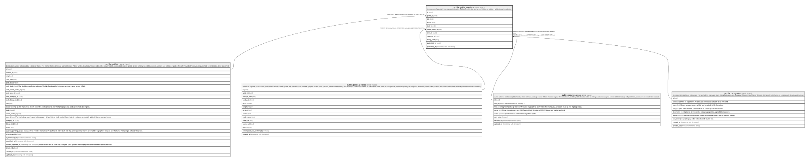

# public.guide_versions

## Description

A snapshot of a guide's live copy each time it's published, with who and when. Written by publish_guide(); read by admins.

## Columns

| Name           | Type                     | Default           | Nullable | Children | Parents                                         | Comment |
| -------------- | ------------------------ | ----------------- | -------- | -------- | ----------------------------------------------- | ------- |
| id             | uuid                     | gen_random_uuid() | false    |          |                                                 |         |
| guide_id       | uuid                     |                   | false    |          | [public.guides](public.guides.md)               |         |
| title          | text                     |                   | false    |          |                                                 |         |
| teaser         | text                     |                   | false    |          |                                                 |         |
| body           | jsonb                    |                   | false    |          |                                                 |         |
| cover_photo_id | uuid                     |                   | true     |          | [public.guide_photos](public.guide_photos.md)   |         |
| area_id        | uuid                     |                   | true     |          | [public.service_areas](public.service_areas.md) |         |
| category_id    | uuid                     |                   | true     |          | [public.categories](public.categories.md)       |         |
| listing_kind   | text                     |                   | true     |          |                                                 |         |
| published_by   | uuid                     |                   | true     |          |                                                 |         |
| published_at   | timestamp with time zone | clock_timestamp() | false    |          |                                                 |         |

## Constraints

| Name                               | Type        | Definition                                                                  |
| ---------------------------------- | ----------- | --------------------------------------------------------------------------- |
| guide_versions_published_by_fkey   | FOREIGN KEY | FOREIGN KEY (published_by) REFERENCES auth.users(id) ON DELETE SET NULL     |
| guide_versions_area_id_fkey        | FOREIGN KEY | FOREIGN KEY (area_id) REFERENCES service_areas(id) ON DELETE SET NULL       |
| guide_versions_category_id_fkey    | FOREIGN KEY | FOREIGN KEY (category_id) REFERENCES categories(id) ON DELETE SET NULL      |
| guide_versions_guide_id_fkey       | FOREIGN KEY | FOREIGN KEY (guide_id) REFERENCES guides(id) ON DELETE RESTRICT             |
| guide_versions_cover_photo_id_fkey | FOREIGN KEY | FOREIGN KEY (cover_photo_id) REFERENCES guide_photos(id) ON DELETE SET NULL |
| guide_versions_pkey                | PRIMARY KEY | PRIMARY KEY (id)                                                            |

## Indexes

| Name                     | Definition                                                                                               |
| ------------------------ | -------------------------------------------------------------------------------------------------------- |
| guide_versions_pkey      | CREATE UNIQUE INDEX guide_versions_pkey ON public.guide_versions USING btree (id)                        |
| guide_versions_guide_idx | CREATE INDEX guide_versions_guide_idx ON public.guide_versions USING btree (guide_id, published_at DESC) |

## Relations

---

> Generated by [tbls](https://github.com/k1LoW/tbls)
