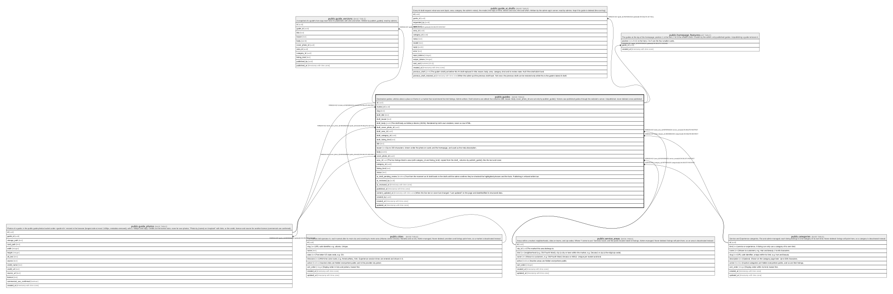

# public.guides

## Description

Destination guides: articles about a place or theme in a market that recommend live lokl listings. Admin-written. Draft columns are edited; live columns (title, teaser, body, cover_photo_id) are set only by publish_guide(). Visitors see published guides through the website's server. Unpublished, never deleted, once published.

## Columns

| Name                    | Type                     | Default                 | Nullable | Children                                                                                                                                                                                                    | Parents                                         | Comment                                                                                                                                                               |
| ----------------------- | ------------------------ | ----------------------- | -------- | ----------------------------------------------------------------------------------------------------------------------------------------------------------------------------------------------------------- | ----------------------------------------------- | --------------------------------------------------------------------------------------------------------------------------------------------------------------------- |
| id                      | uuid                     | gen_random_uuid()       | false    | [public.guide_photos](public.guide_photos.md) [public.guide_versions](public.guide_versions.md) [public.guide_ai_drafts](public.guide_ai_drafts.md) [public.homepage_features](public.homepage_features.md) |                                                 |                                                                                                                                                                       |
| market_id               | uuid                     |                         | false    |                                                                                                                                                                                                             | [public.cities](public.cities.md)               |                                                                                                                                                                       |
| slug                    | text                     |                         | false    |                                                                                                                                                                                                             |                                                 |                                                                                                                                                                       |
| draft_title             | text                     | ''::text                | false    |                                                                                                                                                                                                             |                                                 |                                                                                                                                                                       |
| draft_teaser            | text                     | ''::text                | false    |                                                                                                                                                                                                             |                                                 |                                                                                                                                                                       |
| draft_body              | jsonb                    | '{"blocks": []}'::jsonb | false    |                                                                                                                                                                                                             |                                                 | The draft body as Editor.js blocks (JSON). Rendered by lokl's own renderer, never as raw HTML.                                                                        |
| draft_cover_photo_id    | uuid                     |                         | true     |                                                                                                                                                                                                             | [public.guide_photos](public.guide_photos.md)   |                                                                                                                                                                       |
| draft_area_id           | uuid                     |                         | true     |                                                                                                                                                                                                             | [public.service_areas](public.service_areas.md) |                                                                                                                                                                       |
| draft_category_id       | uuid                     |                         | true     |                                                                                                                                                                                                             | [public.categories](public.categories.md)       |                                                                                                                                                                       |
| draft_listing_kind      | text                     |                         | true     |                                                                                                                                                                                                             |                                                 |                                                                                                                                                                       |
| title                   | text                     |                         | true     |                                                                                                                                                                                                             |                                                 |                                                                                                                                                                       |
| teaser                  | text                     |                         | true     |                                                                                                                                                                                                             |                                                 | Up to 160 characters: shown under the photo on cards and the homepage, and used as the meta description.                                                              |
| body                    | jsonb                    |                         | true     |                                                                                                                                                                                                             |                                                 |                                                                                                                                                                       |
| cover_photo_id          | uuid                     |                         | true     |                                                                                                                                                                                                             | [public.guide_photos](public.guide_photos.md)   |                                                                                                                                                                       |
| area_id                 | uuid                     |                         | true     |                                                                                                                                                                                                             | [public.service_areas](public.service_areas.md) | The live listings block's area (with category_id and listing_kind): copied from the draft_ columns by publish_guide(), like the text and cover.                       |
| category_id             | uuid                     |                         | true     |                                                                                                                                                                                                             | [public.categories](public.categories.md)       |                                                                                                                                                                       |
| listing_kind            | text                     |                         | true     |                                                                                                                                                                                                             |                                                 |                                                                                                                                                                       |
| status                  | text                     | 'draft'::text           | false    |                                                                                                                                                                                                             |                                                 |                                                                                                                                                                       |
| ai_draft_pending_review | boolean                  | false                   | false    |                                                                                                                                                                                                             |                                                 | True from the moment an AI draft lands in the draft until the admin confirms they've checked the highlighted phrases and the facts. Publishing is refused while true. |
| ai_reviewed_by          | uuid                     |                         | true     |                                                                                                                                                                                                             |                                                 |                                                                                                                                                                       |
| ai_reviewed_at          | timestamp with time zone |                         | true     |                                                                                                                                                                                                             |                                                 |                                                                                                                                                                       |
| published_at            | timestamp with time zone |                         | true     |                                                                                                                                                                                                             |                                                 |                                                                                                                                                                       |
| content_updated_at      | timestamp with time zone |                         | true     |                                                                                                                                                                                                             |                                                 | When the live text or cover last changed: "Last updated" on the page and dateModified in structured data.                                                             |
| created_by              | uuid                     | auth.uid()              | true     |                                                                                                                                                                                                             |                                                 |                                                                                                                                                                       |
| created_at              | timestamp with time zone | now()                   | false    |                                                                                                                                                                                                             |                                                 |                                                                                                                                                                       |
| updated_at              | timestamp with time zone | now()                   | false    |                                                                                                                                                                                                             |                                                 |                                                                                                                                                                       |

## Constraints

| Name                            | Type        | Definition                                                                                                                                   |
| ------------------------------- | ----------- | -------------------------------------------------------------------------------------------------------------------------------------------- |
| guides_draft_listing_kind_check | CHECK       | CHECK ((draft_listing_kind = ANY (ARRAY['service'::text, 'experience'::text])))                                                              |
| guides_draft_teaser_check       | CHECK       | CHECK ((char_length(draft_teaser) <= 160))                                                                                                   |
| guides_draft_title_check        | CHECK       | CHECK ((char_length(draft_title) <= 120))                                                                                                    |
| guides_listing_kind_check       | CHECK       | CHECK ((listing_kind = ANY (ARRAY['service'::text, 'experience'::text])))                                                                    |
| guides_published_has_content    | CHECK       | CHECK (((status = 'draft'::text) OR ((title IS NOT NULL) AND (teaser IS NOT NULL) AND (body IS NOT NULL) AND (cover_photo_id IS NOT NULL)))) |
| guides_slug_check               | CHECK       | CHECK (((slug ~ '^[a-z0-9]+(-[a-z0-9]+)*$'::text) AND (char_length(slug) <= 80)))                                                            |
| guides_status_check             | CHECK       | CHECK ((status = ANY (ARRAY['draft'::text, 'published'::text, 'unpublished'::text])))                                                        |
| guides_teaser_check             | CHECK       | CHECK ((char_length(teaser) <= 160))                                                                                                         |
| guides_title_check              | CHECK       | CHECK ((char_length(title) <= 120))                                                                                                          |
| guides_ai_reviewed_by_fkey      | FOREIGN KEY | FOREIGN KEY (ai_reviewed_by) REFERENCES auth.users(id) ON DELETE SET NULL                                                                    |
| guides_created_by_fkey          | FOREIGN KEY | FOREIGN KEY (created_by) REFERENCES auth.users(id) ON DELETE SET NULL                                                                        |
| guides_market_id_fkey           | FOREIGN KEY | FOREIGN KEY (market_id) REFERENCES cities(id) ON DELETE RESTRICT                                                                             |
| guides_area_id_fkey             | FOREIGN KEY | FOREIGN KEY (area_id) REFERENCES service_areas(id) ON DELETE RESTRICT                                                                        |
| guides_draft_area_id_fkey       | FOREIGN KEY | FOREIGN KEY (draft_area_id) REFERENCES service_areas(id) ON DELETE RESTRICT                                                                  |
| guides_category_id_fkey         | FOREIGN KEY | FOREIGN KEY (category_id) REFERENCES categories(id) ON DELETE RESTRICT                                                                       |
| guides_draft_category_id_fkey   | FOREIGN KEY | FOREIGN KEY (draft_category_id) REFERENCES categories(id) ON DELETE RESTRICT                                                                 |
| guides_pkey                     | PRIMARY KEY | PRIMARY KEY (id)                                                                                                                             |
| guides_slug_unique              | UNIQUE      | UNIQUE (market_id, slug)                                                                                                                     |
| guides_cover_fk                 | FOREIGN KEY | FOREIGN KEY (cover_photo_id) REFERENCES guide_photos(id) ON DELETE RESTRICT                                                                  |
| guides_draft_cover_fk           | FOREIGN KEY | FOREIGN KEY (draft_cover_photo_id) REFERENCES guide_photos(id) ON DELETE SET NULL                                                            |

## Indexes

| Name               | Definition                                                                            |
| ------------------ | ------------------------------------------------------------------------------------- |
| guides_pkey        | CREATE UNIQUE INDEX guides_pkey ON public.guides USING btree (id)                     |
| guides_slug_unique | CREATE UNIQUE INDEX guides_slug_unique ON public.guides USING btree (market_id, slug) |

## Triggers

| Name                  | Definition                                                                                                                                                      |
| --------------------- | --------------------------------------------------------------------------------------------------------------------------------------------------------------- |
| guides_area_in_market | CREATE TRIGGER guides_area_in_market BEFORE INSERT OR UPDATE OF draft_area_id, market_id ON public.guides FOR EACH ROW EXECUTE FUNCTION guides_area_in_market() |
| guides_cover_is_own   | CREATE TRIGGER guides_cover_is_own BEFORE INSERT OR UPDATE OF draft_cover_photo_id ON public.guides FOR EACH ROW EXECUTE FUNCTION guides_cover_is_own()         |
| guides_guard          | CREATE TRIGGER guides_guard BEFORE INSERT OR DELETE OR UPDATE ON public.guides FOR EACH ROW EXECUTE FUNCTION guides_guard()                                     |
| guides_set_updated_at | CREATE TRIGGER guides_set_updated_at BEFORE UPDATE ON public.guides FOR EACH ROW EXECUTE FUNCTION set_updated_at()                                              |

## Relations

---

> Generated by [tbls](https://github.com/k1LoW/tbls)
