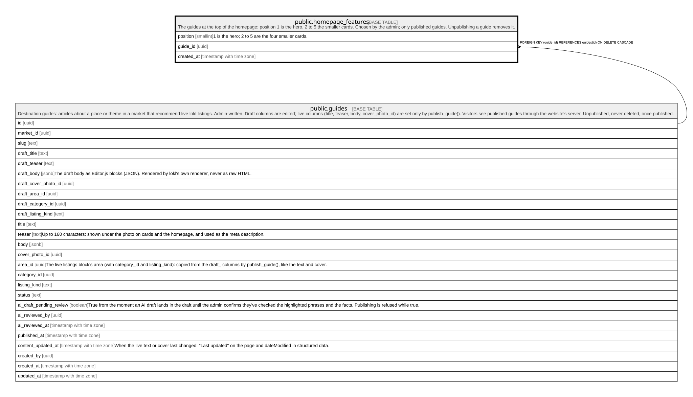

# public.homepage_features

## Description

The guides at the top of the homepage: position 1 is the hero, 2 to 5 the smaller cards. Chosen by the admin; only published guides. Unpublishing a guide removes it.

## Columns

| Name       | Type                     | Default | Nullable | Children | Parents                           | Comment                                           |
| ---------- | ------------------------ | ------- | -------- | -------- | --------------------------------- | ------------------------------------------------- |
| position   | smallint                 |         | false    |          |                                   | 1 is the hero; 2 to 5 are the four smaller cards. |
| guide_id   | uuid                     |         | false    |          | [public.guides](public.guides.md) |                                                   |
| created_at | timestamp with time zone | now()   | false    |          |                                   |                                                   |

## Constraints

| Name                             | Type        | Definition                                                     |
| -------------------------------- | ----------- | -------------------------------------------------------------- |
| homepage_features_position_check | CHECK       | CHECK ((("position" >= 1) AND ("position" <= 5)))              |
| homepage_features_guide_id_fkey  | FOREIGN KEY | FOREIGN KEY (guide_id) REFERENCES guides(id) ON DELETE CASCADE |
| homepage_features_pkey           | PRIMARY KEY | PRIMARY KEY ("position")                                       |
| homepage_features_guide_id_key   | UNIQUE      | UNIQUE (guide_id)                                              |

## Indexes

| Name                           | Definition                                                                                            |
| ------------------------------ | ----------------------------------------------------------------------------------------------------- |
| homepage_features_pkey         | CREATE UNIQUE INDEX homepage_features_pkey ON public.homepage_features USING btree ("position")       |
| homepage_features_guide_id_key | CREATE UNIQUE INDEX homepage_features_guide_id_key ON public.homepage_features USING btree (guide_id) |

## Triggers

| Name                             | Definition                                                                                                                                                           |
| -------------------------------- | -------------------------------------------------------------------------------------------------------------------------------------------------------------------- |
| homepage_features_published_only | CREATE TRIGGER homepage_features_published_only BEFORE INSERT OR UPDATE ON public.homepage_features FOR EACH ROW EXECUTE FUNCTION homepage_features_published_only() |

## Relations

---

> Generated by [tbls](https://github.com/k1LoW/tbls)
