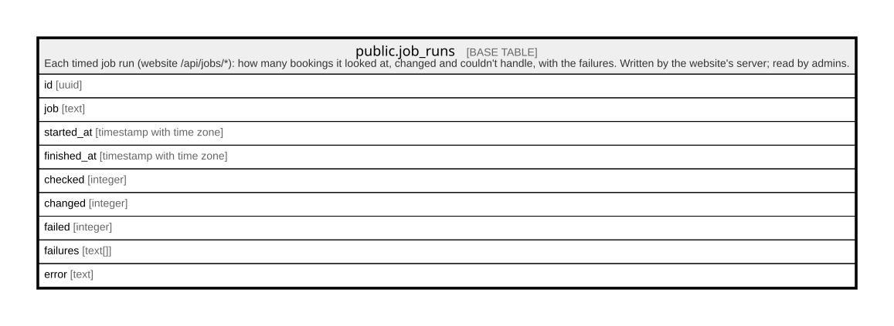

# public.job_runs

## Description

Each timed job run (website /api/jobs/*): how many bookings it looked at, changed and couldn't handle, with the failures. Written by the website's server; read by admins.

## Columns

| Name        | Type                     | Default           | Nullable | Children | Parents | Comment |
| ----------- | ------------------------ | ----------------- | -------- | -------- | ------- | ------- |
| id          | uuid                     | gen_random_uuid() | false    |          |         |         |
| job         | text                     |                   | false    |          |         |         |
| started_at  | timestamp with time zone |                   | false    |          |         |         |
| finished_at | timestamp with time zone | clock_timestamp() | false    |          |         |         |
| checked     | integer                  | 0                 | false    |          |         |         |
| changed     | integer                  | 0                 | false    |          |         |         |
| failed      | integer                  | 0                 | false    |          |         |         |
| failures    | text[]                   | '{}'::text[]      | false    |          |         |         |
| error       | text                     |                   | true     |          |         |         |

## Constraints

| Name                 | Type        | Definition                           |
| -------------------- | ----------- | ------------------------------------ |
| job_runs_error_check | CHECK       | CHECK ((char_length(error) <= 1000)) |
| job_runs_job_check   | CHECK       | CHECK ((char_length(job) <= 60))     |
| job_runs_pkey        | PRIMARY KEY | PRIMARY KEY (id)                     |

## Indexes

| Name                | Definition                                                                         |
| ------------------- | ---------------------------------------------------------------------------------- |
| job_runs_pkey       | CREATE UNIQUE INDEX job_runs_pkey ON public.job_runs USING btree (id)              |
| job_runs_recent_idx | CREATE INDEX job_runs_recent_idx ON public.job_runs USING btree (finished_at DESC) |

## Relations

---

> Generated by [tbls](https://github.com/k1LoW/tbls)
