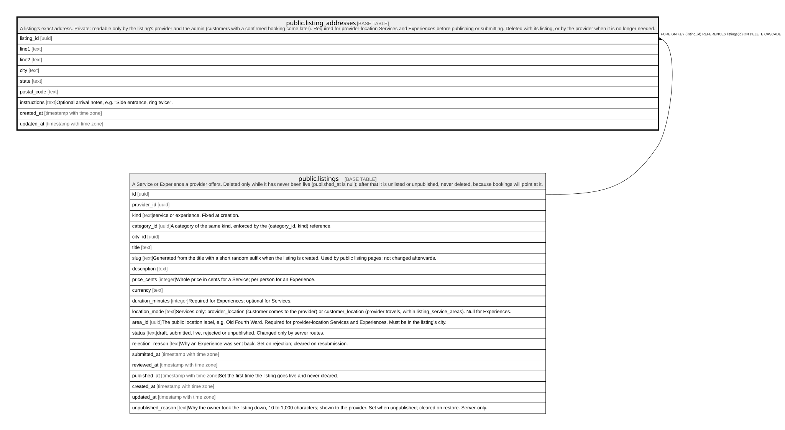

# public.listing_addresses

## Description

A listing's exact address. Private: readable only by the listing's provider and the admin (customers with a confirmed booking come later). Required for provider-location Services and Experiences before publishing or submitting. Deleted with its listing, or by the provider when it is no longer needed.

## Columns

| Name         | Type                     | Default | Nullable | Children | Parents                               | Comment                                                   |
| ------------ | ------------------------ | ------- | -------- | -------- | ------------------------------------- | --------------------------------------------------------- |
| listing_id   | uuid                     |         | false    |          | [public.listings](public.listings.md) |                                                           |
| line1        | text                     |         | false    |          |                                       |                                                           |
| line2        | text                     |         | true     |          |                                       |                                                           |
| city         | text                     |         | false    |          |                                       |                                                           |
| state        | text                     |         | false    |          |                                       |                                                           |
| postal_code  | text                     |         | false    |          |                                       |                                                           |
| instructions | text                     |         | true     |          |                                       | Optional arrival notes, e.g. "Side entrance, ring twice". |
| created_at   | timestamp with time zone | now()   | false    |          |                                       |                                                           |
| updated_at   | timestamp with time zone | now()   | false    |          |                                       |                                                           |

## Constraints

| Name                                 | Type        | Definition                                                          |
| ------------------------------------ | ----------- | ------------------------------------------------------------------- |
| listing_addresses_city_check         | CHECK       | CHECK (((char_length(city) >= 2) AND (char_length(city) <= 80)))    |
| listing_addresses_instructions_check | CHECK       | CHECK ((char_length(instructions) <= 500))                          |
| listing_addresses_line1_check        | CHECK       | CHECK (((char_length(line1) >= 3) AND (char_length(line1) <= 200))) |
| listing_addresses_line2_check        | CHECK       | CHECK ((char_length(line2) <= 200))                                 |
| listing_addresses_postal_code_check  | CHECK       | CHECK ((postal_code ~ '^[0-9]{5}(-[0-9]{4})?$'::text))              |
| listing_addresses_state_check        | CHECK       | CHECK ((state ~ '^[A-Z]{2}$'::text))                                |
| listing_addresses_listing_id_fkey    | FOREIGN KEY | FOREIGN KEY (listing_id) REFERENCES listings(id) ON DELETE CASCADE  |
| listing_addresses_pkey               | PRIMARY KEY | PRIMARY KEY (listing_id)                                            |

## Indexes

| Name                   | Definition                                                                                      |
| ---------------------- | ----------------------------------------------------------------------------------------------- |
| listing_addresses_pkey | CREATE UNIQUE INDEX listing_addresses_pkey ON public.listing_addresses USING btree (listing_id) |

## Triggers

| Name                             | Definition                                                                                                                                                   |
| -------------------------------- | ------------------------------------------------------------------------------------------------------------------------------------------------------------ |
| listing_addresses_guard          | CREATE TRIGGER listing_addresses_guard BEFORE INSERT OR DELETE OR UPDATE ON public.listing_addresses FOR EACH ROW EXECUTE FUNCTION listing_addresses_guard() |
| listing_addresses_set_updated_at | CREATE TRIGGER listing_addresses_set_updated_at BEFORE UPDATE ON public.listing_addresses FOR EACH ROW EXECUTE FUNCTION set_updated_at()                     |

## Relations

---

> Generated by [tbls](https://github.com/k1LoW/tbls)
