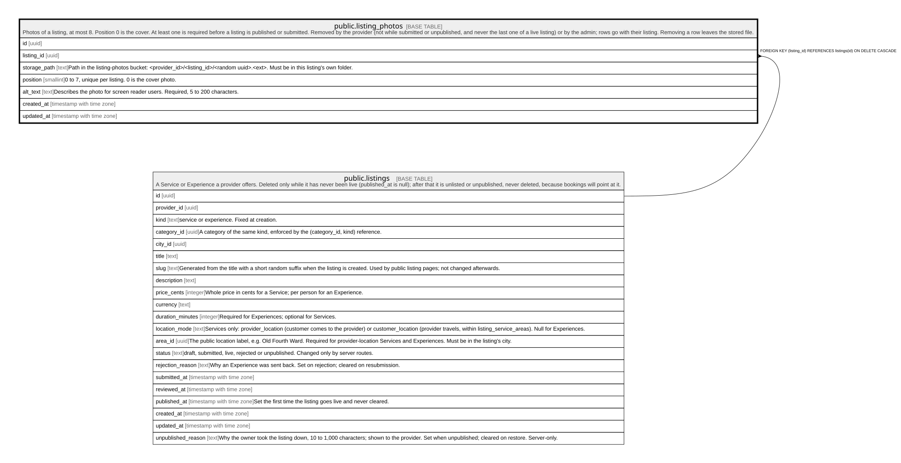

# public.listing_photos

## Description

Photos of a listing, at most 8. Position 0 is the cover. At least one is required before a listing is published or submitted. Removed by the provider (not while submitted or unpublished, and never the last one of a live listing) or by the admin; rows go with their listing. Removing a row leaves the stored file.

## Columns

| Name         | Type                     | Default           | Nullable | Children | Parents                               | Comment                                                                                                                                                                                                                                                                                        |
| ------------ | ------------------------ | ----------------- | -------- | -------- | ------------------------------------- | ---------------------------------------------------------------------------------------------------------------------------------------------------------------------------------------------------------------------------------------------------------------------------------------------- |
| id           | uuid                     | gen_random_uuid() | false    |          |                                       |                                                                                                                                                                                                                                                                                                |
| listing_id   | uuid                     |                   | false    |          | [public.listings](public.listings.md) |                                                                                                                                                                                                                                                                                                |
| storage_path | text                     |                   | false    |          |                                       | Path in the listing-photos bucket: \<provider_id\>/\<listing_id\>/\<random uuid\>.\<ext\>. Must be in this listing's own folder.                                                                                                                                                               |
| position     | smallint                 |                   | false    |          |                                       | 0 to 7, unique per listing. 0 is the cover photo.                                                                                                                                                                                                                                              |
| alt_text     | text                     |                   | false    |          |                                       | Describes the photo for screen reader users. Required, 5 to 200 characters.                                                                                                                                                                                                                    |
| created_at   | timestamp with time zone | now()             | false    |          |                                       |                                                                                                                                                                                                                                                                                                |
| updated_at   | timestamp with time zone | now()             | false    |          |                                       |                                                                                                                                                                                                                                                                                                |
| card_path    | text                     |                   | true     |          |                                       | The card-sized copy (about 600px wide) of this photo, in the same folder: \<uuid\>.card.webp for \<uuid\>.\<ext\>, or \<uuid\>.card.jpg where the browser couldn't encode WebP. Null for photos added before card copies existed; pages then use the full photo. Set on upload, never changed. |

## Constraints

| Name                                   | Type        | Definition                                                                                                                                                                                                |
| -------------------------------------- | ----------- | --------------------------------------------------------------------------------------------------------------------------------------------------------------------------------------------------------- |
| listing_photos_alt_text_check          | CHECK       | CHECK (((char_length(alt_text) >= 5) AND (char_length(alt_text) <= 200)))                                                                                                                                 |
| listing_photos_card_path_check         | CHECK       | CHECK (((card_path = regexp_replace(storage_path, '\.(jpg|jpeg|png|webp)$'::text, '.card.webp'::text)) OR (card_path = regexp_replace(storage_path, '\.(jpg|jpeg|png|webp)$'::text, '.card.jpg'::text)))) |
| listing_photos_position_check          | CHECK       | CHECK ((("position" >= 0) AND ("position" <= 7)))                                                                                                                                                         |
| listing_photos_storage_path_check      | CHECK       | CHECK ((storage_path ~ '^[0-9a-f-]{36}/[0-9a-f-]{36}/[0-9a-f-]{36}\.(jpg|jpeg|png|webp)$'::text))                                                                                                         |
| listing_photos_listing_id_fkey         | FOREIGN KEY | FOREIGN KEY (listing_id) REFERENCES listings(id) ON DELETE CASCADE                                                                                                                                        |
| listing_photos_pkey                    | PRIMARY KEY | PRIMARY KEY (id)                                                                                                                                                                                          |
| listing_photos_storage_path_key        | UNIQUE      | UNIQUE (storage_path)                                                                                                                                                                                     |
| listing_photos_listing_id_position_key | UNIQUE      | UNIQUE (listing_id, "position") DEFERRABLE                                                                                                                                                                |
| listing_photos_card_path_key           | UNIQUE      | UNIQUE (card_path)                                                                                                                                                                                        |

## Indexes

| Name                                   | Definition                                                                                                               |
| -------------------------------------- | ------------------------------------------------------------------------------------------------------------------------ |
| listing_photos_pkey                    | CREATE UNIQUE INDEX listing_photos_pkey ON public.listing_photos USING btree (id)                                        |
| listing_photos_storage_path_key        | CREATE UNIQUE INDEX listing_photos_storage_path_key ON public.listing_photos USING btree (storage_path)                  |
| listing_photos_listing_id_position_key | CREATE UNIQUE INDEX listing_photos_listing_id_position_key ON public.listing_photos USING btree (listing_id, "position") |
| listing_photos_card_path_key           | CREATE UNIQUE INDEX listing_photos_card_path_key ON public.listing_photos USING btree (card_path)                        |

## Triggers

| Name                          | Definition                                                                                                                                                            |
| ----------------------------- | --------------------------------------------------------------------------------------------------------------------------------------------------------------------- |
| listing_photos_check          | CREATE TRIGGER listing_photos_check BEFORE INSERT OR UPDATE OF storage_path, listing_id ON public.listing_photos FOR EACH ROW EXECUTE FUNCTION listing_photos_check() |
| listing_photos_guard          | CREATE TRIGGER listing_photos_guard BEFORE INSERT OR DELETE OR UPDATE ON public.listing_photos FOR EACH ROW EXECUTE FUNCTION listing_photos_guard()                   |
| listing_photos_set_updated_at | CREATE TRIGGER listing_photos_set_updated_at BEFORE UPDATE ON public.listing_photos FOR EACH ROW EXECUTE FUNCTION set_updated_at()                                    |

## Relations

---

> Generated by [tbls](https://github.com/k1LoW/tbls)
