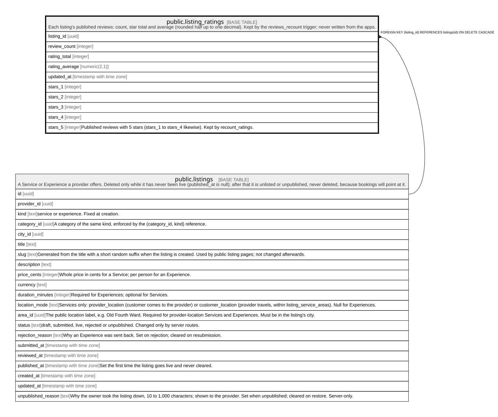

# public.listing_ratings

## Description

Each listing's published reviews: count, star total and average (rounded half up to one decimal). Kept by the reviews_recount trigger; never written from the apps.

## Columns

| Name           | Type                     | Default | Nullable | Extra Definition                                                                                                                                                                | Children | Parents                               | Comment                                                                                |
| -------------- | ------------------------ | ------- | -------- | ------------------------------------------------------------------------------------------------------------------------------------------------------------------------------- | -------- | ------------------------------------- | -------------------------------------------------------------------------------------- |
| listing_id     | uuid                     |         | false    |                                                                                                                                                                                 |          | [public.listings](public.listings.md) |                                                                                        |
| review_count   | integer                  | 0       | false    |                                                                                                                                                                                 |          |                                       |                                                                                        |
| rating_total   | integer                  | 0       | false    |                                                                                                                                                                                 |          |                                       |                                                                                        |
| rating_average | numeric(2,1)             |         | true     | GENERATED ALWAYS AS  CASE     WHEN (review_count \> 0) THEN round(((rating_total)::numeric / (review_count)::numeric), 1)     ELSE NULL::numeric END STORED |          |                                       |                                                                                        |
| updated_at     | timestamp with time zone | now()   | false    |                                                                                                                                                                                 |          |                                       |                                                                                        |
| stars_1        | integer                  | 0       | false    |                                                                                                                                                                                 |          |                                       |                                                                                        |
| stars_2        | integer                  | 0       | false    |                                                                                                                                                                                 |          |                                       |                                                                                        |
| stars_3        | integer                  | 0       | false    |                                                                                                                                                                                 |          |                                       |                                                                                        |
| stars_4        | integer                  | 0       | false    |                                                                                                                                                                                 |          |                                       |                                                                                        |
| stars_5        | integer                  | 0       | false    |                                                                                                                                                                                 |          |                                       | Published reviews with 5 stars (stars_1 to stars_4 likewise). Kept by recount_ratings. |

## Constraints

| Name                               | Type        | Definition                                                                       |
| ---------------------------------- | ----------- | -------------------------------------------------------------------------------- |
| listing_ratings_rating_total_check | CHECK       | CHECK ((rating_total >= 0))                                                      |
| listing_ratings_review_count_check | CHECK       | CHECK ((review_count >= 0))                                                      |
| listing_ratings_stars_1_check      | CHECK       | CHECK ((stars_1 >= 0))                                                           |
| listing_ratings_stars_2_check      | CHECK       | CHECK ((stars_2 >= 0))                                                           |
| listing_ratings_stars_3_check      | CHECK       | CHECK ((stars_3 >= 0))                                                           |
| listing_ratings_stars_4_check      | CHECK       | CHECK ((stars_4 >= 0))                                                           |
| listing_ratings_stars_5_check      | CHECK       | CHECK ((stars_5 >= 0))                                                           |
| listing_ratings_stars_add_up       | CHECK       | CHECK ((((((stars_1 + stars_2) + stars_3) + stars_4) + stars_5) = review_count)) |
| listing_ratings_listing_id_fkey    | FOREIGN KEY | FOREIGN KEY (listing_id) REFERENCES listings(id) ON DELETE CASCADE               |
| listing_ratings_pkey               | PRIMARY KEY | PRIMARY KEY (listing_id)                                                         |

## Indexes

| Name                 | Definition                                                                                  |
| -------------------- | ------------------------------------------------------------------------------------------- |
| listing_ratings_pkey | CREATE UNIQUE INDEX listing_ratings_pkey ON public.listing_ratings USING btree (listing_id) |

## Relations

---

> Generated by [tbls](https://github.com/k1LoW/tbls)
