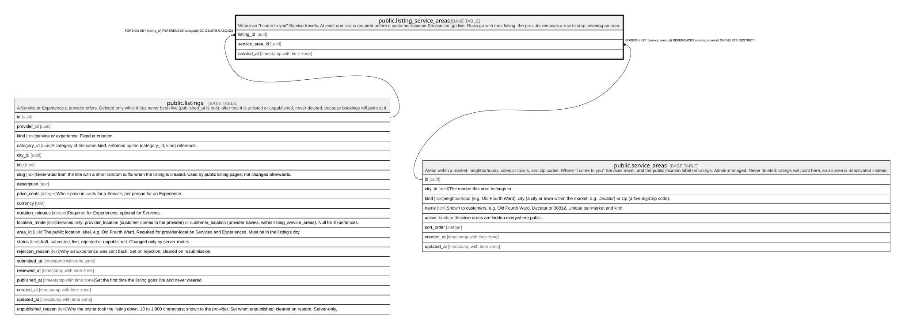

# public.listing_service_areas

## Description

Where an "I come to you" Service travels. At least one row is required before a customer-location Service can go live. Rows go with their listing; the provider removes a row to stop covering an area.

## Columns

| Name            | Type                     | Default | Nullable | Children | Parents                                         | Comment |
| --------------- | ------------------------ | ------- | -------- | -------- | ----------------------------------------------- | ------- |
| listing_id      | uuid                     |         | false    |          | [public.listings](public.listings.md)           |         |
| service_area_id | uuid                     |         | false    |          | [public.service_areas](public.service_areas.md) |         |
| created_at      | timestamp with time zone | now()   | false    |          |                                                 |         |

## Constraints

| Name                                       | Type        | Definition                                                                    |
| ------------------------------------------ | ----------- | ----------------------------------------------------------------------------- |
| listing_service_areas_service_area_id_fkey | FOREIGN KEY | FOREIGN KEY (service_area_id) REFERENCES service_areas(id) ON DELETE RESTRICT |
| listing_service_areas_listing_id_fkey      | FOREIGN KEY | FOREIGN KEY (listing_id) REFERENCES listings(id) ON DELETE CASCADE            |
| listing_service_areas_pkey                 | PRIMARY KEY | PRIMARY KEY (listing_id, service_area_id)                                     |

## Indexes

| Name                                      | Definition                                                                                                               |
| ----------------------------------------- | ------------------------------------------------------------------------------------------------------------------------ |
| listing_service_areas_pkey                | CREATE UNIQUE INDEX listing_service_areas_pkey ON public.listing_service_areas USING btree (listing_id, service_area_id) |
| listing_service_areas_service_area_id_idx | CREATE INDEX listing_service_areas_service_area_id_idx ON public.listing_service_areas USING btree (service_area_id)     |

## Triggers

| Name                        | Definition                                                                                                                                                     |
| --------------------------- | -------------------------------------------------------------------------------------------------------------------------------------------------------------- |
| listing_service_areas_check | CREATE TRIGGER listing_service_areas_check BEFORE INSERT ON public.listing_service_areas FOR EACH ROW EXECUTE FUNCTION listing_service_areas_check()           |
| listing_service_areas_guard | CREATE TRIGGER listing_service_areas_guard BEFORE INSERT OR DELETE ON public.listing_service_areas FOR EACH ROW EXECUTE FUNCTION listing_service_areas_guard() |

## Relations

---

> Generated by [tbls](https://github.com/k1LoW/tbls)
