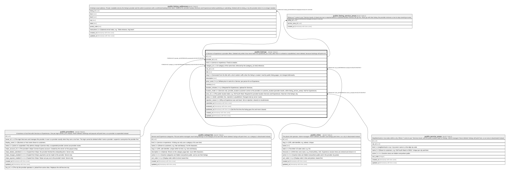

# public.listings

## Description

A Service or Experience a provider offers. Deleted only while it has never been live (published_at is null); after that it is unlisted or unpublished, never deleted, because bookings will point at it.

## Columns

| Name               | Type                     | Default           | Nullable | Children                                                                                                                                                                                                                                                                                                                                                                                                                                                              | Parents                                         | Comment                                                                                                                                                        |
| ------------------ | ------------------------ | ----------------- | -------- | --------------------------------------------------------------------------------------------------------------------------------------------------------------------------------------------------------------------------------------------------------------------------------------------------------------------------------------------------------------------------------------------------------------------------------------------------------------------- | ----------------------------------------------- | -------------------------------------------------------------------------------------------------------------------------------------------------------------- |
| id                 | uuid                     | gen_random_uuid() | false    | [public.listing_addresses](public.listing_addresses.md) [public.listing_service_areas](public.listing_service_areas.md) [public.listing_photos](public.listing_photos.md) [public.experience_sessions](public.experience_sessions.md) [public.notifications](public.notifications.md) [public.bookings](public.bookings.md) [public.saved_listings](public.saved_listings.md) [public.reviews](public.reviews.md) [public.listing_ratings](public.listing_ratings.md) |                                                 |                                                                                                                                                                |
| provider_id        | uuid                     |                   | false    |                                                                                                                                                                                                                                                                                                                                                                                                                                                                       | [public.providers](public.providers.md)         |                                                                                                                                                                |
| kind               | text                     |                   | false    |                                                                                                                                                                                                                                                                                                                                                                                                                                                                       | [public.categories](public.categories.md)       | service or experience. Fixed at creation.                                                                                                                      |
| category_id        | uuid                     |                   | false    |                                                                                                                                                                                                                                                                                                                                                                                                                                                                       | [public.categories](public.categories.md)       | A category of the same kind, enforced by the (category_id, kind) reference.                                                                                    |
| city_id            | uuid                     |                   | false    |                                                                                                                                                                                                                                                                                                                                                                                                                                                                       | [public.cities](public.cities.md)               |                                                                                                                                                                |
| title              | text                     |                   | false    |                                                                                                                                                                                                                                                                                                                                                                                                                                                                       |                                                 |                                                                                                                                                                |
| slug               | text                     |                   | false    |                                                                                                                                                                                                                                                                                                                                                                                                                                                                       |                                                 | Generated from the title with a short random suffix when the listing is created. Used by public listing pages; not changed afterwards.                         |
| description        | text                     |                   | false    |                                                                                                                                                                                                                                                                                                                                                                                                                                                                       |                                                 |                                                                                                                                                                |
| price_cents        | integer                  |                   | false    |                                                                                                                                                                                                                                                                                                                                                                                                                                                                       |                                                 | Whole price in cents for a Service; per person for an Experience.                                                                                              |
| currency           | text                     | 'usd'::text       | false    |                                                                                                                                                                                                                                                                                                                                                                                                                                                                       |                                                 |                                                                                                                                                                |
| duration_minutes   | integer                  |                   | true     |                                                                                                                                                                                                                                                                                                                                                                                                                                                                       |                                                 | Required for Experiences; optional for Services.                                                                                                               |
| location_mode      | text                     |                   | true     |                                                                                                                                                                                                                                                                                                                                                                                                                                                                       |                                                 | Services only: provider_location (customer comes to the provider) or customer_location (provider travels, within listing_service_areas). Null for Experiences. |
| area_id            | uuid                     |                   | true     |                                                                                                                                                                                                                                                                                                                                                                                                                                                                       | [public.service_areas](public.service_areas.md) | The public location label, e.g. Old Fourth Ward. Required for provider-location Services and Experiences. Must be in the listing's city.                       |
| status             | text                     | 'draft'::text     | false    |                                                                                                                                                                                                                                                                                                                                                                                                                                                                       |                                                 | draft, submitted, live, rejected or unpublished. Changed only by server routes.                                                                                |
| rejection_reason   | text                     |                   | true     |                                                                                                                                                                                                                                                                                                                                                                                                                                                                       |                                                 | Why an Experience was sent back. Set on rejection; cleared on resubmission.                                                                                    |
| submitted_at       | timestamp with time zone |                   | true     |                                                                                                                                                                                                                                                                                                                                                                                                                                                                       |                                                 |                                                                                                                                                                |
| reviewed_at        | timestamp with time zone |                   | true     |                                                                                                                                                                                                                                                                                                                                                                                                                                                                       |                                                 |                                                                                                                                                                |
| published_at       | timestamp with time zone |                   | true     |                                                                                                                                                                                                                                                                                                                                                                                                                                                                       |                                                 | Set the first time the listing goes live and never cleared.                                                                                                    |
| created_at         | timestamp with time zone | now()             | false    |                                                                                                                                                                                                                                                                                                                                                                                                                                                                       |                                                 |                                                                                                                                                                |
| updated_at         | timestamp with time zone | now()             | false    |                                                                                                                                                                                                                                                                                                                                                                                                                                                                       |                                                 |                                                                                                                                                                |
| unpublished_reason | text                     |                   | true     |                                                                                                                                                                                                                                                                                                                                                                                                                                                                       |                                                 | Why the owner took the listing down, 10 to 1,000 characters; shown to the provider. Set when unpublished; cleared on restore. Server-only.                     |

## Constraints

| Name                              | Type        | Definition                                                                                                            |
| --------------------------------- | ----------- | --------------------------------------------------------------------------------------------------------------------- |
| listings_area_required            | CHECK       | CHECK ((((kind = 'service'::text) AND (location_mode = 'customer_location'::text)) OR (area_id IS NOT NULL)))         |
| listings_currency_check           | CHECK       | CHECK ((currency = 'usd'::text))                                                                                      |
| listings_description_check        | CHECK       | CHECK (((char_length(description) >= 20) AND (char_length(description) <= 5000)))                                     |
| listings_duration_minutes_check   | CHECK       | CHECK (((duration_minutes >= 5) AND (duration_minutes <= 1440)))                                                      |
| listings_experience_shape         | CHECK       | CHECK (((kind <> 'experience'::text) OR ((duration_minutes IS NOT NULL) AND (location_mode IS NULL))))                |
| listings_kind_check               | CHECK       | CHECK ((kind = ANY (ARRAY['service'::text, 'experience'::text])))                                                     |
| listings_location_mode_check      | CHECK       | CHECK ((location_mode = ANY (ARRAY['provider_location'::text, 'customer_location'::text])))                           |
| listings_price_cents_check        | CHECK       | CHECK ((price_cents > 0))                                                                                             |
| listings_rejection_reason         | CHECK       | CHECK (((status <> 'rejected'::text) OR (rejection_reason IS NOT NULL)))                                              |
| listings_rejection_reason_check   | CHECK       | CHECK ((char_length(rejection_reason) <= 1000))                                                                       |
| listings_service_shape            | CHECK       | CHECK (((kind <> 'service'::text) OR (location_mode IS NOT NULL)))                                                    |
| listings_slug_check               | CHECK       | CHECK ((slug ~ '^[a-z0-9]+(-[a-z0-9]+)*$'::text))                                                                     |
| listings_status_check             | CHECK       | CHECK ((status = ANY (ARRAY['draft'::text, 'submitted'::text, 'live'::text, 'rejected'::text, 'unpublished'::text]))) |
| listings_title_check              | CHECK       | CHECK (((char_length(title) >= 5) AND (char_length(title) <= 100)))                                                   |
| listings_unpublished_reason       | CHECK       | CHECK (((status = 'unpublished'::text) = (unpublished_reason IS NOT NULL)))                                           |
| listings_unpublished_reason_check | CHECK       | CHECK (((char_length(unpublished_reason) >= 10) AND (char_length(unpublished_reason) <= 1000)))                       |
| listings_provider_id_fkey         | FOREIGN KEY | FOREIGN KEY (provider_id) REFERENCES providers(id) ON DELETE RESTRICT                                                 |
| listings_city_id_fkey             | FOREIGN KEY | FOREIGN KEY (city_id) REFERENCES cities(id) ON DELETE RESTRICT                                                        |
| listings_area_id_fkey             | FOREIGN KEY | FOREIGN KEY (area_id) REFERENCES service_areas(id) ON DELETE RESTRICT                                                 |
| listings_category_id_kind_fkey    | FOREIGN KEY | FOREIGN KEY (category_id, kind) REFERENCES categories(id, kind) ON DELETE RESTRICT                                    |
| listings_pkey                     | PRIMARY KEY | PRIMARY KEY (id)                                                                                                      |
| listings_slug_key                 | UNIQUE      | UNIQUE (slug)                                                                                                         |

## Indexes

| Name                            | Definition                                                                                                                       |
| ------------------------------- | -------------------------------------------------------------------------------------------------------------------------------- |
| listings_pkey                   | CREATE UNIQUE INDEX listings_pkey ON public.listings USING btree (id)                                                            |
| listings_slug_key               | CREATE UNIQUE INDEX listings_slug_key ON public.listings USING btree (slug)                                                      |
| listings_provider_id_idx        | CREATE INDEX listings_provider_id_idx ON public.listings USING btree (provider_id)                                               |
| listings_live_city_category_idx | CREATE INDEX listings_live_city_category_idx ON public.listings USING btree (city_id, category_id) WHERE (status = 'live'::text) |
| listings_title_trgm             | CREATE INDEX listings_title_trgm ON public.listings USING gin (title gin_trgm_ops)                                               |
| listings_kind_updated_idx       | CREATE INDEX listings_kind_updated_idx ON public.listings USING btree (kind, updated_at DESC)                                    |
| listings_kind_status_idx        | CREATE INDEX listings_kind_status_idx ON public.listings USING btree (kind, status)                                              |

## Triggers

| Name                          | Definition                                                                                                                                                                                           |
| ----------------------------- | ---------------------------------------------------------------------------------------------------------------------------------------------------------------------------------------------------- |
| listings_check_references     | CREATE TRIGGER listings_check_references BEFORE INSERT OR UPDATE OF category_id, city_id, area_id ON public.listings FOR EACH ROW EXECUTE FUNCTION listings_check_references()                       |
| listings_guard_provider_edits | CREATE TRIGGER listings_guard_provider_edits BEFORE UPDATE ON public.listings FOR EACH ROW EXECUTE FUNCTION listings_guard_provider_edits()                                                          |
| listings_notify_status_change | CREATE TRIGGER listings_notify_status_change AFTER UPDATE OF status ON public.listings FOR EACH ROW WHEN ((old.status IS DISTINCT FROM new.status)) EXECUTE FUNCTION listings_notify_status_change() |
| listings_require_photo        | CREATE TRIGGER listings_require_photo BEFORE UPDATE OF status ON public.listings FOR EACH ROW EXECUTE FUNCTION listings_require_photo()                                                              |
| listings_set_slug             | CREATE TRIGGER listings_set_slug BEFORE INSERT ON public.listings FOR EACH ROW EXECUTE FUNCTION listings_set_slug()                                                                                  |
| listings_set_updated_at       | CREATE TRIGGER listings_set_updated_at BEFORE UPDATE ON public.listings FOR EACH ROW EXECUTE FUNCTION set_updated_at()                                                                               |

## Relations

---

> Generated by [tbls](https://github.com/k1LoW/tbls)
