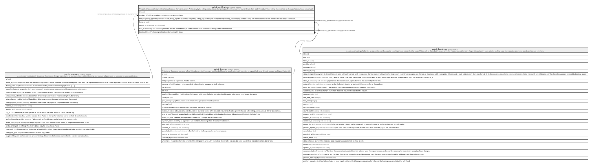

# public.notifications

## Description

Things that happened to a provider's listings because of an admin action. Written only by the listings_notify_status_change trigger. Providers read their own and mark them read. Deleted with their listing; otherwise kept (a cleanup of old read ones comes later).

## Columns

| Name        | Type                     | Default           | Nullable | Children | Parents                                 | Comment                                                                                                                                                                                                                                         |
| ----------- | ------------------------ | ----------------- | -------- | -------- | --------------------------------------- | ----------------------------------------------------------------------------------------------------------------------------------------------------------------------------------------------------------------------------------------------- |
| id          | uuid                     | gen_random_uuid() | false    |          |                                         |                                                                                                                                                                                                                                                 |
| provider_id | uuid                     |                   | false    |          | [public.providers](public.providers.md) | The recipient: the business that owns the listing.                                                                                                                                                                                              |
| kind        | text                     |                   | false    |          |                                         | listing_approved (submitted -\> live), listing_rejected (submitted -\> rejected), listing_unpublished (live -\> unpublished) or listing_restored (unpublished -\> live). The sentence shown is built from this and the listing's current title. |
| listing_id  | uuid                     |                   | false    |          | [public.listings](public.listings.md)   |                                                                                                                                                                                                                                                 |
| created_at  | timestamp with time zone | now()             | false    |          |                                         |                                                                                                                                                                                                                                                 |
| read_at     | timestamp with time zone |                   | true     |          |                                         | When the provider marked it read; null while unread. Once set it doesn't change, and it can't be cleared.                                                                                                                                       |
| booking_id  | uuid                     |                   | true     |          | [public.bookings](public.bookings.md)   | For booking notifications: the booking it's about.                                                                                                                                                                                              |

## Constraints

| Name                           | Type        | Definition                                                                                                                                                                                                                                                                        |
| ------------------------------ | ----------- | --------------------------------------------------------------------------------------------------------------------------------------------------------------------------------------------------------------------------------------------------------------------------------- |
| notifications_kind_check       | CHECK       | CHECK ((kind = ANY (ARRAY['listing_approved'::text, 'listing_rejected'::text, 'listing_unpublished'::text, 'listing_restored'::text, 'booking_requested'::text, 'booking_confirmed'::text, 'booking_cancelled'::text, 'booking_problem_reported'::text, 'review_posted'::text]))) |
| notifications_provider_id_fkey | FOREIGN KEY | FOREIGN KEY (provider_id) REFERENCES providers(id) ON DELETE RESTRICT                                                                                                                                                                                                             |
| notifications_listing_id_fkey  | FOREIGN KEY | FOREIGN KEY (listing_id) REFERENCES listings(id) ON DELETE CASCADE                                                                                                                                                                                                                |
| notifications_pkey             | PRIMARY KEY | PRIMARY KEY (id)                                                                                                                                                                                                                                                                  |
| notifications_booking_id_fkey  | FOREIGN KEY | FOREIGN KEY (booking_id) REFERENCES bookings(id) ON DELETE RESTRICT                                                                                                                                                                                                               |

## Indexes

| Name                                     | Definition                                                                                                               |
| ---------------------------------------- | ------------------------------------------------------------------------------------------------------------------------ |
| notifications_pkey                       | CREATE UNIQUE INDEX notifications_pkey ON public.notifications USING btree (id)                                          |
| notifications_provider_id_created_at_idx | CREATE INDEX notifications_provider_id_created_at_idx ON public.notifications USING btree (provider_id, created_at DESC) |
| notifications_unread_idx                 | CREATE INDEX notifications_unread_idx ON public.notifications USING btree (provider_id) WHERE (read_at IS NULL)          |
| notifications_listing_id_idx             | CREATE INDEX notifications_listing_id_idx ON public.notifications USING btree (listing_id)                               |

## Triggers

| Name                      | Definition                                                                                                                                          |
| ------------------------- | --------------------------------------------------------------------------------------------------------------------------------------------------- |
| notifications_set_read_at | CREATE TRIGGER notifications_set_read_at BEFORE UPDATE OF read_at ON public.notifications FOR EACH ROW EXECUTE FUNCTION notifications_set_read_at() |

## Relations

---

> Generated by [tbls](https://github.com/k1LoW/tbls)
