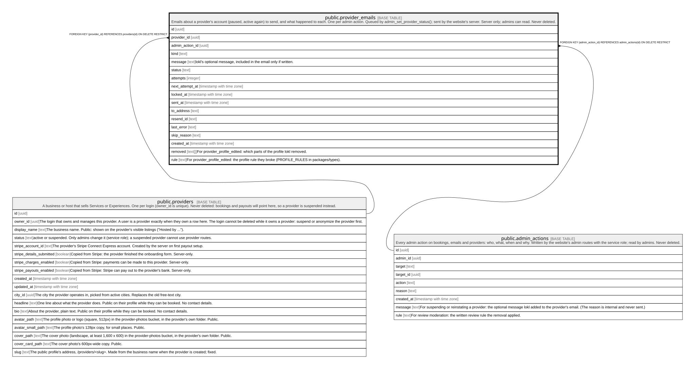

# public.provider_emails

## Description

Emails about a provider's account (paused, active again) to send, and what happened to each. One per admin action. Queued by admin_set_provider_status(); sent by the website's server. Server only; admins can read. Never deleted.

## Columns

| Name            | Type                     | Default           | Nullable | Children | Parents                                         | Comment                                                                                     |
| --------------- | ------------------------ | ----------------- | -------- | -------- | ----------------------------------------------- | ------------------------------------------------------------------------------------------- |
| id              | uuid                     | gen_random_uuid() | false    |          |                                                 |                                                                                             |
| provider_id     | uuid                     |                   | false    |          | [public.providers](public.providers.md)         |                                                                                             |
| admin_action_id | uuid                     |                   | false    |          | [public.admin_actions](public.admin_actions.md) |                                                                                             |
| kind            | text                     |                   | false    |          |                                                 |                                                                                             |
| message         | text                     |                   | true     |          |                                                 | lokl's optional message, included in the email only if written.                             |
| status          | text                     | 'pending'::text   | false    |          |                                                 |                                                                                             |
| attempts        | integer                  | 0                 | false    |          |                                                 |                                                                                             |
| next_attempt_at | timestamp with time zone | now()             | false    |          |                                                 |                                                                                             |
| locked_at       | timestamp with time zone |                   | true     |          |                                                 |                                                                                             |
| sent_at         | timestamp with time zone |                   | true     |          |                                                 |                                                                                             |
| to_address      | text                     |                   | true     |          |                                                 |                                                                                             |
| resend_id       | text                     |                   | true     |          |                                                 |                                                                                             |
| last_error      | text                     |                   | true     |          |                                                 |                                                                                             |
| skip_reason     | text                     |                   | true     |          |                                                 |                                                                                             |
| created_at      | timestamp with time zone | clock_timestamp() | false    |          |                                                 |                                                                                             |
| removed         | text[]                   |                   | true     |          |                                                 | For provider_profile_edited: which parts of the profile lokl removed.                       |
| rule            | text                     |                   | true     |          |                                                 | For provider_profile_edited: the profile rule they broke (PROFILE_RULES in packages/types). |

## Constraints

| Name                                 | Type        | Definition                                                                                                                                                            |
| ------------------------------------ | ----------- | --------------------------------------------------------------------------------------------------------------------------------------------------------------------- |
| provider_emails_attempts_check       | CHECK       | CHECK ((attempts >= 0))                                                                                                                                               |
| provider_emails_kind_check           | CHECK       | CHECK ((kind = ANY (ARRAY['provider_account_paused'::text, 'provider_account_active'::text, 'provider_profile_edited'::text])))                                       |
| provider_emails_last_error_check     | CHECK       | CHECK ((char_length(last_error) <= 500))                                                                                                                              |
| provider_emails_message_check        | CHECK       | CHECK ((char_length(message) <= 1000))                                                                                                                                |
| provider_emails_profile_edit_named   | CHECK       | CHECK (((kind <> 'provider_profile_edited'::text) OR ((rule IS NOT NULL) AND (COALESCE(array_length(removed, 1), 0) > 0))))                                           |
| provider_emails_removed_check        | CHECK       | CHECK ((removed <@ ARRAY['avatar'::text, 'cover'::text, 'headline'::text, 'bio'::text]))                                                                              |
| provider_emails_rule_check           | CHECK       | CHECK ((rule = ANY (ARRAY['contact_details'::text, 'private_information'::text, 'abuse'::text, 'impersonation'::text, 'unsuitable_photo'::text, 'not_yours'::text]))) |
| provider_emails_sent_has_time        | CHECK       | CHECK (((status <> 'sent'::text) OR (sent_at IS NOT NULL)))                                                                                                           |
| provider_emails_skip_reason_check    | CHECK       | CHECK ((char_length(skip_reason) <= 200))                                                                                                                             |
| provider_emails_status_check         | CHECK       | CHECK ((status = ANY (ARRAY['pending'::text, 'sending'::text, 'sent'::text, 'skipped'::text, 'failed'::text])))                                                       |
| provider_emails_to_address_check     | CHECK       | CHECK ((char_length(to_address) <= 320))                                                                                                                              |
| provider_emails_provider_id_fkey     | FOREIGN KEY | FOREIGN KEY (provider_id) REFERENCES providers(id) ON DELETE RESTRICT                                                                                                 |
| provider_emails_admin_action_id_fkey | FOREIGN KEY | FOREIGN KEY (admin_action_id) REFERENCES admin_actions(id) ON DELETE RESTRICT                                                                                         |
| provider_emails_pkey                 | PRIMARY KEY | PRIMARY KEY (id)                                                                                                                                                      |
| provider_emails_admin_action_id_key  | UNIQUE      | UNIQUE (admin_action_id)                                                                                                                                              |

## Indexes

| Name                                | Definition                                                                                                                                                  |
| ----------------------------------- | ----------------------------------------------------------------------------------------------------------------------------------------------------------- |
| provider_emails_pkey                | CREATE UNIQUE INDEX provider_emails_pkey ON public.provider_emails USING btree (id)                                                                         |
| provider_emails_admin_action_id_key | CREATE UNIQUE INDEX provider_emails_admin_action_id_key ON public.provider_emails USING btree (admin_action_id)                                             |
| provider_emails_due_idx             | CREATE INDEX provider_emails_due_idx ON public.provider_emails USING btree (next_attempt_at) WHERE (status = ANY (ARRAY['pending'::text, 'sending'::text])) |

## Relations

---

> Generated by [tbls](https://github.com/k1LoW/tbls)
