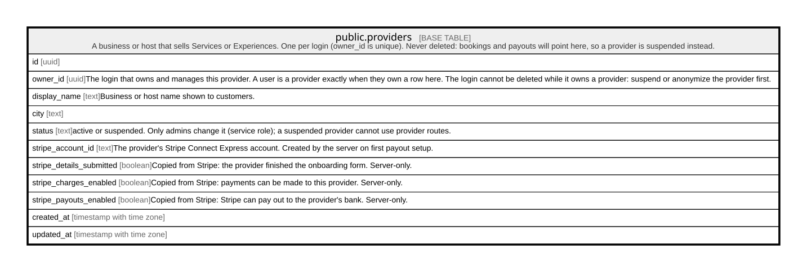

# public.providers

## Description

A business or host that sells Services or Experiences. One per login (owner_id is unique). Never deleted: bookings and payouts will point here, so a provider is suspended instead.

## Columns

| Name                     | Type                     | Default           | Nullable | Children | Parents                           | Comment                                                                                                                                                                                              |
| ------------------------ | ------------------------ | ----------------- | -------- | -------- | --------------------------------- | ---------------------------------------------------------------------------------------------------------------------------------------------------------------------------------------------------- |
| id                       | uuid                     | gen_random_uuid() | false    |          |                                   |                                                                                                                                                                                                      |
| owner_id                 | uuid                     |                   | false    |          |                                   | The login that owns and manages this provider. A user is a provider exactly when they own a row here. The login cannot be deleted while it owns a provider: suspend or anonymize the provider first. |
| display_name             | text                     |                   | false    |          |                                   | Business or host name shown to customers.                                                                                                                                                            |
| status                   | text                     | 'active'::text    | false    |          |                                   | active or suspended. Only admins change it (service role); a suspended provider cannot use provider routes.                                                                                          |
| stripe_account_id        | text                     |                   | true     |          |                                   | The provider's Stripe Connect Express account. Created by the server on first payout setup.                                                                                                          |
| stripe_details_submitted | boolean                  | false             | false    |          |                                   | Copied from Stripe: the provider finished the onboarding form. Server-only.                                                                                                                          |
| stripe_charges_enabled   | boolean                  | false             | false    |          |                                   | Copied from Stripe: payments can be made to this provider. Server-only.                                                                                                                              |
| stripe_payouts_enabled   | boolean                  | false             | false    |          |                                   | Copied from Stripe: Stripe can pay out to the provider's bank. Server-only.                                                                                                                          |
| created_at               | timestamp with time zone | now()             | false    |          |                                   |                                                                                                                                                                                                      |
| updated_at               | timestamp with time zone | now()             | false    |          |                                   |                                                                                                                                                                                                      |
| city_id                  | uuid                     |                   | false    |          | [public.cities](public.cities.md) | The city the provider operates in, picked from active cities. Replaces the old free-text city.                                                                                                       |

## Constraints

| Name                            | Type        | Definition                                                                        |
| ------------------------------- | ----------- | --------------------------------------------------------------------------------- |
| providers_display_name_check    | CHECK       | CHECK (((char_length(display_name) >= 2) AND (char_length(display_name) <= 120))) |
| providers_status_check          | CHECK       | CHECK ((status = ANY (ARRAY['active'::text, 'suspended'::text])))                 |
| providers_owner_id_fkey         | FOREIGN KEY | FOREIGN KEY (owner_id) REFERENCES auth.users(id) ON DELETE RESTRICT               |
| providers_pkey                  | PRIMARY KEY | PRIMARY KEY (id)                                                                  |
| providers_owner_id_key          | UNIQUE      | UNIQUE (owner_id)                                                                 |
| providers_stripe_account_id_key | UNIQUE      | UNIQUE (stripe_account_id)                                                        |
| providers_city_id_fkey          | FOREIGN KEY | FOREIGN KEY (city_id) REFERENCES cities(id) ON DELETE RESTRICT                    |

## Indexes

| Name                            | Definition                                                                                              |
| ------------------------------- | ------------------------------------------------------------------------------------------------------- |
| providers_pkey                  | CREATE UNIQUE INDEX providers_pkey ON public.providers USING btree (id)                                 |
| providers_owner_id_key          | CREATE UNIQUE INDEX providers_owner_id_key ON public.providers USING btree (owner_id)                   |
| providers_stripe_account_id_key | CREATE UNIQUE INDEX providers_stripe_account_id_key ON public.providers USING btree (stripe_account_id) |
| providers_city_id_idx           | CREATE INDEX providers_city_id_idx ON public.providers USING btree (city_id)                            |

## Triggers

| Name                     | Definition                                                                                                                                              |
| ------------------------ | ------------------------------------------------------------------------------------------------------------------------------------------------------- |
| providers_city_active    | CREATE TRIGGER providers_city_active BEFORE INSERT OR UPDATE OF city_id ON public.providers FOR EACH ROW EXECUTE FUNCTION providers_check_city_active() |
| providers_set_updated_at | CREATE TRIGGER providers_set_updated_at BEFORE UPDATE ON public.providers FOR EACH ROW EXECUTE FUNCTION set_updated_at()                                |

## Relations

---

> Generated by [tbls](https://github.com/k1LoW/tbls)
