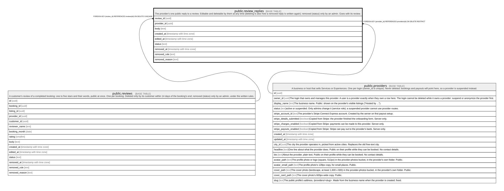

# public.review_replies

## Description

The provider's one public reply to a review. Editable and deletable by them at any time (deleting is also how a removed reply is written again); removed (status) only by an admin. Goes with its review.

## Columns

| Name           | Type                     | Default           | Nullable | Children | Parents                                 | Comment |
| -------------- | ------------------------ | ----------------- | -------- | -------- | --------------------------------------- | ------- |
| review_id      | uuid                     |                   | false    |          | [public.reviews](public.reviews.md)     |         |
| provider_id    | uuid                     |                   | false    |          | [public.providers](public.providers.md) |         |
| body           | text                     |                   | false    |          |                                         |         |
| created_at     | timestamp with time zone | now()             | false    |          |                                         |         |
| edited_at      | timestamp with time zone |                   | true     |          |                                         |         |
| status         | text                     | 'published'::text | false    |          |                                         |         |
| removed_at     | timestamp with time zone |                   | true     |          |                                         |         |
| removed_rule   | text                     |                   | true     |          |                                         |         |
| removed_reason | text                     |                   | true     |          |                                         |         |

## Constraints

| Name                                   | Type        | Definition                                                                                                                                                                 |
| -------------------------------------- | ----------- | -------------------------------------------------------------------------------------------------------------------------------------------------------------------------- |
| review_replies_body_length             | CHECK       | CHECK (((char_length(TRIM(BOTH FROM body)) >= 1) AND (char_length(TRIM(BOTH FROM body)) <= 1500)))                                                                         |
| review_replies_body_no_contact_details | CHECK       | CHECK ((NOT has_contact_details(body)))                                                                                                                                    |
| review_replies_removed_has_rule        | CHECK       | CHECK (((status = 'removed'::text) = ((removed_at IS NOT NULL) AND (removed_rule IS NOT NULL))))                                                                           |
| review_replies_removed_reason_check    | CHECK       | CHECK ((char_length(removed_reason) <= 1000))                                                                                                                              |
| review_replies_removed_rule_check      | CHECK       | CHECK ((removed_rule = ANY (ARRAY['abuse'::text, 'private_information'::text, 'off_topic'::text, 'spam'::text, 'sexual_or_illegal'::text, 'conflict_of_interest'::text]))) |
| review_replies_status_check            | CHECK       | CHECK ((status = ANY (ARRAY['published'::text, 'removed'::text])))                                                                                                         |
| review_replies_provider_id_fkey        | FOREIGN KEY | FOREIGN KEY (provider_id) REFERENCES providers(id) ON DELETE RESTRICT                                                                                                      |
| review_replies_review_id_fkey          | FOREIGN KEY | FOREIGN KEY (review_id) REFERENCES reviews(id) ON DELETE CASCADE                                                                                                           |
| review_replies_pkey                    | PRIMARY KEY | PRIMARY KEY (review_id)                                                                                                                                                    |

## Indexes

| Name                        | Definition                                                                                  |
| --------------------------- | ------------------------------------------------------------------------------------------- |
| review_replies_pkey         | CREATE UNIQUE INDEX review_replies_pkey ON public.review_replies USING btree (review_id)    |
| review_replies_provider_idx | CREATE INDEX review_replies_provider_idx ON public.review_replies USING btree (provider_id) |

## Triggers

| Name                | Definition                                                                                                                              |
| ------------------- | --------------------------------------------------------------------------------------------------------------------------------------- |
| review_replies_fill | CREATE TRIGGER review_replies_fill BEFORE INSERT OR UPDATE ON public.review_replies FOR EACH ROW EXECUTE FUNCTION review_replies_fill() |

## Relations

---

> Generated by [tbls](https://github.com/k1LoW/tbls)
