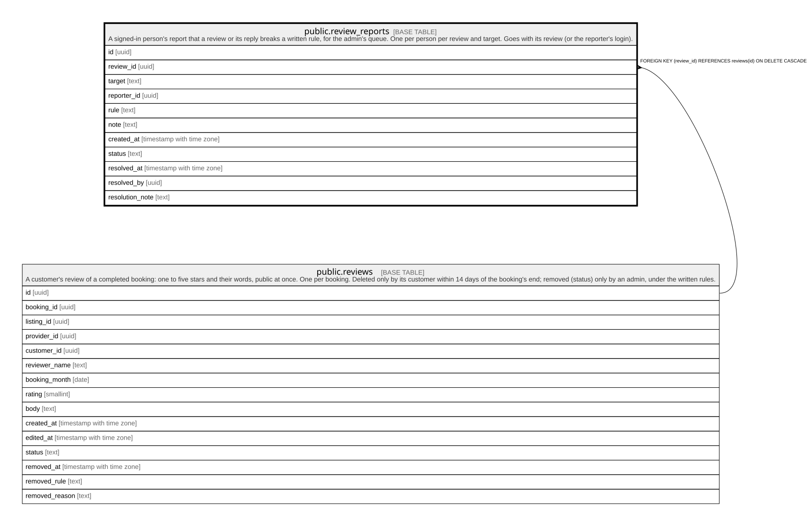

# public.review_reports

## Description

A signed-in person's report that a review or its reply breaks a written rule, for the admin's queue. One per person per review and target. Goes with its review (or the reporter's login).

## Columns

| Name            | Type                     | Default           | Nullable | Children | Parents                             | Comment |
| --------------- | ------------------------ | ----------------- | -------- | -------- | ----------------------------------- | ------- |
| id              | uuid                     | gen_random_uuid() | false    |          |                                     |         |
| review_id       | uuid                     |                   | false    |          | [public.reviews](public.reviews.md) |         |
| target          | text                     | 'review'::text    | false    |          |                                     |         |
| reporter_id     | uuid                     | auth.uid()        | false    |          |                                     |         |
| rule            | text                     |                   | false    |          |                                     |         |
| note            | text                     |                   | true     |          |                                     |         |
| created_at      | timestamp with time zone | now()             | false    |          |                                     |         |
| status          | text                     | 'open'::text      | false    |          |                                     |         |
| resolved_at     | timestamp with time zone |                   | true     |          |                                     |         |
| resolved_by     | uuid                     |                   | true     |          |                                     |         |
| resolution_note | text                     |                   | true     |          |                                     |         |

## Constraints

| Name                                 | Type        | Definition                                                                                                                                                                                 |
| ------------------------------------ | ----------- | ------------------------------------------------------------------------------------------------------------------------------------------------------------------------------------------ |
| review_reports_note_check            | CHECK       | CHECK ((char_length(note) <= 1000))                                                                                                                                                        |
| review_reports_resolution_note_check | CHECK       | CHECK ((char_length(resolution_note) <= 1000))                                                                                                                                             |
| review_reports_resolved              | CHECK       | CHECK (((status = 'open'::text) = (resolved_at IS NULL)))                                                                                                                                  |
| review_reports_rule_check            | CHECK       | CHECK ((rule = ANY (ARRAY['abuse'::text, 'private_information'::text, 'off_topic'::text, 'spam'::text, 'sexual_or_illegal'::text, 'conflict_of_interest'::text, 'something_else'::text]))) |
| review_reports_status_check          | CHECK       | CHECK ((status = ANY (ARRAY['open'::text, 'upheld'::text, 'dismissed'::text])))                                                                                                            |
| review_reports_target_check          | CHECK       | CHECK ((target = ANY (ARRAY['review'::text, 'reply'::text])))                                                                                                                              |
| review_reports_reporter_id_fkey      | FOREIGN KEY | FOREIGN KEY (reporter_id) REFERENCES auth.users(id) ON DELETE CASCADE                                                                                                                      |
| review_reports_resolved_by_fkey      | FOREIGN KEY | FOREIGN KEY (resolved_by) REFERENCES auth.users(id) ON DELETE SET NULL                                                                                                                     |
| review_reports_review_id_fkey        | FOREIGN KEY | FOREIGN KEY (review_id) REFERENCES reviews(id) ON DELETE CASCADE                                                                                                                           |
| review_reports_pkey                  | PRIMARY KEY | PRIMARY KEY (id)                                                                                                                                                                           |
| review_reports_once                  | UNIQUE      | UNIQUE (review_id, target, reporter_id)                                                                                                                                                    |

## Indexes

| Name                        | Definition                                                                                                          |
| --------------------------- | ------------------------------------------------------------------------------------------------------------------- |
| review_reports_pkey         | CREATE UNIQUE INDEX review_reports_pkey ON public.review_reports USING btree (id)                                   |
| review_reports_once         | CREATE UNIQUE INDEX review_reports_once ON public.review_reports USING btree (review_id, target, reporter_id)       |
| review_reports_open_idx     | CREATE INDEX review_reports_open_idx ON public.review_reports USING btree (review_id) WHERE (status = 'open'::text) |
| review_reports_reporter_idx | CREATE INDEX review_reports_reporter_idx ON public.review_reports USING btree (reporter_id)                         |

## Relations

---

> Generated by [tbls](https://github.com/k1LoW/tbls)
