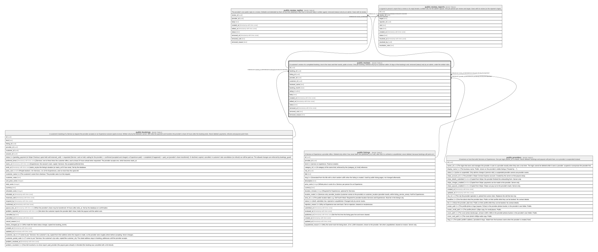

# public.reviews

## Description

A customer's review of a completed booking: one to five stars and their words, public at once. One per booking. Deleted only by its customer within 14 days of the booking's end; removed (status) only by an admin, under the written rules.

## Columns

| Name           | Type                     | Default           | Nullable | Children                                                                                            | Parents                                 | Comment |
| -------------- | ------------------------ | ----------------- | -------- | --------------------------------------------------------------------------------------------------- | --------------------------------------- | ------- |
| id             | uuid                     | gen_random_uuid() | false    | [public.review_replies](public.review_replies.md) [public.review_reports](public.review_reports.md) |                                         |         |
| booking_id     | uuid                     |                   | false    |                                                                                                     | [public.bookings](public.bookings.md)   |         |
| listing_id     | uuid                     |                   | false    |                                                                                                     | [public.listings](public.listings.md)   |         |
| provider_id    | uuid                     |                   | false    |                                                                                                     | [public.providers](public.providers.md) |         |
| customer_id    | uuid                     |                   | false    |                                                                                                     |                                         |         |
| reviewer_name  | text                     |                   | false    |                                                                                                     |                                         |         |
| booking_month  | date                     |                   | false    |                                                                                                     |                                         |         |
| rating         | smallint                 |                   | false    |                                                                                                     |                                         |         |
| body           | text                     |                   | false    |                                                                                                     |                                         |         |
| created_at     | timestamp with time zone | now()             | false    |                                                                                                     |                                         |         |
| edited_at      | timestamp with time zone |                   | true     |                                                                                                     |                                         |         |
| status         | text                     | 'published'::text | false    |                                                                                                     |                                         |         |
| removed_at     | timestamp with time zone |                   | true     |                                                                                                     |                                         |         |
| removed_rule   | text                     |                   | true     |                                                                                                     |                                         |         |
| removed_reason | text                     |                   | true     |                                                                                                     |                                         |         |

## Constraints

| Name                            | Type        | Definition                                                                                                                                                                 |
| ------------------------------- | ----------- | -------------------------------------------------------------------------------------------------------------------------------------------------------------------------- |
| reviews_body_length             | CHECK       | CHECK (((char_length(TRIM(BOTH FROM body)) >= 20) AND (char_length(TRIM(BOTH FROM body)) <= 2000)))                                                                        |
| reviews_body_no_contact_details | CHECK       | CHECK ((NOT has_contact_details(body)))                                                                                                                                    |
| reviews_rating_check            | CHECK       | CHECK (((rating >= 1) AND (rating <= 5)))                                                                                                                                  |
| reviews_removed_has_rule        | CHECK       | CHECK (((status = 'removed'::text) = ((removed_at IS NOT NULL) AND (removed_rule IS NOT NULL))))                                                                           |
| reviews_removed_reason_check    | CHECK       | CHECK ((char_length(removed_reason) <= 1000))                                                                                                                              |
| reviews_removed_rule_check      | CHECK       | CHECK ((removed_rule = ANY (ARRAY['abuse'::text, 'private_information'::text, 'off_topic'::text, 'spam'::text, 'sexual_or_illegal'::text, 'conflict_of_interest'::text]))) |
| reviews_reviewer_name_check     | CHECK       | CHECK (((char_length(reviewer_name) >= 1) AND (char_length(reviewer_name) <= 160)))                                                                                        |
| reviews_status_check            | CHECK       | CHECK ((status = ANY (ARRAY['published'::text, 'removed'::text])))                                                                                                         |
| reviews_customer_id_fkey        | FOREIGN KEY | FOREIGN KEY (customer_id) REFERENCES auth.users(id) ON DELETE RESTRICT                                                                                                     |
| reviews_provider_id_fkey        | FOREIGN KEY | FOREIGN KEY (provider_id) REFERENCES providers(id) ON DELETE RESTRICT                                                                                                      |
| reviews_listing_id_fkey         | FOREIGN KEY | FOREIGN KEY (listing_id) REFERENCES listings(id) ON DELETE RESTRICT                                                                                                        |
| reviews_booking_id_fkey         | FOREIGN KEY | FOREIGN KEY (booking_id) REFERENCES bookings(id) ON DELETE RESTRICT                                                                                                        |
| reviews_pkey                    | PRIMARY KEY | PRIMARY KEY (id)                                                                                                                                                           |
| reviews_booking_id_key          | UNIQUE      | UNIQUE (booking_id)                                                                                                                                                        |

## Indexes

| Name                   | Definition                                                                                                                      |
| ---------------------- | ------------------------------------------------------------------------------------------------------------------------------- |
| reviews_pkey           | CREATE UNIQUE INDEX reviews_pkey ON public.reviews USING btree (id)                                                             |
| reviews_booking_id_key | CREATE UNIQUE INDEX reviews_booking_id_key ON public.reviews USING btree (booking_id)                                           |
| reviews_listing_idx    | CREATE INDEX reviews_listing_idx ON public.reviews USING btree (listing_id, created_at DESC) WHERE (status = 'published'::text) |
| reviews_provider_idx   | CREATE INDEX reviews_provider_idx ON public.reviews USING btree (provider_id, created_at DESC)                                  |
| reviews_customer_idx   | CREATE INDEX reviews_customer_idx ON public.reviews USING btree (customer_id)                                                   |

## Triggers

| Name                    | Definition                                                                                                                                          |
| ----------------------- | --------------------------------------------------------------------------------------------------------------------------------------------------- |
| reviews_fill            | CREATE TRIGGER reviews_fill BEFORE INSERT ON public.reviews FOR EACH ROW EXECUTE FUNCTION reviews_fill()                                            |
| reviews_guard           | CREATE TRIGGER reviews_guard BEFORE UPDATE ON public.reviews FOR EACH ROW EXECUTE FUNCTION reviews_guard()                                          |
| reviews_notify_provider | CREATE TRIGGER reviews_notify_provider AFTER INSERT ON public.reviews FOR EACH ROW EXECUTE FUNCTION reviews_notify_provider()                       |
| reviews_recount         | CREATE TRIGGER reviews_recount AFTER INSERT OR DELETE OR UPDATE OF rating, status ON public.reviews FOR EACH ROW EXECUTE FUNCTION reviews_recount() |

## Relations

---

> Generated by [tbls](https://github.com/k1LoW/tbls)
