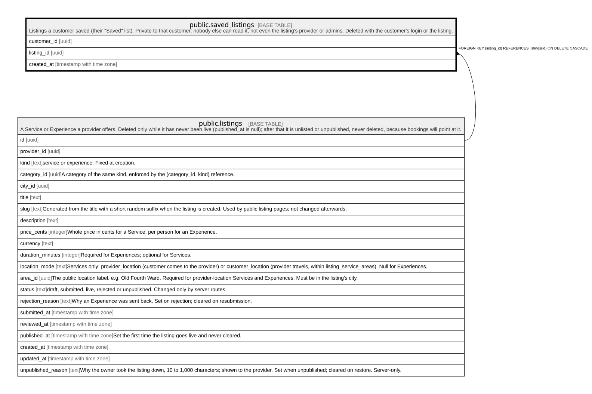

# public.saved_listings

## Description

Listings a customer saved (their "Saved" list). Private to that customer: nobody else can read it, not even the listing's provider or admins. Deleted with the customer's login or the listing.

## Columns

| Name        | Type                     | Default    | Nullable | Children | Parents                               | Comment |
| ----------- | ------------------------ | ---------- | -------- | -------- | ------------------------------------- | ------- |
| customer_id | uuid                     | auth.uid() | false    |          |                                       |         |
| listing_id  | uuid                     |            | false    |          | [public.listings](public.listings.md) |         |
| created_at  | timestamp with time zone | now()      | false    |          |                                       |         |

## Constraints

| Name                            | Type        | Definition                                                            |
| ------------------------------- | ----------- | --------------------------------------------------------------------- |
| saved_listings_customer_id_fkey | FOREIGN KEY | FOREIGN KEY (customer_id) REFERENCES auth.users(id) ON DELETE CASCADE |
| saved_listings_listing_id_fkey  | FOREIGN KEY | FOREIGN KEY (listing_id) REFERENCES listings(id) ON DELETE CASCADE    |
| saved_listings_pkey             | PRIMARY KEY | PRIMARY KEY (customer_id, listing_id)                                 |

## Indexes

| Name                       | Definition                                                                                             |
| -------------------------- | ------------------------------------------------------------------------------------------------------ |
| saved_listings_pkey        | CREATE UNIQUE INDEX saved_listings_pkey ON public.saved_listings USING btree (customer_id, listing_id) |
| saved_listings_listing_idx | CREATE INDEX saved_listings_listing_idx ON public.saved_listings USING btree (listing_id)              |

## Triggers

| Name                 | Definition                                                                                                                   |
| -------------------- | ---------------------------------------------------------------------------------------------------------------------------- |
| saved_listings_limit | CREATE TRIGGER saved_listings_limit BEFORE INSERT ON public.saved_listings FOR EACH ROW EXECUTE FUNCTION saved_items_limit() |

## Relations

---

> Generated by [tbls](https://github.com/k1LoW/tbls)
