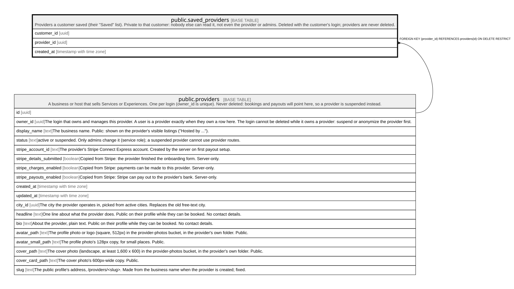

# public.saved_providers

## Description

Providers a customer saved (their "Saved" list). Private to that customer: nobody else can read it, not even the provider or admins. Deleted with the customer's login; providers are never deleted.

## Columns

| Name        | Type                     | Default    | Nullable | Children | Parents                                 | Comment |
| ----------- | ------------------------ | ---------- | -------- | -------- | --------------------------------------- | ------- |
| customer_id | uuid                     | auth.uid() | false    |          |                                         |         |
| provider_id | uuid                     |            | false    |          | [public.providers](public.providers.md) |         |
| created_at  | timestamp with time zone | now()      | false    |          |                                         |         |

## Constraints

| Name                             | Type        | Definition                                                            |
| -------------------------------- | ----------- | --------------------------------------------------------------------- |
| saved_providers_customer_id_fkey | FOREIGN KEY | FOREIGN KEY (customer_id) REFERENCES auth.users(id) ON DELETE CASCADE |
| saved_providers_provider_id_fkey | FOREIGN KEY | FOREIGN KEY (provider_id) REFERENCES providers(id) ON DELETE RESTRICT |
| saved_providers_pkey             | PRIMARY KEY | PRIMARY KEY (customer_id, provider_id)                                |

## Indexes

| Name                         | Definition                                                                                                |
| ---------------------------- | --------------------------------------------------------------------------------------------------------- |
| saved_providers_pkey         | CREATE UNIQUE INDEX saved_providers_pkey ON public.saved_providers USING btree (customer_id, provider_id) |
| saved_providers_provider_idx | CREATE INDEX saved_providers_provider_idx ON public.saved_providers USING btree (provider_id)             |

## Triggers

| Name                  | Definition                                                                                                                     |
| --------------------- | ------------------------------------------------------------------------------------------------------------------------------ |
| saved_providers_limit | CREATE TRIGGER saved_providers_limit BEFORE INSERT ON public.saved_providers FOR EACH ROW EXECUTE FUNCTION saved_items_limit() |

## Relations

---

> Generated by [tbls](https://github.com/k1LoW/tbls)
