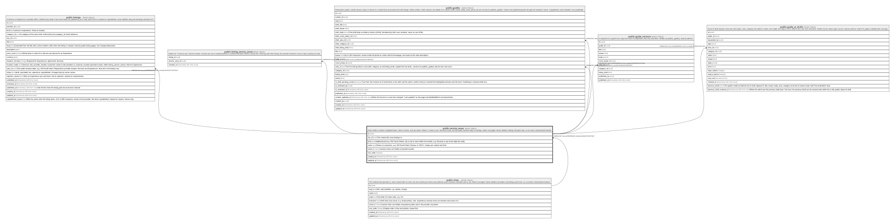

# public.service_areas

## Description

Neighborhoods or zip codes within a city. Where "I come to you" Services travel, and the public location label on listings. Admin-managed. Never deleted: listings will point here, so an area is deactivated instead.

## Columns

| Name       | Type                     | Default           | Nullable | Children                                                                                              | Parents                           | Comment                                                                      |
| ---------- | ------------------------ | ----------------- | -------- | ----------------------------------------------------------------------------------------------------- | --------------------------------- | ---------------------------------------------------------------------------- |
| id         | uuid                     | gen_random_uuid() | false    | [public.listings](public.listings.md) [public.listing_service_areas](public.listing_service_areas.md) |                                   |                                                                              |
| city_id    | uuid                     |                   | false    |                                                                                                       | [public.cities](public.cities.md) |                                                                              |
| kind       | text                     |                   | false    |                                                                                                       |                                   | neighborhood or zip. A zip area's name is a five-digit zip code.             |
| name       | text                     |                   | false    |                                                                                                       |                                   | Shown to customers, e.g. Old Fourth Ward or 30312. Unique per city and kind. |
| active     | boolean                  | true              | false    |                                                                                                       |                                   | Inactive areas are hidden everywhere public.                                 |
| sort_order | integer                  | 0                 | false    |                                                                                                       |                                   |                                                                              |
| created_at | timestamp with time zone | now()             | false    |                                                                                                       |                                   |                                                                              |
| updated_at | timestamp with time zone | now()             | false    |                                                                                                       |                                   |                                                                              |

## Constraints

| Name                                | Type        | Definition                                                       |
| ----------------------------------- | ----------- | ---------------------------------------------------------------- |
| service_areas_check                 | CHECK       | CHECK (((kind <> 'zip'::text) OR (name ~ '^[0-9]{5}$'::text)))   |
| service_areas_kind_check            | CHECK       | CHECK ((kind = ANY (ARRAY['neighborhood'::text, 'zip'::text])))  |
| service_areas_name_check            | CHECK       | CHECK (((char_length(name) >= 1) AND (char_length(name) <= 80))) |
| service_areas_city_id_fkey          | FOREIGN KEY | FOREIGN KEY (city_id) REFERENCES cities(id) ON DELETE RESTRICT   |
| service_areas_pkey                  | PRIMARY KEY | PRIMARY KEY (id)                                                 |
| service_areas_city_id_kind_name_key | UNIQUE      | UNIQUE (city_id, kind, name)                                     |

## Indexes

| Name                                | Definition                                                                                                        |
| ----------------------------------- | ----------------------------------------------------------------------------------------------------------------- |
| service_areas_pkey                  | CREATE UNIQUE INDEX service_areas_pkey ON public.service_areas USING btree (id)                                   |
| service_areas_city_id_kind_name_key | CREATE UNIQUE INDEX service_areas_city_id_kind_name_key ON public.service_areas USING btree (city_id, kind, name) |

## Triggers

| Name                         | Definition                                                                                                                       |
| ---------------------------- | -------------------------------------------------------------------------------------------------------------------------------- |
| service_areas_set_updated_at | CREATE TRIGGER service_areas_set_updated_at BEFORE UPDATE ON public.service_areas FOR EACH ROW EXECUTE FUNCTION set_updated_at() |

## Relations

---

> Generated by [tbls](https://github.com/k1LoW/tbls)
